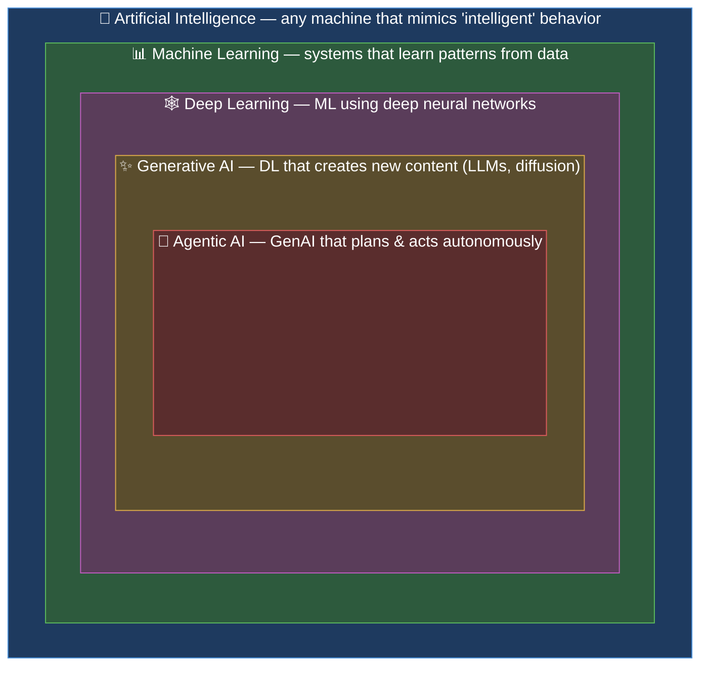
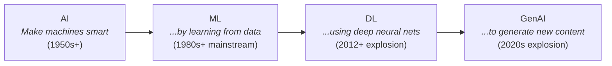
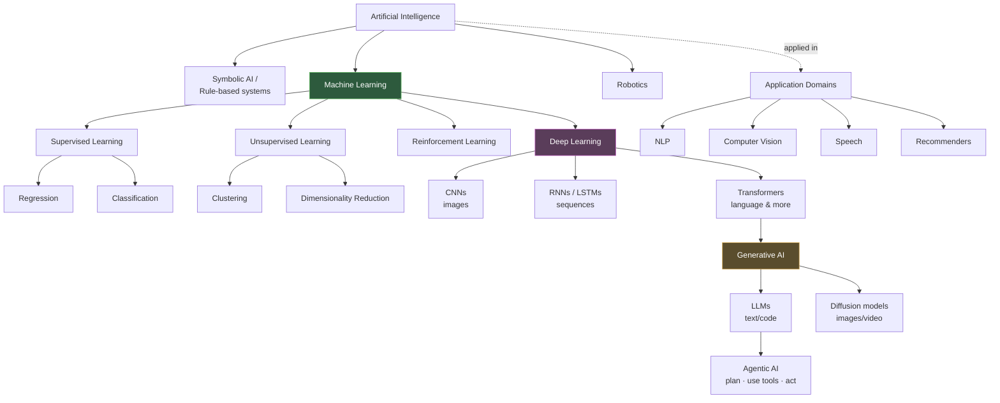
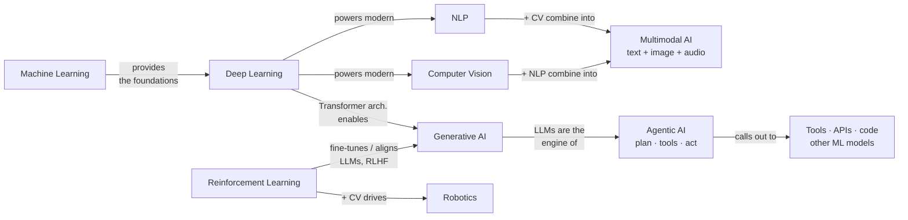
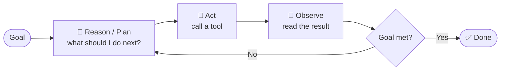
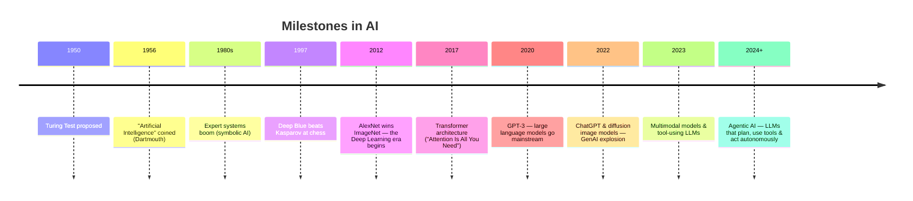

# The AI Landscape — A Map of the Whole Field

> **Topic:** Artificial Intelligence — the big picture and how its subfields fit together
> **Scope:** What AI is → the nesting (AI ⊃ ML ⊃ DL ⊃ GenAI ⊃ Agentic AI) → every major subfield → how they relate → where to go deeper
> **Style:** A **hub / map note** — the 10,000-foot view. Each part links to its own deep-dive note.
> **Format:** Obsidian-compatible (Mermaid diagrams, callouts, tables)
> **Related notes:** [[ml]] · [[deep-learning]] · [[nlp]] · [[computer-vision]] · [[generative-ai]] · [[agentic-ai]]

---

## Table of Contents

1. [The One Picture to Remember](#1-the-one-picture-to-remember)
2. [What Is Artificial Intelligence?](#2-what-is-artificial-intelligence)
3. [The Nesting — Why AI ⊃ ML ⊃ DL ⊃ GenAI](#3-the-nesting--why-ai--ml--dl--genai)
4. [The Full Family Tree](#4-the-full-family-tree)
5. [Subfield-by-Subfield](#5-subfield-by-subfield)
6. [How the Pieces Relate](#6-how-the-pieces-relate)
6.5. [Agentic AI — The Frontier](#65-agentic-ai--the-frontier)
7. [A Timeline — How We Got Here](#7-a-timeline--how-we-got-here)
8. [Where to Go Deeper](#8-where-to-go-deeper)

---

## 1. The One Picture to Remember

The single most important thing to internalize: **these are nested circles, not separate boxes.** Deep Learning is a *kind of* Machine Learning, which is a *kind of* AI.

> [!important] The relationship in one sentence each
> - **AI** is the *goal* — machines doing things that seem to require intelligence.
> - **ML** is the *dominant approach* to AI today — learn from data instead of hard-coding rules.
> - **DL** is the *most powerful family* of ML — many-layered neural networks.
> - **GenAI** is the *breakthrough application* of DL — models that *generate* text, images, code, audio.
> - **Agentic AI** is the *frontier* — a GenAI model that doesn't just answer, but **plans, uses tools, and takes actions** on its own to reach a goal.

> [!warning] One honest caveat about the innermost circle
> The clean nesting is *mostly* true, but **Agentic AI is a paradigm, not purely a "narrower technique."** An agent uses a GenAI model as its brain, but it also reaches *back out* to tools, memory, and the RL-style *agent loop*. So picture it as the frontier layer that sits on top of GenAI while borrowing from across the whole map — not a strict subset. (See §6.5.)

---

## 2. What Is Artificial Intelligence?

**AI** is the broad science of making machines perform tasks that would normally require human intelligence — reasoning, perceiving, understanding language, planning, deciding.

Crucially, **not all AI is machine learning.** For decades, AI meant hand-crafted logic.

| Approach | How it works | Example |
|----------|-------------|---------|
| **Symbolic AI** (GOFAI, rule-based) | Humans write explicit rules & logic | Expert systems, chess engines like Deep Blue, `if-then` diagnosis tools |
| **Machine Learning** | Machine learns rules *from data* | Spam filters, recommendations, image recognition |

> [!note] "Narrow" vs "General" AI
> - **ANI (Narrow AI)** — good at *one* task (translation, face ID, playing Go). **Everything that exists today is narrow AI**, including ChatGPT.
> - **AGI (General AI)** — hypothetical human-level ability across *any* task. Does not exist yet.
> - **ASI (Superintelligence)** — hypothetical beyond-human intelligence. Speculative.

---

## 3. The Nesting — Why AI ⊃ ML ⊃ DL ⊃ GenAI

Walk it from the outside in:

> [!tip] The intuition for the shrinking circles
> Each inner circle is a **more specific, more powerful technique** that became practical later:
> - **ML** took over AI when data + compute made "learning from examples" beat hand-written rules.
> - **DL** took over ML (~2012, the ImageNet moment) when GPUs + big data let deep networks learn features automatically.
> - **GenAI** emerged (~2020s) when the **Transformer** architecture + massive scale let deep nets *generate* fluent language and imagery, not just classify.

---

## 4. The Full Family Tree

The nested view is clean but hides the *sibling* subfields. Here's the fuller map — the branches of ML, and the application domains that cut across them.

> [!note] Two different ways to slice the field
> The tree above mixes two orthogonal groupings — keep them separate in your head:
> - **By *technique*** — how the machine learns (supervised / unsupervised / RL / deep). This is the [[ml]] view.
> - **By *application domain*** — what problem it solves (vision, language, speech). A domain like NLP *uses* whatever technique works best (today, usually Transformers).

---

## 5. Subfield-by-Subfield

| Subfield | What it does | Core techniques | Everyday example | Deep-dive |
|----------|-------------|-----------------|------------------|-----------|
| **Machine Learning** | Learn patterns from data | Regression, trees, SVMs, gradient boosting | Netflix recommendations | [[ml]] |
| **Deep Learning** | ML with many-layered neural nets | CNNs, RNNs, Transformers | Face unlock on your phone | [[deep-learning]] |
| **Generative AI** | *Create* new content | LLMs, diffusion, GANs | ChatGPT, Midjourney | [[generative-ai]] |
| **Agentic AI** | Autonomously *plan & act* to reach a goal | LLM + tools + memory + planning loop | Coding agents, research agents, computer-use | [[agentic-ai]] |
| **NLP** | Understand & produce human language | Transformers, embeddings | Translation, chatbots, search | [[nlp]] |
| **Computer Vision** | Understand images & video | CNNs, vision Transformers | Self-driving perception, medical imaging | [[computer-vision]] |
| **Speech / Audio** | Recognize & synthesize sound | RNNs, Transformers | Siri, voice typing | — |
| **Reinforcement Learning** | Learn by trial, reward & error | Q-learning, policy gradients | Game AI (AlphaGo), robotics control | [[reinforcement-learning]] |
| **Robotics** | Physical action in the world | RL + CV + control theory | Warehouse robots, drones | — |
| **Expert / Symbolic Systems** | Reason with hand-coded rules | Logic, knowledge graphs | Tax software, early diagnosis tools | — |

> [!example] The same problem, different lenses
> "Read the text in a photo of a receipt" touches **three** subfields at once: **Computer Vision** (find & read the pixels), **NLP** (understand the words), and it's all powered by **Deep Learning** techniques. Real products stitch subfields together.

---

## 6. How the Pieces Relate

The relationships aren't only "contains" — subfields **feed** and **combine** with each other.

> [!important] Key relationships to remember
> - **ML is the foundation** — DL inherits its core ideas (training data, loss functions, gradient descent, overfitting). Understand [[ml]] *first*; it makes everything else click.
> - **Deep Learning is the common engine** — modern NLP, Computer Vision, and Speech are *all* deep learning under the hood now. The old hand-crafted methods have largely been replaced.
> - **The Transformer is the bridge** — one 2017 architecture ("Attention Is All You Need") now underpins LLMs, vision, audio, and multimodal systems alike.
> - **Self-supervised learning is how LLMs are born** — training on "predict the next word" over enormous text needs *no human labels*, which is what lets these models scale to internet-sized data (see [[ml]] §2).
> - **RL + GenAI = alignment** — RLHF (Reinforcement Learning from Human Feedback) is how raw language models become helpful assistants.
> - **Everything is converging on multimodal & agents** — the frontier combines subfields: models that see, read, listen, and *act*.

---

## 6.5 Agentic AI — The Frontier

A plain LLM is like a brilliant expert **locked in a room with no phone**: ask a question, get a fluent answer, and that's it. It can't look anything up, run code, or *do* anything in the world.

**Agentic AI unlocks the room.** You give the LLM:
- **Tools** it can call (search the web, run code, query a database, send an email),
- a **memory** of what it has done, and
- a **loop** that lets it decide the next step for itself.

Now it doesn't just *answer* — it **pursues a goal over many steps**, deciding its own actions along the way.

> [!important] The one-line definition
> **Agentic AI = an LLM (the reasoning "brain") + tools + memory, running in a loop that lets it plan, act, observe the result, and adjust — autonomously, until the goal is met.**

### The agent loop

This **Reason → Act → Observe** cycle (often called the *ReAct* pattern) is the heart of every agent. It's exactly the RL framing — *agent, environment, action, feedback* — but the "policy" is an LLM reasoning in natural language instead of a numerically-learned function.

### What makes something "agentic" vs. just a chatbot

| Plain LLM / Chatbot | Agentic AI |
|---------------------|------------|
| One question → one answer | A goal → many self-chosen steps |
| Only knows its training data | Uses **tools** to fetch live info & act |
| No memory between turns (mostly) | **Remembers** and builds on past steps |
| *You* drive each step | *It* decides the next step |
| Passive | **Autonomous** |

> [!example] What agents actually do today
> - **Coding agents** (like Claude Code) — read a repo, edit files, run tests, fix failures, open a PR.
> - **Research agents** — search dozens of sources, cross-check, and write a cited report.
> - **Computer-use agents** — click, type, and navigate software like a human would.
> - **Multi-agent systems** — several specialized agents (planner, coder, reviewer) collaborating.

> [!note] Where it sits on the map — and what it borrows
> Agentic AI is built **on top of GenAI** (it needs a capable LLM), but it stitches the whole map together: **GenAI** supplies reasoning, **RL** supplies the agent/goal/feedback framing (and RLHF-style training makes models good at tool use), and it plugs into **tools** that may themselves be other ML models (vision, speech). That's why it's the *frontier* — it's less a new technique than a new way of *orchestrating* everything else.

> [!warning] Why agents are hard (the honest part)
> More autonomy = more ways to go wrong. Agents can **compound errors** (one bad step derails the rest), **hallucinate** tool inputs, get stuck in **loops**, run up **cost/time**, and take **unintended actions**. Real agent systems need guardrails: step limits, human approval for risky actions, and verification. Autonomy is powerful *and* the main source of risk.

---

## 7. A Timeline — How We Got Here

> [!note] Two "AI winters"
> AI has boomed and busted before. Overhype in the 1970s and late 1980s led to funding collapses ("AI winters") when promises outran reality. Worth remembering when evaluating today's hype: capabilities are real, but so is the pattern of over-promising.

---

## 8. Where to Go Deeper

This note is the **map**. Follow the links for the territory:

> [!abstract] Study path (recommended order)
> 1. **[[ml]]** — Start here. The fundamentals (data, models, cost, gradient descent, overfitting) that *everything* builds on. ✅ *written*
> 2. **[[deep-learning]]** — Neural networks, backprop, CNNs, RNNs, Transformers.
> 3. **[[nlp]]** — Language: embeddings, attention, LLMs.
> 4. **[[computer-vision]]** — Images: convolutions, detection, segmentation.
> 5. **[[generative-ai]]** — LLMs, diffusion, prompting, RAG, fine-tuning.
> 6. **[[reinforcement-learning]]** — Agents, rewards, policies.
> 7. **[[agentic-ai]]** — The frontier: LLMs + tools + memory + planning loops (§6.5).

| Note | Status |
|------|--------|
| [[ml]] — Machine Learning from the ground up | ✅ Written |
| [[deep-learning]] | 📝 Planned |
| [[nlp]] | 📝 Planned |
| [[computer-vision]] | 📝 Planned |
| [[generative-ai]] | 📝 Planned |
| [[reinforcement-learning]] | 📝 Planned |
| [[agentic-ai]] — Agentic AI (frontier; overview in §6.5) | 📝 Planned |

---

> [!success] The whole field in one paragraph
> **AI** is the goal of making machines intelligent. For decades we tried hand-coded rules (**symbolic AI**); today the winning approach is **Machine Learning** — learning patterns from data. Its most powerful branch, **Deep Learning**, uses many-layered neural networks and now powers nearly all modern **NLP**, **Computer Vision**, and **Speech**. One architecture — the **Transformer** — unlocked **Generative AI** (LLMs and diffusion models) that create text, code, and images. The frontier is **Agentic AI** — wrapping an LLM in tools, memory, and a plan-act-observe loop so it doesn't just *answer* but autonomously *does*. It all rests on the ML fundamentals in [[ml]] — learn those first.

---
*Hub note. Related: [[ml]] · [[deep-learning]] · [[nlp]] · [[computer-vision]] · [[generative-ai]] · [[reinforcement-learning]] · [[agentic-ai]]*
