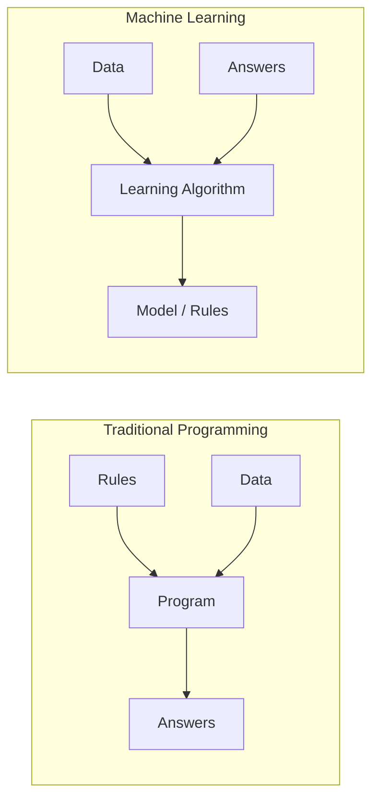
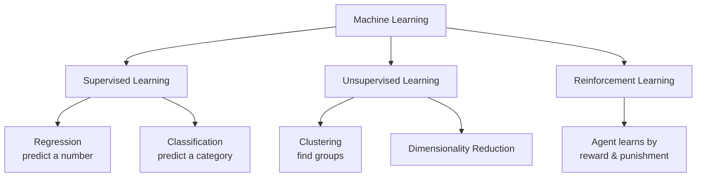
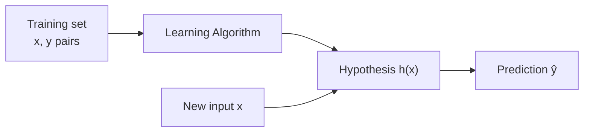
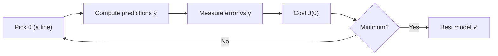
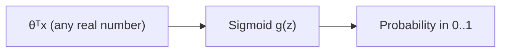
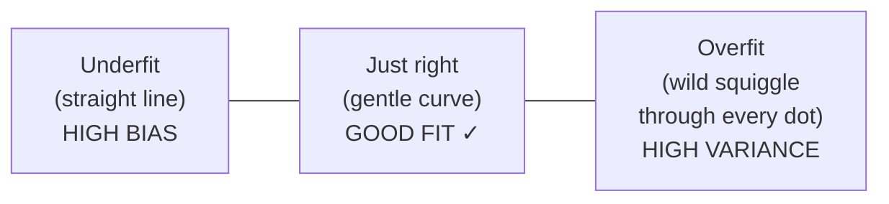
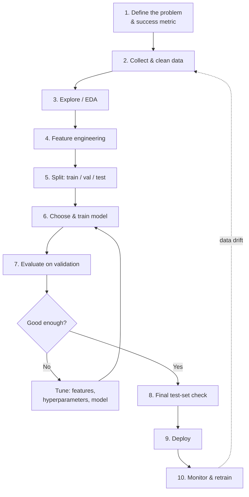
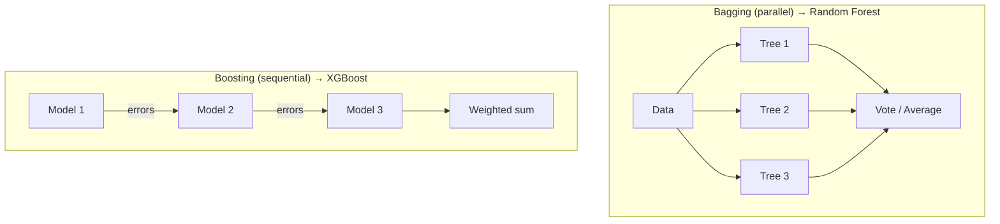
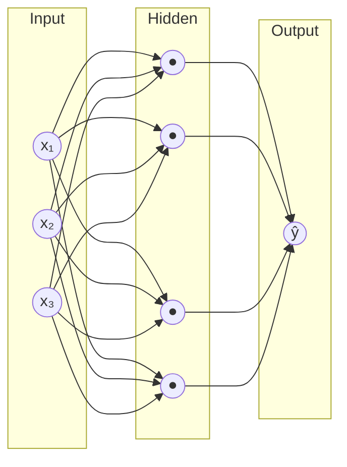
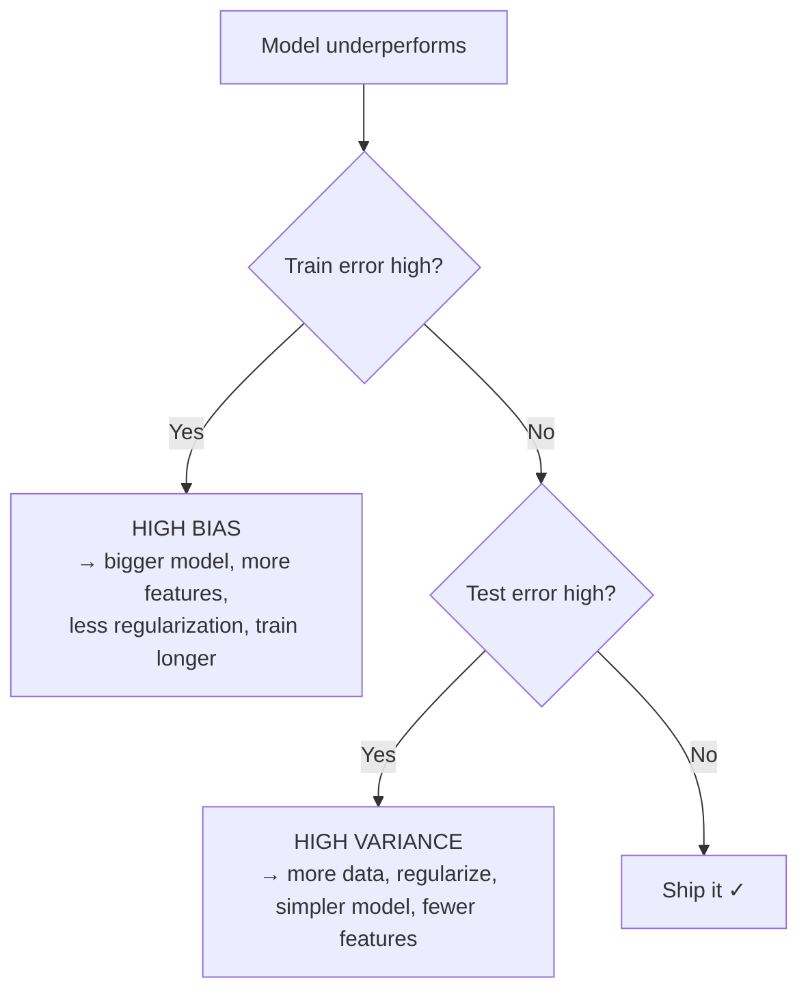

# Machine Learning — From the Ground Up

> **Topic:** Machine Learning — core intuition, math, and algorithms
> **Scope:** What is ML → the learning problem → linear/logistic regression → gradient descent → bias/variance → regularization → the full ML workflow → key algorithms → neural networks → evaluation → practical advice
> **Style:** Taught bottom-up, intuition-first (in the spirit of Andrew Ng) — every formula comes *after* the idea it captures.
> **Format:** Obsidian-compatible (Mermaid diagrams, callouts, LaTeX math, collapsible Q&A)
> **Part of:** [[ai-overview]] (the whole AI landscape) — this note is the **ML** piece.
> **Related notes:** [[deep-learning]] · [[python]] · [[statistics]] · [[system-design]]

---

## Table of Contents

1. [What Is Machine Learning?](#1-what-is-machine-learning)
2. [The Three Types of Learning](#2-the-three-types-of-learning)
3. [The Learning Problem — Notation & Setup](#3-the-learning-problem--notation--setup)
4. [Linear Regression — The "Hello World" of ML](#4-linear-regression--the-hello-world-of-ml)
5. [Cost Functions — Measuring "Wrongness"](#5-cost-functions--measuring-wrongness)
6. [Gradient Descent — How Machines Learn](#6-gradient-descent--how-machines-learn)
7. [Feature Scaling & Learning Rate](#7-feature-scaling--learning-rate)
8. [Logistic Regression — Classification](#8-logistic-regression--classification)
9. [Overfitting, Bias & Variance](#9-overfitting-bias--variance)
10. [Regularization](#10-regularization)
11. [The Full ML Workflow](#11-the-full-ml-workflow)
12. [Evaluating a Model](#12-evaluating-a-model)
13. [Core Algorithms — A Field Guide](#13-core-algorithms--a-field-guide)
14. [Neural Networks — The Bridge to Deep Learning](#14-neural-networks--the-bridge-to-deep-learning)
15. [Unsupervised Learning](#15-unsupervised-learning)
16. [Practical Advice — What Actually Moves the Needle](#16-practical-advice--what-actually-moves-the-needle)
17. [Glossary](#17-glossary)
18. [Interview Questions](#18-interview-questions)

---

## 1. What Is Machine Learning?

Imagine you want a program to tell spam email from real email.

The **old way** (rule-based programming): you sit down and write rules by hand — "if the subject contains *FREE MONEY*, flag it." But spammers adapt, edge cases explode, and your rulebook becomes an unmaintainable mess.

The **ML way**: you show the program thousands of emails already labelled *spam* or *not spam*, and let it **figure out the rules itself** from the examples.

> [!note] The classic definition (Tom Mitchell, 1997)
> A computer program is said to **learn** from experience **E** with respect to some task **T** and performance measure **P**, if its performance on **T**, as measured by **P**, improves with experience **E**.
>
> **Spam example:** T = classifying emails, E = watching you label emails, P = fraction correctly classified.

The one-liner to remember:

> [!tip] The essence
> **Traditional programming:** `Rules + Data → Answers`
> **Machine learning:** `Data + Answers → Rules`
> ML is the science of getting computers to learn patterns from data *without being explicitly programmed* for every case.

---

## 2. The Three Types of Learning

| Type | You give it… | It learns to… | Everyday example |
|------|--------------|---------------|------------------|
| **Supervised** | Labelled data (inputs **+** correct answers) | Map input → output | Predict house price; detect spam |
| **Unsupervised** | Unlabelled data (inputs only) | Find hidden structure | Customer segmentation; topic discovery |
| **Reinforcement** | An environment + reward signal | Take actions to maximize reward | Game-playing AI; robot walking |

> [!important] The big idea behind "supervised"
> The word *supervised* means we act like a teacher: we hand the algorithm the **right answers** during training. It studies the examples, then we test it on data it has never seen. Most ML you'll meet in practice — and everything in sections 4–8 — is supervised.

> [!tip] Two more you'll hear about (the "in-between" types)
> The big three aren't the whole story. Two hybrids matter a lot today:
> - **Semi-supervised** — a *little* labelled data + a *lot* of unlabelled data. Labels are expensive; this squeezes value from the cheap unlabelled majority.
> - **Self-supervised** — the data **labels itself**. Hide part of the input and make the model predict it (e.g. "predict the next word"). No human labelling needed, so it scales to the entire internet. **This is how large language models are pre-trained** — which makes self-supervised learning the quiet foundation under GenAI and agentic AI. See [[ai-overview]].

> [!note] "Where does Agentic AI fit?"
> A fair question, since it's everywhere right now. **Agentic AI is *not* a fourth type of learning** — it doesn't belong next to the three above. It's a higher-level **paradigm**: take a large language model (itself built via supervised + reinforcement learning) and wrap it in **tools, memory, and a plan→act→observe loop** so it can pursue goals autonomously. It *borrows* the agent/reward framing from **Reinforcement Learning**, but it lives a few floors up from ML fundamentals. See the dedicated §6.5 in [[ai-overview]] for the full picture.

Supervised learning splits further by what kind of answer we want:

- **Regression** → output is a **continuous number** (price, temperature, age).
- **Classification** → output is a **discrete category** (spam/not-spam, cat/dog/bird).

---

## 3. The Learning Problem — Notation & Setup

Before the math, let's agree on symbols. This notation carries through the whole note, so it's worth 60 seconds.

| Symbol | Meaning |
|--------|---------|
| $m$ | Number of training examples |
| $n$ | Number of features (input variables) |
| $x$ | Input / feature(s) |
| $y$ | Output / target (the answer) |
| $(x^{(i)}, y^{(i)})$ | The **$i$-th** training example |
| $x_j^{(i)}$ | Feature $j$ of the $i$-th example |
| $\hat{y}$ | The model's **prediction** (read "y-hat") |
| $h_\theta(x)$ | The **hypothesis** — the function the model represents |
| $\theta$ | **Parameters** (a.k.a. weights) the model learns |

> [!note] Why "hypothesis"?
> $h$ is historical Ng-course notation. Think of $h_\theta(x)$ as the machine's current *best guess of the rule* mapping inputs to outputs. Training = adjusting $\theta$ until that guess is good.

The whole game:

---

## 4. Linear Regression — The "Hello World" of ML

**Goal:** predict a number. Classic example — predict a house's **price** from its **size**.

Plot your data: size on the x-axis, price on the y-axis. The dots roughly trend upward. The simplest model is: *fit a straight line through them.*

$$h_\theta(x) = \theta_0 + \theta_1 x$$

- $\theta_0$ = the **intercept** (price when size = 0 — the line's height).
- $\theta_1$ = the **slope** (how much price rises per unit of size).

That's it — linear regression *is* finding the best $\theta_0$ and $\theta_1$.

> [!example] From one feature to many
> Real houses have more than size — bedrooms, age, location. With $n$ features:
> $$h_\theta(x) = \theta_0 + \theta_1 x_1 + \theta_2 x_2 + \dots + \theta_n x_n = \theta^T x$$
> This is **multiple linear regression**. The compact form $\theta^T x$ (a dot product) is why ML leans on linear algebra — one matrix multiply handles all features at once.

> [!tip] Intuition check
> "Learning" here means: out of *all possible lines*, find the one that sits closest to the data points. Next we need a way to measure "closest" — that's the cost function.

---

## 5. Cost Functions — Measuring "Wrongness"

To pick the best line, we need a number that says *how bad* a given line is. Lower = better. That's the **cost function** $J(\theta)$.

For each example, the error is (prediction − actual): $h_\theta(x^{(i)}) - y^{(i)}$. We **square** it (so positive and negative errors don't cancel, and big errors are punished more), then average over all $m$ examples:

$$J(\theta) = \frac{1}{2m} \sum_{i=1}^{m} \left( h_\theta(x^{(i)}) - y^{(i)} \right)^2$$

This is **Mean Squared Error (MSE)**, the workhorse cost for regression.

> [!note] Why the $\frac{1}{2}$?
> Purely for math convenience: when we differentiate the square, the exponent 2 cancels the $\frac{1}{2}$, giving a clean gradient. It doesn't change *where* the minimum is.

> [!important] The mental model
> - The line is **good** → predictions land near the dots → errors small → $J(\theta)$ **small**.
> - The line is **bad** → predictions far off → $J(\theta)$ **large**.
>
> So training = **find the $\theta$ that makes $J(\theta)$ as small as possible.** ML is, at its heart, an optimization problem.

If you plot $J$ against the parameters, for linear regression it's a smooth **bowl** (convex). The lowest point of the bowl is our answer.

---

## 6. Gradient Descent — How Machines Learn

We have a bowl-shaped cost $J(\theta)$ and want its lowest point. How? **Gradient descent** — the single most important algorithm in ML.

> [!tip] The mountain analogy (the one everyone remembers)
> You're standing on a foggy hillside and want to reach the valley. You can't see the bottom, but you can feel the slope under your feet. Strategy: **look at the ground, find the steepest downhill direction, take a step that way. Repeat.** Eventually you're at the bottom.
>
> The *slope under your feet* is the **derivative (gradient)**. The *step size* is the **learning rate** $\alpha$.

The update rule, applied repeatedly to every parameter $\theta_j$ **simultaneously**:

$$\theta_j := \theta_j - \alpha \frac{\partial}{\partial \theta_j} J(\theta)$$

- $\alpha$ (**learning rate**) — how big a step to take.
- $\frac{\partial}{\partial \theta_j} J(\theta)$ — the slope of the cost in the direction of $\theta_j$.
- The **minus sign** — we walk *downhill* (opposite the slope).

For linear regression the derivative works out cleanly:

$$\theta_j := \theta_j - \alpha \frac{1}{m} \sum_{i=1}^{m} \left( h_\theta(x^{(i)}) - y^{(i)} \right) x_j^{(i)}$$

> [!warning] Choosing the learning rate $\alpha$
> - **Too small** → tiny steps → training crawls, takes forever.
> - **Too large** → you overshoot the valley, bounce around, and $J$ may *diverge* (blow up).
> - **Just right** → steady, smooth decrease of $J$ every iteration.
>
> Sanity check: plot $J$ vs iteration number. It should **decrease every step** and flatten out. If it goes up, lower $\alpha$.

### Flavours of gradient descent

| Variant | Uses per step | Trade-off |
|---------|---------------|-----------|
| **Batch** | All $m$ examples | Stable, accurate gradient; slow on big data |
| **Stochastic (SGD)** | 1 example | Very fast, noisy path; scales to huge data |
| **Mini-batch** | A small batch (e.g. 32, 64) | Best of both — the default in deep learning |

> [!note] Gradient descent vs. the "normal equation"
> Linear regression actually has a closed-form solution — the **normal equation** $\theta = (X^TX)^{-1}X^Ty$ — that jumps straight to the answer with no iterations. It's great for small feature counts, but inverting a matrix costs ~$O(n^3)$, so for large $n$ (or for models like neural nets that have no closed form), **gradient descent wins**.

---

## 7. Feature Scaling & Learning Rate

Suppose size ∈ [0, 2000] sq ft but bedrooms ∈ [1, 5]. These features live on wildly different scales. The cost "bowl" becomes a long, skewed ravine, and gradient descent zig-zags slowly down it.

**Fix: put all features on a comparable scale.**

| Technique | Formula | Result range |
|-----------|---------|--------------|
| **Normalization (min-max)** | $x' = \dfrac{x - \min}{\max - \min}$ | roughly $[0, 1]$ |
| **Standardization (z-score)** | $x' = \dfrac{x - \mu}{\sigma}$ | mean 0, std 1 |

> [!tip] Rule of thumb
> Scale your features before gradient descent and it converges far faster — the bowl becomes round, so every step points more directly at the minimum. **Standardization** is the most common default. Fit the scaler on the *training set only*, then apply the same transform to test data.

---

## 8. Logistic Regression — Classification

Now the output is a **category**, not a number. E.g. "Is this tumor malignant? yes/no." Linear regression is a poor fit — its line can predict 4.7 or −2, which is meaningless for a yes/no answer.

**The trick:** squash the linear output into the range $(0, 1)$ so we can read it as a **probability**. The squashing function is the **sigmoid** (logistic) function:

$$g(z) = \frac{1}{1 + e^{-z}}, \qquad h_\theta(x) = g(\theta^T x) = \frac{1}{1 + e^{-\theta^T x}}$$

The sigmoid is an **S-curve**: large positive input → output near 1, large negative → near 0, input of 0 → exactly 0.5.

> [!note] Reading the output
> $h_\theta(x) = 0.8$ means *"80% probability this belongs to class 1."* We then apply a **decision boundary**, usually 0.5:
> - $h_\theta(x) \geq 0.5 \Rightarrow$ predict class **1**
> - $h_\theta(x) < 0.5 \Rightarrow$ predict class **0**

### Why not reuse MSE?

Plug the sigmoid into squared error and the cost becomes **non-convex** (lumpy, many local minima) — gradient descent gets stuck. Instead we use **log loss (cross-entropy)**:

$$J(\theta) = -\frac{1}{m} \sum_{i=1}^{m} \Big[ y^{(i)} \log(h_\theta(x^{(i)})) + (1 - y^{(i)}) \log(1 - h_\theta(x^{(i)})) \Big]$$

> [!tip] Why log loss is beautiful
> Read it one example at a time:
> - If the true label $y = 1$, only the first term survives: $-\log(h)$. Predict 0.99 → tiny loss. Predict 0.01 → **huge** loss.
> - If $y = 0$, only the second survives: $-\log(1-h)$, which punishes confident-but-wrong predictions the same way.
>
> It **rewards confident correct answers and savagely punishes confident wrong ones** — and, crucially, it's convex, so gradient descent finds the global minimum.

> [!important] Multi-class classification
> More than two classes (cat/dog/bird)? Two standard approaches:
> - **One-vs-all (OvR):** train one binary classifier per class, pick the most confident.
> - **Softmax regression:** generalize the sigmoid to output a probability *distribution* over all classes at once (this is what the last layer of most neural-net classifiers does).

---

## 9. Overfitting, Bias & Variance

This is the concept that separates people who *use* ML from people who *understand* it.

Imagine fitting three models to the same house data:

| | **Underfitting (High Bias)** | **Just Right** | **Overfitting (High Variance)** |
|---|---|---|---|
| **What it does** | Too simple; misses the real pattern | Captures the trend | Too complex; memorizes noise |
| **Training error** | High | Low | Very low (near 0) |
| **Test error** | High | Low | High |
| **Analogy** | Student who didn't study | Student who understood | Student who memorized the answer key |

> [!important] The core insight
> A model that scores *perfectly* on training data but *poorly* on new data hasn't learned the pattern — it has **memorized the examples, including their noise**. The whole point of ML is **generalization**: performing well on data it has *never seen*. Training accuracy alone is a trap.

> [!note] The bias–variance trade-off
> - **Bias** = error from wrong assumptions (model too simple). ↑ bias → underfit.
> - **Variance** = sensitivity to the particular training data (model too complex). ↑ variance → overfit.
>
> Turning down one tends to turn up the other. The art is finding the **sweet spot** — often controlled by model complexity and regularization strength.

### How to diagnose & fix

| Symptom | Diagnosis | Fixes |
|---------|-----------|-------|
| High train error **and** high test error | **Underfitting** (high bias) | Add features, use a more complex model, train longer, reduce regularization |
| Low train error **but** high test error | **Overfitting** (high variance) | Get more data, remove features, **regularize**, simplify model, early stopping |

> [!tip] Always hold data back
> Split your data — commonly **train / validation / test**. Train on one part, tune choices on the validation part, and touch the **test set only once**, at the very end, as an honest final grade. Peeking at the test set while tuning is self-deception.

---

## 10. Regularization

Regularization is the main cure for overfitting. **Idea:** overfit models tend to have large, wild parameter values to snake through every point. So we *add a penalty for large parameters* to the cost — the model must now balance fitting the data against keeping weights small.

$$J(\theta) = \underbrace{\frac{1}{2m} \sum_{i=1}^{m} \left( h_\theta(x^{(i)}) - y^{(i)} \right)^2}_{\text{fit the data}} + \underbrace{\frac{\lambda}{2m} \sum_{j=1}^{n} \theta_j^2}_{\text{penalty for big weights}}$$

- $\lambda$ (**regularization parameter**) controls the trade-off.
  - $\lambda = 0$ → no penalty → risk overfitting.
  - $\lambda$ too large → weights forced near 0 → model too simple → **underfitting**.

| Type | Penalty term | Effect | Also called |
|------|--------------|--------|-------------|
| **L2** | $\lambda \sum \theta_j^2$ | Shrinks weights smoothly toward (not to) 0 | **Ridge** |
| **L1** | $\lambda \sum \lvert \theta_j \rvert$ | Drives some weights **exactly to 0** → feature selection | **Lasso** |
| **Elastic Net** | Mix of L1 + L2 | Best of both | — |

> [!tip] Intuition
> A large weight means the model leans *hard* on one feature — a classic overfitting move. By taxing large weights, regularization forces the model to spread its bets and stay smooth. **L1** additionally zeroes out useless features, so it doubles as automatic feature selection.

---

## 11. The Full ML Workflow

Algorithms are maybe 20% of real ML. This end-to-end pipeline is the other 80%.

> [!important] Where beginners underestimate the work
> **Steps 2–4 (data + features) eat the majority of the time and drive most of the accuracy.** Fancy models on bad features lose to simple models on great features. Andrew Ng's mantra: *"applied ML is basically feature engineering."*

> [!note] Data leakage — the silent killer
> **Leakage** = information from the test set (or the future) sneaking into training, giving fake-great scores that collapse in production. Classic causes: scaling/imputing *before* splitting, or using a feature that's only known *after* the thing you're predicting. **Always split first, then fit transforms on the training set alone.**

---

## 12. Evaluating a Model

"Accuracy" is often the wrong metric. Learn these.

### Classification — the confusion matrix

|  | **Predicted Positive** | **Predicted Negative** |
|---|---|---|
| **Actual Positive** | True Positive (TP) | False Negative (FN) ← *missed it* |
| **Actual Negative** | False Positive (FP) ← *false alarm* | True Negative (TN) |

$$\text{Accuracy} = \frac{TP + TN}{TP+TN+FP+FN} \qquad \text{Precision} = \frac{TP}{TP + FP} \qquad \text{Recall} = \frac{TP}{TP + FN}$$

$$F_1 = 2 \cdot \frac{\text{Precision} \cdot \text{Recall}}{\text{Precision} + \text{Recall}}$$

> [!warning] Why accuracy lies — the imbalanced-data trap
> If 99% of emails are *not* spam, a model that predicts "not spam" **every time** is 99% accurate — and utterly useless. For rare events (fraud, disease, spam), use **precision, recall, and F1**, not raw accuracy.

> [!tip] Precision vs. Recall — which do you care about?
> - **Precision** — "When I raise an alarm, how often am I right?" Optimize when false alarms are costly (e.g. flagging a legit transaction as fraud annoys customers).
> - **Recall** — "Of all real positives, how many did I catch?" Optimize when *missing* a positive is costly (e.g. failing to detect cancer, or a real fraud).
> - You usually **trade one for the other**; F1 balances them.

### Regression metrics

| Metric | Meaning |
|--------|---------|
| **MAE** (Mean Absolute Error) | Average absolute miss — robust to outliers, same units as target |
| **MSE / RMSE** | Squared error — punishes big misses harder; RMSE is in target units |
| **$R^2$** | Fraction of variance explained (1 = perfect, 0 = no better than predicting the mean) |

> [!note] Cross-validation
> Instead of one train/val split, **k-fold cross-validation** rotates the validation fold $k$ times (commonly $k=5$ or $10$) and averages the scores. This gives a far more reliable estimate — one lucky/unlucky split can't fool you — and uses all your data for both training and validation.

---

## 13. Core Algorithms — A Field Guide

You now understand the machinery. Here's the practical menu, with the one-line intuition for each.

| Algorithm | Type | Intuition | Best for |
|-----------|------|-----------|----------|
| **Linear Regression** | Regression | Fit a straight line/plane | Continuous targets, baseline |
| **Logistic Regression** | Classification | Sigmoid → probability | Binary classification, baseline |
| **k-Nearest Neighbors (kNN)** | Both | "You are like your $k$ closest neighbors" — vote/average them | Simple, low-dim data |
| **Decision Tree** | Both | A flowchart of yes/no questions splitting the data | Interpretable rules |
| **Random Forest** | Both | Many trees vote; averaging cancels their individual errors | Strong, robust default |
| **Gradient Boosting** (XGBoost, LightGBM) | Both | Trees built in sequence, each fixing the previous one's mistakes | **Top choice for tabular data** |
| **SVM** | Both | Find the widest-margin boundary between classes | Clear margins, mid-size data |
| **Naive Bayes** | Classification | Bayes' theorem + "assume features independent" | Text/spam, fast baseline |
| **K-Means** | Clustering | Group points around $k$ moving centers | Segmentation (unsupervised) |
| **PCA** | Dim. reduction | Rotate to the axes of maximum variance, drop the rest | Compression, visualization |

> [!tip] What to actually reach for
> - **Tabular / spreadsheet data?** Start with **gradient boosting (XGBoost/LightGBM)** or **Random Forest** — they win most real-world tabular problems and Kaggle competitions.
> - **Images, audio, text, sequences?** → **neural networks / deep learning** (see next section and [[deep-learning]]).
> - **Always** train a dumb baseline first (logistic/linear regression or "predict the majority class"). If your fancy model can't beat it, something's wrong.

### Ensembles — why "many weak models" win

> [!note] Bagging vs Boosting in one line
> **Bagging** trains many models *independently in parallel* on random data subsets and averages them → cuts **variance** (fixes overfitting). **Boosting** trains models *sequentially*, each focusing on the previous one's mistakes → cuts **bias** (fixes underfitting).

---

## 14. Neural Networks — The Bridge to Deep Learning

Logistic regression is actually a **single neuron**: multiply inputs by weights, sum, pass through an activation function. A **neural network** just stacks many such neurons into **layers**.

> [!important] Why stacking works
> Each layer transforms its input into a slightly more useful representation. Early layers learn **simple features** (edges in an image); deeper layers combine them into **complex concepts** (shapes → faces). This automatic, layered **feature learning** is why deep nets crushed hand-engineered features on images, audio, and language.

Key ideas (covered in depth in [[deep-learning]]):

- **Activation functions** (ReLU, sigmoid, tanh) inject **non-linearity** — without them, a hundred stacked layers collapse into one linear function and gain nothing.
- **Forward propagation** — push inputs through the layers to get a prediction.
- **Backpropagation** — the chain rule, applied cleverly, computes the gradient of the loss w.r.t. every weight so gradient descent can update them.
- **"Deep" learning** = a neural network with many hidden layers.

> [!tip] When to go deep vs. stay classical
> Deep learning shines with **lots of data** and **unstructured inputs** (images, audio, raw text). For modest, structured/tabular datasets, classical models (gradient boosting) are usually **faster, cheaper, more interpretable, and just as accurate**. Don't reach for a neural net because it sounds impressive — reach for it when the data demands it.

---

## 15. Unsupervised Learning

No labels — just find structure in the data itself.

### K-Means clustering

**Goal:** partition data into $k$ groups. The algorithm:

1. Randomly place $k$ **centroids**.
2. **Assign** each point to its nearest centroid.
3. **Move** each centroid to the average of its assigned points.
4. Repeat 2–3 until centroids stop moving.

> [!note] Choosing $k$ — the elbow method
> Plot total within-cluster distance vs. $k$. It always drops as $k$ grows, but there's usually a **"elbow"** where extra clusters stop helping much. That bend is a good $k$.

### PCA (Principal Component Analysis)

**Goal:** reduce many features to a few, losing as little information as possible. It finds the directions ("principal components") along which the data **varies most** and projects onto them.

> [!tip] Why reduce dimensions?
> - **Visualization** — squeeze 50 features into 2 so you can plot them.
> - **Speed & the curse of dimensionality** — fewer features → faster training, less overfitting.
> - **Noise removal** — low-variance directions are often just noise.

---

## 16. Practical Advice — What Actually Moves the Needle

Hard-won wisdom that textbooks underemphasize:

> [!important] Ng's greatest hits
> 1. **More/better data usually beats a better algorithm.** Before tuning for a week, ask: can I get more or cleaner data?
> 2. **Establish a baseline first.** A simple model tells you what "good" even means. Beat it, then iterate.
> 3. **Look at your errors.** Manually inspect the examples your model gets wrong — patterns there point to the next fix (a missing feature, a data-quality bug, a mislabeled class). This "error analysis" is the highest-ROI habit in applied ML.
> 4. **Have a single number metric** to optimize. If you're tracking five metrics, you can't tell if a change helped. Pick one (e.g. F1) as the tie-breaker.
> 5. **Bias/variance tells you *what* to do next.** High bias → bigger model / more features. High variance → more data / regularization. Diagnose *before* you act.
> 6. **Ship the simplest thing that works, then improve.** Complexity is a cost you pay forever in production.

> [!warning] Common beginner mistakes
> - Judging a model by **training accuracy** (see §9).
> - **Data leakage** from scaling/imputing before the split (see §11).
> - Using **accuracy on imbalanced data** (see §12).
> - Tuning hyperparameters against the **test set** (that turns it into a second validation set — you lose your honest final grade).
> - **Not scaling features** for distance/gradient-based models (see §7).

---

## 17. Glossary

| Term | Plain-English meaning |
|------|----------------------|
| **Feature** | An input variable (a column). |
| **Label / Target** | The answer you're predicting. |
| **Parameter / Weight** | A value the model *learns* ($\theta$). |
| **Hyperparameter** | A value *you* set before training (learning rate, $\lambda$, $k$, tree depth). |
| **Model** | The trained function that maps inputs → predictions. |
| **Training** | Adjusting parameters to minimize the cost. |
| **Inference** | Using the trained model to predict on new data. |
| **Epoch** | One full pass through the training data. |
| **Loss / Cost** | A number measuring how wrong the model is. |
| **Convergence** | When training stops improving (cost flattens). |
| **Generalization** | Performing well on unseen data — the whole goal. |
| **Overfitting** | Memorizing training data instead of learning the pattern. |
| **Regularization** | Penalizing complexity to fight overfitting. |
| **Gradient** | The slope of the cost — points toward steepest increase. |

---

## 18. Interview Questions

> [!question]- What's the difference between supervised and unsupervised learning?
> Supervised learning trains on **labelled** data (inputs paired with correct answers) to learn an input→output mapping — e.g. regression and classification. Unsupervised learning uses **unlabelled** data to find hidden structure — e.g. clustering (K-Means) and dimensionality reduction (PCA).

> [!question]- Explain the bias–variance trade-off.
> **Bias** is error from overly simplistic assumptions (underfitting — high train *and* test error). **Variance** is error from over-sensitivity to the training data (overfitting — low train error, high test error). Reducing one usually raises the other; the goal is the sweet spot that minimizes total error on unseen data.

> [!question]- What is overfitting and how do you prevent it?
> Overfitting = the model memorizes training data (including noise) and fails to generalize. Prevent with: more data, regularization (L1/L2), simpler models, dropout (for NNs), early stopping, cross-validation, and reducing features.

> [!question]- Why can't we use MSE as the cost function for logistic regression?
> Plugging the sigmoid into MSE produces a **non-convex** cost with many local minima, so gradient descent can get stuck. **Log loss (cross-entropy)** is convex for logistic regression and correctly punishes confident-wrong predictions, so it's used instead.

> [!question]- How does gradient descent work, and what does the learning rate do?
> It iteratively steps the parameters in the direction of the **negative gradient** of the cost to reach a minimum. The **learning rate** $\alpha$ sets step size: too small → slow convergence; too large → overshooting/divergence. Verify by plotting cost vs. iterations — it should decrease steadily.

> [!question]- Your model is 99% accurate but useless. What happened?
> Almost certainly **class imbalance**: if 99% of examples are one class, predicting that class always yields 99% accuracy while catching zero of the rare (important) cases. Use **precision, recall, F1**, ROC-AUC, or a confusion matrix instead, and consider resampling/class weights.

> [!question]- Precision vs. recall — when do you prioritize each?
> **Precision** (of predicted positives, how many are correct) matters when **false positives are costly** — e.g. flagging good transactions as fraud. **Recall** (of actual positives, how many you caught) matters when **false negatives are costly** — e.g. missing a cancer diagnosis. **F1** balances the two.

> [!question]- What is regularization and how do L1 and L2 differ?
> Adding a penalty on parameter magnitude to the cost, to discourage complexity and fight overfitting. **L2 (Ridge)** shrinks weights smoothly toward zero; **L1 (Lasso)** can drive weights **exactly to zero**, performing automatic feature selection. $\lambda$ controls the strength.

> [!question]- What is data leakage? Give an example.
> Leakage is when information unavailable at prediction time (or from the test set) leaks into training, inflating validation scores that then collapse in production. Example: standardizing the whole dataset **before** the train/test split, so test-set statistics influence training. Fix: split first, fit all transforms on the training set only.

> [!question]- When would you choose gradient boosting over a neural network?
> For **structured/tabular data**, gradient boosting (XGBoost/LightGBM) usually matches or beats neural nets while being faster to train, easier to tune, and more interpretable. Reach for neural networks when you have **large amounts of unstructured data** — images, audio, text — where automatic feature learning pays off.

---

> [!success] The one-paragraph summary
> Machine learning = learning rules from data instead of hand-coding them. You define a **model** ($h_\theta$), measure its wrongness with a **cost function** ($J$), and **minimize that cost with gradient descent** to learn the parameters. The eternal enemy is **overfitting** — beaten with more data, regularization, and honest evaluation on held-out data. Master the workflow (data & features matter most), pick metrics that match the problem, diagnose with bias/variance, and start simple. Everything else — from XGBoost to GPT — is a variation on these fundamentals.

---
*Related: [[deep-learning]] · [[statistics]] · [[python]] · [[data-engineering]]*
