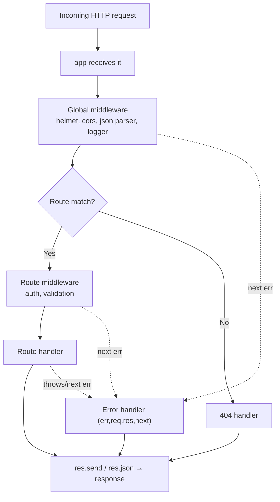
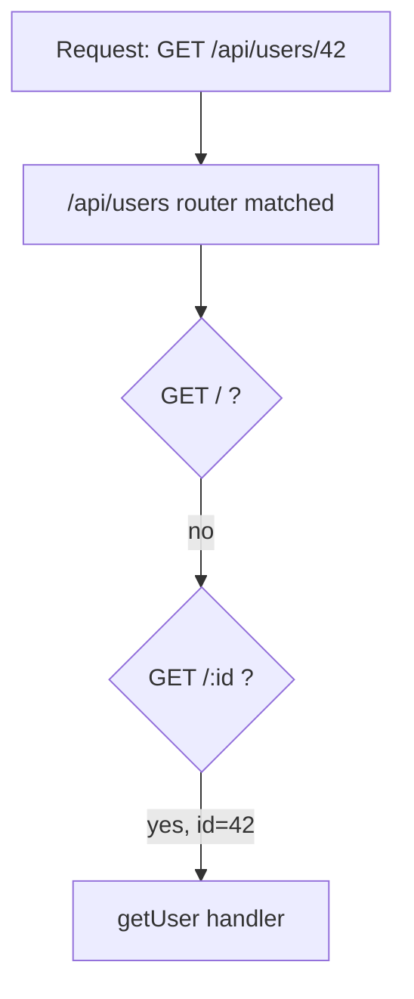
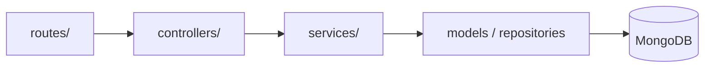
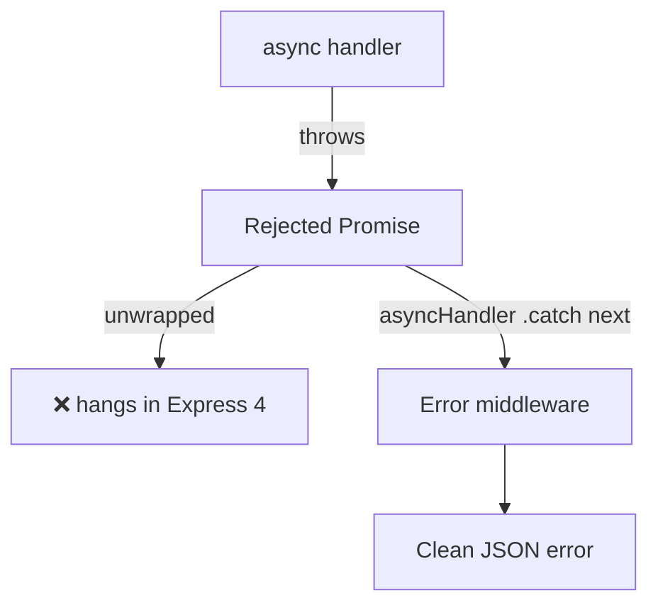
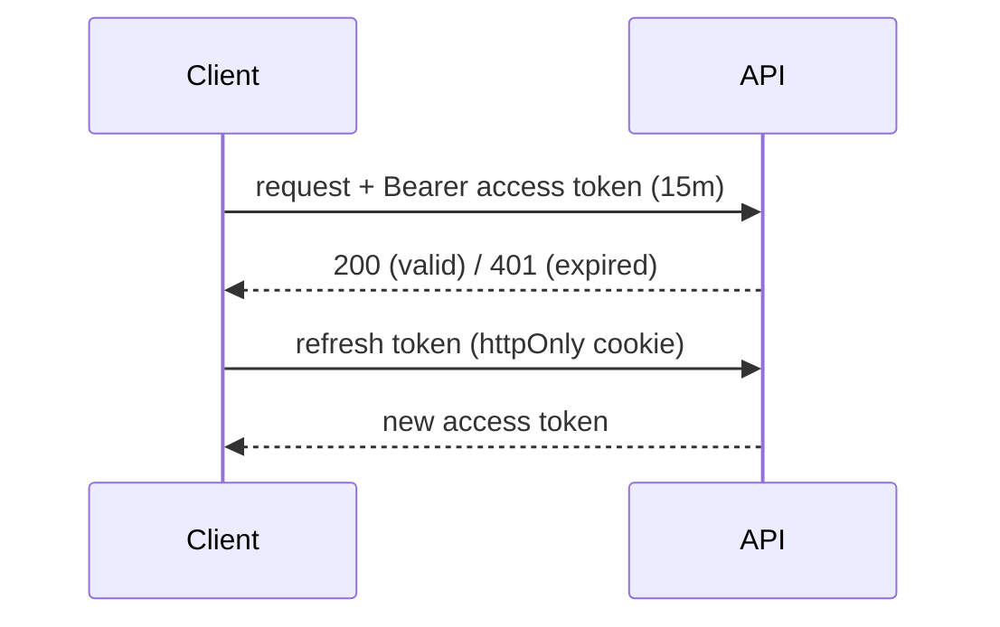

# Express Framework — Deep Dive & Interview Notes

> **Topic:** Express.js — the de-facto Node.js web framework
> **Target audience:** Backend Developer (Node.js, Express, MongoDB, REST APIs) — 2–8 years / up to senior
> **Format:** Concept deep dives + Q&A, with Mermaid diagrams, callouts, code, and follow-ups
> **Related notes:** [[nodejs]] · [[mongodb]] · [[git_notes]] · [[system-design]]

---

## Table of Contents

**Fundamentals**
1. [What is Express & why use it](#1-what-is-express--why-use-it)
2. [Request–Response Lifecycle](#2-requestresponse-lifecycle)
3. [Middleware — the heart of Express](#3-middleware--the-heart-of-express)
4. [Routing in depth](#4-routing-in-depth)
5. [Request & Response objects](#5-request--response-objects)

**Building real APIs**
6. [Project structure (layered architecture)](#6-project-structure-layered-architecture)
7. [Error handling](#7-error-handling)
8. [Validation](#8-validation)
9. [Authentication & Authorization](#9-authentication--authorization)
10. [Security hardening](#10-security-hardening)

**Production**
11. [Performance & scaling](#11-performance--scaling)
12. [Express 4 vs Express 5](#12-express-4-vs-express-5)
13. [Express vs Fastify vs Koa vs NestJS](#13-express-vs-fastify-vs-koa-vs-nestjs)

**Interview**
14. [Interview Questions](#14-interview-questions)
15. [Quick Cheat-Sheet](#15-quick-cheat-sheet)

---

## 1. What is Express & why use it

**Express is a minimal, unopinionated web framework for Node.js** that sits on top of the built-in `http` module and gives you routing, middleware, and request/response helpers — without dictating project structure.

Without Express you'd manually parse URLs, methods, and bodies on the raw `http` server. Express turns that into a clean declarative API.

```js
// Raw Node http — verbose
const http = require('http');
http.createServer((req, res) => {
  if (req.url === '/users' && req.method === 'GET') { /* ...manual... */ }
}).listen(3000);

// Express — declarative
const express = require('express');
const app = express();
app.get('/users', (req, res) => res.json(users));
app.listen(3000);
```

> [!NOTE] Why it's still dominant
> Express is **tiny, stable, and battle-tested**, with the largest middleware ecosystem in Node. It's the foundation many other frameworks (incl. parts of NestJS) build on. See [[nodejs]] for how the event loop powers its concurrency.

---

## 2. Request–Response Lifecycle

Every request flows through a **pipeline** of middleware and route handlers until something sends a response.



> [!IMPORTANT]
> Exactly **one** of two things must happen per request: a response is sent (`res.send/json/end/...`) **or** `next()` passes control onward. Do neither and the request **hangs** until timeout.

---

## 3. Middleware — the heart of Express

**Middleware are functions `(req, res, next)` executed in order during the request lifecycle.** They can read/modify `req`/`res`, end the response, or call `next()` to continue.

### Types of middleware


| Type | Registered with | Example |
|------|-----------------|---------|
| Application-level | `app.use()` / `app.METHOD()` | request logger |
| Router-level | `router.use()` | auth for `/admin/*` |
| Built-in | `express.json()`, `express.static()` | body parsing, static files |
| Third-party | `app.use(helmet())` | security, CORS |
| Error-handling | `app.use((err,req,res,next)=>…)` | centralized errors |

### Code

```js
// Custom middleware: attach a request id + timing
app.use((req, res, next) => {
  req.id = crypto.randomUUID();
  const start = Date.now();
  res.on('finish', () => console.log(`${req.id} ${req.method} ${req.url} ${Date.now()-start}ms`));
  next();                               // ALWAYS continue or respond
});

// Path-scoped middleware
app.use('/api/admin', requireAdmin);    // runs only for /api/admin/*
```

> [!WARNING] Order matters
> Express runs middleware **top-to-bottom in registration order**. `express.json()` must come **before** handlers that read `req.body`; the error handler and 404 handler must be registered **last**.

> [!TIP]
> Keep middleware **single-purpose**. Never put blocking/CPU-heavy work in middleware — it runs on every request and stalls the event loop ([[nodejs]] Q1).

---

## 4. Routing in depth

**Routing maps an HTTP method + path to a handler.** Use `express.Router` to modularize.

```js
// routes/users.js
const router = express.Router();
router.get('/', listUsers);
router.get('/:id', getUser);            // route param → req.params.id
router.post('/', createUser);
module.exports = router;

// app.js
app.use('/api/users', require('./routes/users'));   // mount prefix
```

### Route matching rules

- **First match wins** — order specific routes before generic ones.
- **Params** (`/:id`) → `req.params`; **query** (`?sort=asc`) → `req.query`.
- Supports patterns and (Express 5) named wildcards.
- `app.route('/x').get(…).post(…)` chains methods on one path.



> [!NOTE] `app.use` vs `app.get`
> `app.use(path, fn)` matches the path **as a prefix** for **all** methods (great for middleware); `app.get(path, fn)` matches the path **exactly** for GET only.

> [!WARNING]
> A catch-all like `app.get('/:slug', …)` placed **before** `/about` will swallow `/about`. Put static/specific routes first.

---

## 5. Request & Response objects

> [!question]- Common `req` properties
> - `req.params` — route params (`/:id`)
> - `req.query` — query string (`?page=2`)
> - `req.body` — parsed body (needs `express.json()`/`urlencoded()`)
> - `req.headers` / `req.get('Authorization')`
> - `req.cookies` (with `cookie-parser`), `req.ip`, `req.method`, `req.path`

> [!question]- Common `res` methods
> - `res.json(obj)` — send JSON (sets Content-Type)
> - `res.status(201).json(...)` — chainable status
> - `res.send(...)`, `res.end()`, `res.sendStatus(204)`
> - `res.set('X-Foo','bar')` — set header
> - `res.redirect('/login')`, `res.cookie(...)`, `res.sendFile(...)`

> [!WARNING]
> Calling `res.send` twice throws **`Cannot set headers after they are sent`**. Always `return` after sending in branches:
> ```js
> if (!user) return res.status(404).json({ error: 'not found' });
> res.json(user);   // only runs if user exists
> ```

---

## 6. Project structure (layered architecture)

**Separate HTTP concerns from business logic from data access** — keeps code testable and framework-agnostic.



```
src/
 ├─ routes/        → endpoints + route middleware
 ├─ controllers/   → parse req, call service, shape response (HTTP only)
 ├─ services/      → business rules (NO req/res here)
 ├─ models/        → Mongoose schemas / data access
 ├─ middlewares/   → auth, validation, error handler
 ├─ config/        → env, db connection
 └─ app.js / server.js
```

> [!TIP]
> Keep `req`/`res` **out of services**. Pure services are unit-testable and reusable from queue workers, cron jobs, or CLIs — not just HTTP. See [[nodejs]] §G2.

---

## 7. Error handling

**Express 4 does NOT auto-catch errors thrown in `async` handlers** — a rejected promise won't reach your error middleware unless you forward it. Funnel all errors into one centralized handler.

```js
// asyncHandler wrapper — turns rejections into next(err)
const asyncHandler = (fn) => (req, res, next) =>
  Promise.resolve(fn(req, res, next)).catch(next);

class AppError extends Error {
  constructor(message, status) { super(message); this.status = status; this.isOperational = true; }
}

app.get('/users/:id', asyncHandler(async (req, res) => {
  const user = await User.findById(req.params.id);
  if (!user) throw new AppError('User not found', 404);   // safely forwarded
  res.json(user);
}));

// 404 (after all routes)
app.use((req, res) => res.status(404).json({ error: 'Not found' }));

// Centralized error handler (LAST, 4 args)
app.use((err, req, res, next) => {
  const status = err.status || 500;
  if (status >= 500) console.error(err);                  // log unexpected
  res.status(status).json({ error: err.isOperational ? err.message : 'Internal Server Error' });
});
```



> [!IMPORTANT]
> Distinguish **operational errors** (validation, not-found → clean 4xx) from **programmer errors** (bugs → log fully, generic 500). Never leak stack traces to clients. See [[nodejs]] Q6.

> [!TIP] Express 5
> Express 5 **automatically forwards rejected promises** from async handlers to the error middleware — no wrapper needed.

---

## 8. Validation

**Validate and sanitize every incoming payload at the edge** — never trust client input. Use a schema library (Zod / Joi) in a middleware.

```js
const { z } = require('zod');
const createUser = z.object({
  email: z.string().email(),
  age: z.number().int().min(0).max(120),
});

const validate = (schema) => (req, res, next) => {
  const result = schema.safeParse(req.body);
  if (!result.success) return res.status(400).json({ errors: result.error.issues });
  req.body = result.data;               // use parsed/coerced data
  next();
};

app.post('/users', validate(createUser), createUserHandler);
```

> [!WARNING]
> Validation also prevents **NoSQL injection** — type-checking stops `{ "$gt": "" }` style payloads from reaching MongoDB. See [[nodejs]] Q12.

---

## 9. Authentication & Authorization

**Authentication = who you are; Authorization = what you may do.** Verify identity in one middleware, check permissions in another.

```js
function authenticate(req, res, next) {
  const token = req.get('Authorization')?.split(' ')[1];
  if (!token) return res.status(401).json({ error: 'No token' });
  try { req.user = jwt.verify(token, process.env.JWT_SECRET); next(); }
  catch { return res.status(401).json({ error: 'Invalid token' }); }
}

const authorize = (...roles) => (req, res, next) =>
  roles.includes(req.user.role) ? next() : res.status(403).json({ error: 'Forbidden' });

app.delete('/posts/:id', authenticate, authorize('admin'), deletePost);
```



> [!IMPORTANT] IDOR
> Authentication alone isn't enough — always check **ownership**: a logged-in user must not delete *another* user's resource. Missing this is the classic **IDOR** vulnerability. See [[nodejs]] §D.

---

## 10. Security hardening

```js
app.use(helmet());                              // secure HTTP headers (CSP, HSTS…)
app.use(cors({ origin: ['https://app.example.com'], credentials: true }));
app.use(express.json({ limit: '10kb' }));       // cap body size (DoS guard)
app.use(rateLimit({ windowMs: 60_000, max: 100 }));
app.use(mongoSanitize());                        // strip $ and . to block NoSQL injection
app.disable('x-powered-by');                     // hide framework fingerprint
```

> [!question]- Security checklist
> - **HTTPS/TLS** (terminate at LB/proxy) · **helmet** headers · **tight CORS**
> - **Validate & sanitize** all input · **parameterized** queries
> - **bcrypt/argon2** password hashing · short-lived JWT + refresh
> - **Rate limiting** ([[nodejs]] Q10) · **body-size limits**
> - **Secrets in env / secret manager**, never in code · `npm audit` in CI
> - **No stack traces** to clients · log security events

> [!WARNING]
> `cors({ origin: '*', credentials: true })` is invalid/insecure — browsers reject wildcard origin with credentials. Whitelist explicit origins.

---

## 11. Performance & scaling

> [!question]- High-impact Express performance levers
> - **Compression**: `app.use(compression())` (gzip responses) — or better, do it at the reverse proxy.
> - **Caching**: HTTP `Cache-Control`/`ETag` for clients/CDN; Redis for hot data ([[nodejs]] §F).
> - **Stream large payloads** instead of buffering (`fs.createReadStream().pipe(res)`).
> - **Avoid blocking the loop** — offload CPU work to worker_threads/queue.
> - **Connection pooling** for MongoDB; reuse the client.
> - **Cluster / PM2 `-i max`** to use all cores; keep the app **stateless** ([[nodejs]] Q7).
> - **Pagination** (cursor over offset) for list endpoints.
> - Put a reverse proxy (nginx) / CDN in front for TLS, static assets, and rate limiting at the edge.

> [!TIP]
> Set `app.set('trust proxy', 1)` behind a load balancer so `req.ip`, rate limiting, and `Secure` cookies work correctly with `X-Forwarded-*` headers.

---

## 12. Express 4 vs Express 5

| Change | Express 4 | Express 5 |
|--------|-----------|-----------|
| Async errors | Not auto-caught (need wrapper) | **Auto-forwarded** to error handler |
| Node version | older supported | requires modern Node (18+) |
| Path matching | `path-to-regexp` v0 | updated; named wildcards `/*splat` |
| Deprecated APIs | present | removed (`app.del`, `res.json(status,obj)`…) |
| Promise support | partial | improved |

> [!NOTE]
> Express 5 reached stable release. The biggest practical win is **native async error handling**, removing the need for `asyncHandler` wrappers.

---

## 13. Express vs Fastify vs Koa vs NestJS

| | Style | Strengths | Best for |
|---|-------|-----------|----------|
| **Express** | minimal, middleware | huge ecosystem, simple, stable | most APIs, learning, flexibility |
| **Fastify** | schema-first | fastest, built-in validation/logging | high-throughput JSON APIs |
| **Koa** | async/await `ctx` | tiny, modern core | minimalists wanting full control |
| **NestJS** | opinionated, TS, DI | structure, modules, scalable teams | large enterprise apps |

> [!TIP]
> NestJS can run **on top of Express** (default) or Fastify — so Express knowledge transfers directly.

---

## 14. Interview Questions

> [!question]- Beginner
> **Q: What is Express and what problem does it solve?**
> A minimal Node web framework adding routing, middleware, and req/res helpers over the raw `http` module — so you don't hand-parse URLs/methods/bodies.
>
> **Q: What is middleware?**
> A function `(req, res, next)` run in order during the request cycle; it can modify req/res, end the response, or call `next()` to continue.
>
> **Q: How do you read a route param vs a query string?**
> `req.params.id` for `/users/:id`; `req.query.sort` for `?sort=asc`.
>
> **Q: How do you parse a JSON body?**
> `app.use(express.json())` — then read `req.body`.

> [!question]- Intermediate
> **Q: Why does middleware order matter?**
> Express executes middleware in registration order; body parsers must precede handlers that use the body, and the error/404 handlers must be last.
>
> **Q: How does error-handling middleware differ?**
> It takes **four** args `(err, req, res, next)` and is triggered by `next(err)` or a thrown sync error. Register it last.
>
> **Q: `app.use` vs `app.get`?**
> `app.use` matches the path as a **prefix for all methods** (middleware); `app.get` matches **exactly for GET**.
>
> **Q: How do you catch errors in async route handlers (Express 4)?**
> Wrap with an `asyncHandler` that does `Promise.resolve(fn(...)).catch(next)`, or use `express-async-errors`. Express 5 does this natively.

> [!question]- Senior / Scenario
> **Q: How would you structure a large Express codebase?**
> Layered: routes → controllers → services → repositories/models, with cross-cutting middleware (auth, validation, errors). Keep req/res out of services for testability.
>
> **Q: How do you implement RBAC?**
> An `authenticate` middleware that verifies the token and sets `req.user`, then an `authorize(...roles)` middleware that checks role/ownership before the handler.
>
> **Q: A route works locally but rate limiting / `req.ip` is wrong in production behind a load balancer — why?**
> You need `app.set('trust proxy', …)` so Express reads `X-Forwarded-For`/`X-Forwarded-Proto`.
>
> **Q: How do you handle file uploads?**
> Use `multer` (multipart parsing) with size/type limits; stream large files to storage (S3) rather than buffering in memory.
>
> **Q: How do you make an Express app production-ready?**
> helmet + CORS + rate limiting + validation + centralized errors + structured logging + health checks + graceful shutdown + cluster/PM2 + stateless design. See [[nodejs]] §H.

---

## 15. Quick Cheat-Sheet

| Task | Code |
|------|------|
| Create app | `const app = express()` |
| JSON body parsing | `app.use(express.json())` |
| Static files | `app.use(express.static('public'))` |
| Route | `app.get('/x', handler)` |
| Router mount | `app.use('/api', router)` |
| Path middleware | `app.use('/admin', mw)` |
| Send JSON + status | `res.status(201).json(obj)` |
| Redirect | `res.redirect('/login')` |
| 404 handler | `app.use((req,res)=>res.sendStatus(404))` |
| Error handler | `app.use((err,req,res,next)=>{…})` |
| Trust proxy | `app.set('trust proxy', 1)` |
| Security stack | `helmet()` · `cors()` · `rateLimit()` |

---

> [!NOTE] How to use this note
> Pair it with [[nodejs]] — Express questions almost always branch into Node internals (event loop, async, scaling) and data (MongoDB). Practice explaining the **request lifecycle** and **middleware order** out loud; they're the most common Express interview openers.

### See Also
- [[nodejs]] — Node.js core, async, scaling, security, MongoDB
- [[mongodb]] — schema design, aggregation, transactions
- [[system-design]] — scaling, caching, queues
- [[git_notes]] — version control
