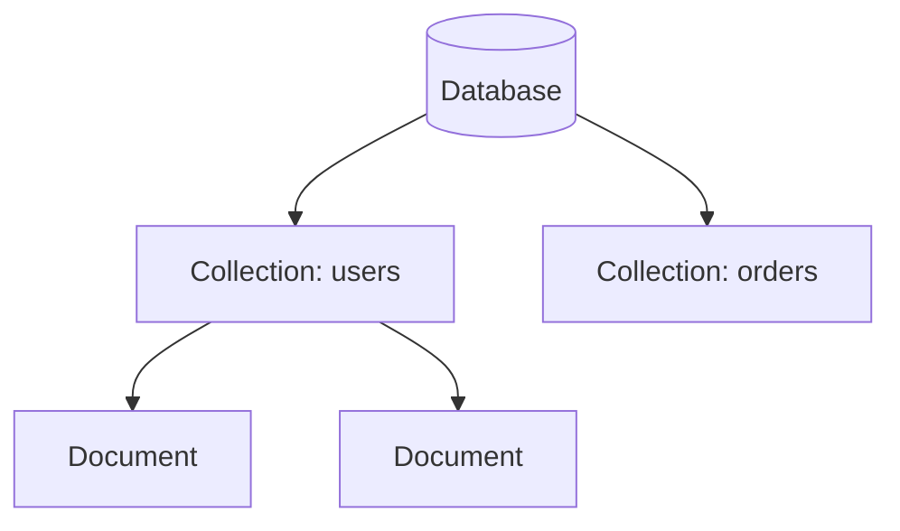
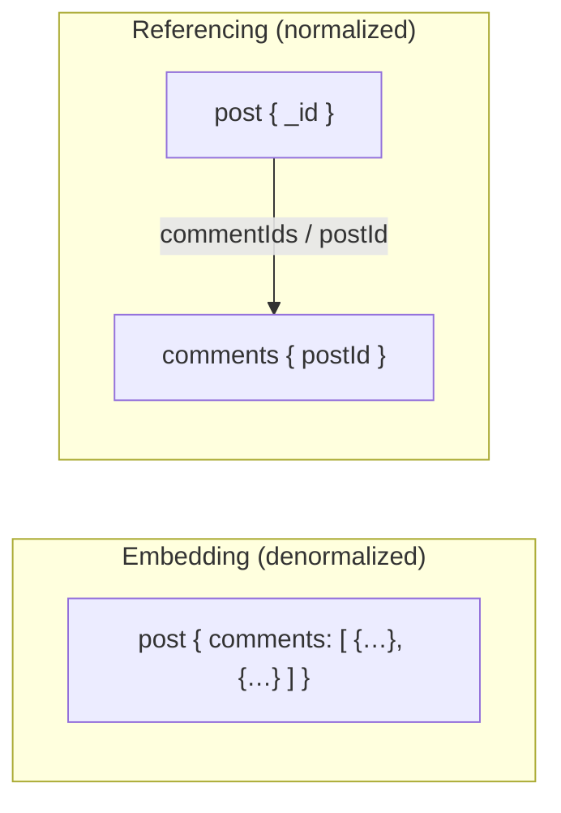
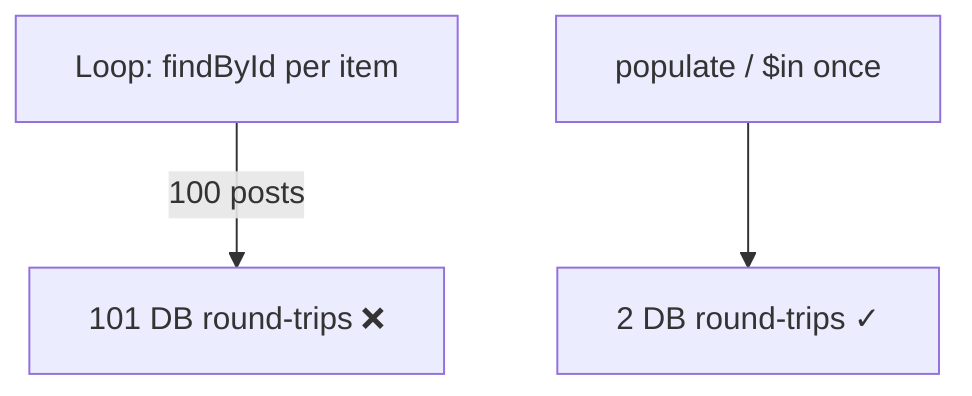
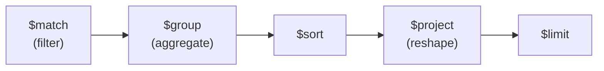
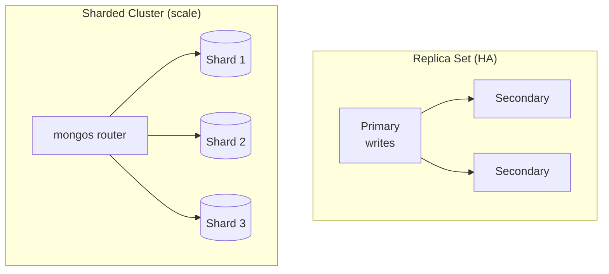

# MongoDB & Mongoose — Deep Dive & Interview Notes

> **Topic:** MongoDB (document database) + Mongoose (Node.js ODM)
> **Target audience:** Backend Developer (Node.js) — 2–8 years / up to senior
> **Format:** Concept deep dives + Q&A, with Mermaid diagrams, callouts, code, and follow-ups
> **Related notes:** [[nodejs]] · [[express]] · [[system-design]] · [[git_notes]]

---

## Table of Contents

**Fundamentals**
1. [What is MongoDB & when to use it](#1-what-is-mongodb--when-to-use-it)
2. [Documents, BSON & the data model](#2-documents-bson--the-data-model)
3. [CRUD operations](#3-crud-operations)

**Modeling**
4. [Schema Design — Embedding vs Referencing](#4-schema-design--embedding-vs-referencing)
5. [Mongoose essentials](#5-mongoose-essentials)
6. [populate & the N+1 problem](#6-populate--the-n1-problem)

**Querying at scale**
7. [Indexes](#7-indexes)
8. [Aggregation Pipeline](#8-aggregation-pipeline)
9. [Pagination](#9-pagination)

**Distributed & production**
10. [Transactions](#10-transactions)
11. [Replica Sets & Sharding](#11-replica-sets--sharding)
12. [Concurrency control](#12-concurrency-control)
13. [Performance & production tips](#13-performance--production-tips)

14. [Interview Questions](#14-interview-questions)
15. [Quick Cheat-Sheet](#15-quick-cheat-sheet)

---

## 1. What is MongoDB & when to use it

**MongoDB is a NoSQL, document-oriented database** that stores data as flexible JSON-like documents instead of rows in tables. It trades rigid schemas and multi-table JOINs for flexibility, horizontal scalability, and a data model that maps naturally to application objects.

| | SQL (relational) | MongoDB (document) |
|---|---|---|
| Unit | row in a table | document in a collection |
| Schema | fixed, enforced | flexible (per-document) |
| Relations | JOINs across tables | embed or reference + `$lookup` |
| Scaling | mostly vertical | horizontal (sharding) built-in |
| Transactions | core strength | supported (replica set) |

> [!NOTE] When to choose MongoDB
> Great for: evolving/varied schemas, hierarchical/nested data, high write throughput, content/catalogs, rapid iteration. Less ideal for: heavily relational data with many-to-many JOINs and strict cross-entity transactional integrity (a relational DB may fit better).

> [!TIP]
> "Schemaless" is misleading — you still design a schema, you just enforce it in the **application** (via [[#5. Mongoose essentials]]) rather than the database.

---

## 2. Documents, BSON & the data model

**Documents are stored as BSON** (Binary JSON) — a binary-encoded superset of JSON adding types like `ObjectId`, `Date`, `Decimal128`, and binary data.

```js
{
  _id: ObjectId("652f1c..."),     // 12-byte unique id, auto-generated
  name: "Ada",
  roles: ["admin", "editor"],     // arrays natively
  profile: { city: "London" },    // nested sub-documents
  createdAt: ISODate("2026-01-01")
}
```



> [!question]- What is `_id` / ObjectId?
> Every document has a unique `_id` (default a 12-byte **ObjectId**: 4-byte timestamp + 5-byte random + 3-byte counter). It's **roughly time-ordered**, so sorting by `_id` ≈ sorting by creation time — handy for cursor pagination ([[#9. Pagination]]).

> [!WARNING]
> Max document size is **16 MB**. Don't model unbounded growing arrays (all comments on a viral post) inside one document — reference instead ([[#4. Schema Design]]).

---

## 3. CRUD operations

```js
// Create
await db.users.insertOne({ name: "Ada", age: 36 });
await db.users.insertMany([...]);

// Read
await db.users.find({ age: { $gte: 18 } }).sort({ age: -1 }).limit(10);
await db.users.findOne({ _id });

// Update
await db.users.updateOne({ _id }, { $set: { age: 37 }, $inc: { logins: 1 } });
await db.users.updateMany({ active: false }, { $set: { archived: true } });

// Delete
await db.users.deleteOne({ _id });
```

> [!question]- Essential query operators
> - **Comparison:** `$eq $ne $gt $gte $lt $lte $in $nin`
> - **Logical:** `$and $or $not $nor`
> - **Element:** `$exists $type`
> - **Array:** `$all $elemMatch $size`
> - **Update:** `$set $unset $inc $push $pull $addToSet $rename`

> [!TIP]
> Use **atomic update operators** (`$inc`, `$push`) instead of read-modify-write in app code — they avoid race conditions and round-trips. See [[#12. Concurrency control]].

---

## 4. Schema Design — Embedding vs Referencing

**The single most important MongoDB decision.** Model data by how it's *accessed*, not by normalization rules.



| Embed when… | Reference when… |
|-------------|-----------------|
| Data read together | Data queried independently |
| 1:1 or 1:few | 1:many / many:many |
| Sub-doc has no life of its own | Entity shared across parents |
| Bounded size | Unbounded growth |

> [!IMPORTANT] The golden rule
> **"Data that is accessed together should be stored together."** Embedding gives single-read performance (no JOIN); referencing keeps documents small and avoids duplication. Most real schemas **mix both**.

> [!WARNING]
> Unbounded embedded arrays are the #1 schema mistake → hit the 16 MB limit and slow every read of the parent. For 1:many that grows without bound (orders per user, comments per post), **reference**.

> [!TIP] Denormalization on purpose
> It's fine to **duplicate** a few fields (e.g. store `authorName` on a post) to avoid a lookup on a hot read path — accept the cost of updating duplicates. This is a deliberate read-optimization trade-off.

---

## 5. Mongoose essentials

**Mongoose is an ODM** that adds schemas, validation, type casting, middleware (hooks), and query helpers on top of the MongoDB driver.

```js
const userSchema = new mongoose.Schema({
  email: { type: String, required: true, unique: true, lowercase: true },
  age:   { type: Number, min: 0, max: 120 },
  role:  { type: String, enum: ['user', 'admin'], default: 'user' },
}, { timestamps: true });           // auto createdAt / updatedAt

// Middleware (hook): hash password before save
userSchema.pre('save', async function () {
  if (this.isModified('password')) this.password = await bcrypt.hash(this.password, 12);
});

// Virtual (computed, not stored)
userSchema.virtual('isAdult').get(function () { return this.age >= 18; });

const User = mongoose.model('User', userSchema);
```

> [!question]- Key Mongoose features
> - **Validation** — `required`, `min/max`, `enum`, custom validators (runs on `save`/`validate`).
> - **Middleware/hooks** — `pre`/`post` for `save`, `findOneAndUpdate`, `remove`, aggregate.
> - **Virtuals** — computed fields not persisted (e.g. `fullName`).
> - **`.lean()`** — return plain objects, skip hydration → faster reads.
> - **Query helpers / statics / methods** — reusable query logic.

> [!WARNING]
> Update hooks (`pre('save')`) **don't run** on `updateOne`/`findByIdAndUpdate` by default — those bypass document middleware. Use `findOneAndUpdate` hooks or `runValidators: true`. A common source of "my hook didn't fire" bugs.

> [!TIP]
> Use `.lean()` on read-only endpoints (no need for `.save()`, virtuals, getters) — significantly less CPU/memory. See [[nodejs]] §E3.

---

## 6. populate & the N+1 problem

**`populate` resolves referenced ObjectIds into full documents** — Mongoose's "JOIN".

```js
// post.author is an ObjectId ref → replace with the user doc
const posts = await Post.find().populate('author', 'name email');
```

> [!WARNING] The N+1 trap
> Calling `populate`/`findById` **inside a loop** fires one query per item — 100 posts → 101 queries.

```js
// ❌ N+1
for (const post of posts) post.author = await User.findById(post.authorId);

// ✅ batch: populate over the whole set (or one $in query)
const posts = await Post.find().populate('author');
```



> [!TIP]
> `populate` runs a **second query** under the hood (not a server-side JOIN). For heavy joins/aggregation, use `$lookup` in the [[#8. Aggregation Pipeline]] to do it in one server-side operation. Related: [[nodejs]] Q9 (slow endpoint / N+1 fix).

---

## 7. Indexes

**An index is a B-tree of sorted field values + pointers** so queries avoid scanning every document (a COLLSCAN). Reads get fast; writes pay a small cost.

```js
userSchema.index({ email: 1 }, { unique: true });
userSchema.index({ status: 1, createdAt: -1 });   // compound

// Diagnose: COLLSCAN vs IXSCAN
await User.find({ status: 'active' }).sort({ createdAt: -1 }).explain('executionStats');
```

> [!IMPORTANT] The ESR rule
> Order compound-index fields as **Equality → Sort → Range**. A `{a:1,b:1,c:1}` index serves queries on prefixes `{a}`, `{a,b}`, `{a,b,c}` — but **not** `{b}` or `{c}` alone.

> [!question]- Index types
> - **Single / Compound** — most queries.
> - **Unique** — enforce uniqueness (`email`).
> - **Partial** — index a subset (`{ active: true }`) → smaller.
> - **Sparse** — skip docs missing the field.
> - **TTL** — auto-expire docs (sessions, OTPs) after N seconds.
> - **Text** — full-text search. **Geospatial** — `$near` queries.

> [!WARNING]
> Too many indexes → slow writes + bloated RAM (indexes should fit in memory). Building an index in the **foreground locks** the collection — use background/rolling builds in prod. Drop unused indexes (`$indexStats`).

This is covered in depth in [[nodejs]] Q8 — including covered queries and `explain` analysis.

---

## 8. Aggregation Pipeline

**A pipeline transforms documents through ordered stages** — each stage's output feeds the next. It's MongoDB's analytics/reporting engine (grouping, joins, computed fields).



```js
// Total revenue per customer, top 5
await Order.aggregate([
  { $match: { status: 'paid' } },                              // filter early!
  { $group: { _id: '$customerId', total: { $sum: '$amount' } } },
  { $sort: { total: -1 } },
  { $limit: 5 },
  { $lookup: { from: 'users', localField: '_id',
               foreignField: '_id', as: 'customer' } },        // server-side join
]);
```

> [!question]- Common stages
> `$match` filter · `$group` aggregate (`$sum/$avg/$max/$push`) · `$sort` · `$project` reshape · `$limit/$skip` · `$lookup` join · `$unwind` flatten arrays · `$addFields` compute · `$facet` multiple pipelines at once.

> [!IMPORTANT]
> Put `$match` (and `$sort` on indexed fields) **as early as possible** — it lets the pipeline use indexes and shrinks the working set before expensive stages. Filtering late processes far more documents.

> [!TIP]
> `$lookup` is a single server-side join — preferable to app-side `populate` loops for analytics. But on huge collections, large `$lookup`/`$group` can be memory-heavy; ensure supporting indexes and consider `allowDiskUse`.

---

## 9. Pagination

**Offset pagination (`skip`/`limit`) is simple but degrades on deep pages; cursor (keyset) pagination stays fast at any depth.**

```js
// ❌ Offset — DB must walk & discard `skip` docs → slow at page 10,000
await Post.find().sort({ _id: -1 }).skip(page * 20).limit(20);

// ✅ Cursor — uses index, O(log n), stable under inserts
await Post.find({ _id: { $lt: lastSeenId } }).sort({ _id: -1 }).limit(20);
```

> [!TIP]
> Use **cursor pagination** for infinite scroll / large or fast-changing datasets (also avoids skipped/duplicated rows when items are inserted between pages). Offset is fine for small, bounded admin tables. See [[express]] §C4.

---

## 10. Transactions

**Multi-document ACID transactions run in a session and commit/abort atomically** — requires a replica set (even single-node).

```js
const session = await mongoose.startSession();
try {
  await session.withTransaction(async () => {
    await Account.updateOne({ _id: a }, { $inc: { balance: -100 } }, { session });
    await Account.updateOne({ _id: b }, { $inc: { balance: +100 } }, { session });
  });
} finally { session.endSession(); }
```

> [!WARNING]
> Transactions add latency and hold locks → don't overuse. Often the better fix is **schema design**: embed related data so a single-document update (which is *always* atomic) does the job. Classic legitimate use: money transfers between accounts.

> [!NOTE]
> A **single document write is always atomic** in MongoDB — including updates to nested fields/arrays within it. Multi-document transactions are only needed when atomicity must span documents/collections.

---

## 11. Replica Sets & Sharding

**Replica set = primary + secondaries (high availability). Sharding = horizontal partitioning across machines (scale).**



> [!question]- Key concepts
> - **Failover:** if the primary dies, secondaries **elect** a new primary automatically.
> - **Write concern (`w`):** how many nodes must ack a write. `w:"majority"` = durable, survives failover.
> - **Read preference:** `primary` (fresh) vs `secondary` (scales reads, but **eventually consistent** / possibly stale).
> - **Shard key:** the field data is partitioned by — choosing it well (high cardinality, even distribution) is critical; a bad key creates hotspots.

> [!WARNING]
> Reading from secondaries can return **stale data** (replication lag) — a CAP/consistency trade-off. Choose read preference per operation. See [[system-design]] §12 (CAP).

---

## 12. Concurrency control

**Two clients updating the same doc can cause lost updates.** Strategies:

- **Atomic operators** (`$inc`, `$push`, `findOneAndUpdate`) — let the DB do read-modify-write atomically. Prefer this.
- **Optimistic concurrency** — version field; update only if version matches, else retry.

```js
// Optimistic locking — prevents lost updates without locking
const res = await Doc.updateOne(
  { _id, version: currentVersion },
  { $set: data, $inc: { version: 1 } }
);
if (res.matchedCount === 0) { /* someone else updated → reload & retry */ }
```

> [!TIP]
> Mongoose has built-in optimistic concurrency via the `__v` version key (enable `optimisticConcurrency: true`). Avoid read-then-write in app code where an atomic operator would do. See [[nodejs]] §E6.

---

## 13. Performance & production tips

> [!question]- Production checklist
> - **Index** for your real query patterns; verify with `explain` (IXSCAN not COLLSCAN). [[#7. Indexes]]
> - **`.lean()`** on read-only queries. **`.select()`** only needed fields.
> - **Avoid N+1** — batch with `$in` / `populate` / `$lookup`. [[#6. populate]]
> - **Connection pooling** — reuse one connection (Mongoose manages a pool; tune `maxPoolSize`).
> - **Cursor pagination** over deep `skip`. [[#9. Pagination]]
> - **Cache hot reads** in Redis. [[system-design]] §4
> - **Filter early** in aggregation; add supporting indexes.
> - **Bounded documents** — no unbounded arrays. [[#4. Schema Design]]
> - **TTL indexes** to auto-expire sessions/tokens.
> - **Write concern** tuned to durability needs; **majority** for critical data.

> [!IMPORTANT]
> The working set (frequently-accessed data + indexes) should **fit in RAM**. When it spills to disk, latency spikes. Monitor index size, cache-hit ratio, slow queries (`db.setProfilingLevel`).

---

## 14. Interview Questions

> [!question]- Fundamentals
> **Q: SQL vs MongoDB — when each?** Relational/strict-integrity/heavy-JOIN → SQL; flexible/nested/evolving schema, high write throughput, horizontal scale → MongoDB.
> **Q: What is BSON?** Binary JSON with extra types (ObjectId, Date, Decimal128); what MongoDB stores.
> **Q: What's in an ObjectId?** 12 bytes: timestamp + random + counter — roughly time-ordered, globally unique.
> **Q: Is MongoDB schemaless?** No — you design a schema, enforced in the app (Mongoose) rather than the DB.

> [!question]- Modeling & querying
> **Q: Embedding vs referencing?** Embed data read together / bounded / 1:few; reference for 1:many, shared, independently-queried, unbounded.
> **Q: What's the N+1 problem and the fix?** One query per item in a loop; fix with `populate`/`$in`/`$lookup` batching.
> **Q: How do indexes work and the ESR rule?** B-tree avoiding COLLSCAN; order compound fields Equality→Sort→Range.
> **Q: When use the aggregation pipeline?** Grouping, computed reports, server-side joins (`$lookup`); `$match` early to use indexes.
> **Q: Offset vs cursor pagination?** Offset slow at depth; cursor uses the index and is stable.

> [!question]- Distributed & production
> **Q: How do transactions work / when to use?** Session-based, atomic across docs, need a replica set; prefer schema design (single-doc atomicity) when possible.
> **Q: Replica set vs sharding?** Replica set = HA/failover; sharding = horizontal scale by shard key.
> **Q: What is write concern / read preference?** How many nodes ack a write (durability) / which node serves reads (freshness vs scale).
> **Q: How do you prevent lost updates?** Atomic operators or optimistic concurrency (version field).
> **Q: Why might reading from a secondary return stale data?** Replication lag → eventual consistency. [[system-design]] §12

---

## 15. Quick Cheat-Sheet

| Concept | One-liner |
|---------|-----------|
| Document / BSON | JSON-like record; binary-encoded with rich types |
| `_id` / ObjectId | 12-byte unique, time-ordered id |
| 16 MB limit | no unbounded embedded arrays |
| Embed vs reference | together+bounded vs many/shared/unbounded |
| Atomic ops | `$set $inc $push $addToSet` — race-free |
| `.lean()` | plain objects, faster read-only queries |
| populate | second-query "join"; beware N+1 |
| Index | B-tree; verify with `explain` (IXSCAN) |
| ESR rule | Equality → Sort → Range in compound index |
| TTL index | auto-expire docs (sessions, OTP) |
| Aggregation | staged transform; `$match` early; `$lookup` join |
| Cursor pagination | `_id < lastSeen` — fast at any depth |
| Transaction | atomic multi-doc; needs replica set |
| Replica set | primary + secondaries → HA + failover |
| Sharding | partition by shard key → horizontal scale |
| Write concern | `w:"majority"` for durability |
| Optimistic concurrency | version field prevents lost updates |

---

> [!NOTE] How to use this note
> The two highest-signal MongoDB interview topics are **schema design (embed vs reference)** and **indexing (ESR + `explain`)** — be ready to reason about both with a concrete example. Pair with [[nodejs]] §E (Mongoose Q&A) and [[express]] (the API layer above the data).

### See Also
- [[nodejs]] — Node.js core, async, scaling, security, Mongoose Q&A
- [[express]] — Express framework deep dive
- [[system-design]] — caching, queues, CAP, scaling
- [[git_notes]] — version control
