# Node.js Backend Interview Questions

> **Target audience:** Backend Developer (Node.js, Express, MongoDB, REST APIs) — 2–5 years experience
> **Format:** Question & Answer, with deep explanations, Mermaid diagrams, callouts, and follow-ups
> **Related notes:** [[git_notes]] · [[express]] · [[mongodb]] · [[system-design]]

---

## Table of Contents

**Beginner**
- [Q1. What is the Event Loop and how does Node.js handle concurrency?](#q1-what-is-the-event-loop-and-how-does-nodejs-handle-concurrency)
- [Q2. What is the difference between `process.nextTick`, `setImmediate`, and `setTimeout`?](#q2-what-is-the-difference-between-processnexttick-setimmediate-and-settimeout)
- [Q3. Callbacks vs Promises vs Async/Await](#q3-callbacks-vs-promises-vs-asyncawait)

**Intermediate**
- [Q4. How does middleware work in Express?](#q4-how-does-middleware-work-in-express)
- [Q5. How do streams and buffers work in Node.js?](#q5-how-do-streams-and-buffers-work-in-nodejs)
- [Q6. How do you handle errors in async Express routes?](#q6-how-do-you-handle-errors-in-async-express-routes)

**Senior**
- [Q7. How does Node.js scale across CPU cores (cluster / worker_threads)?](#q7-how-does-nodejs-scale-across-cpu-cores-cluster--worker_threads)
- [Q8. How do MongoDB indexes work and when do they hurt you?](#q8-how-do-mongodb-indexes-work-and-when-do-they-hurt-you)

**Scenario-based**
- [Q9. An API endpoint is slow under load. How do you debug it?](#q9-an-api-endpoint-is-slow-under-load-how-do-you-debug-it)
- [Q10. Design a rate limiter for a REST API](#q10-design-a-rate-limiter-for-a-rest-api)

**Production**
- [Q11. How do you prevent and detect memory leaks in production?](#q11-how-do-you-prevent-and-detect-memory-leaks-in-production)
- [Q12. How do you secure a production Node.js REST API?](#q12-how-do-you-secure-a-production-nodejs-rest-api)

---

## Q1. What is the Event Loop and how does Node.js handle concurrency?

### Short Interview Answer

Node.js is **single-threaded** for executing JavaScript but achieves concurrency through an **event loop** backed by **libuv**. Instead of blocking on I/O (file, network, DB), Node offloads those operations to the OS or a thread pool and registers a callback. The event loop continuously checks for completed operations and runs their callbacks, so a single thread can handle thousands of concurrent connections without one slow request blocking the others.

### Detailed Explanation

The common misconception is that Node "is single-threaded so it can only do one thing." The accurate statement is: **your JavaScript runs on one thread, but I/O is asynchronous and handled elsewhere.**

Node.js sits on top of two key libraries:
- **V8** — Google's engine that compiles and runs JavaScript.
- **libuv** — a C library providing the event loop, async I/O, and a **thread pool** (default 4 threads) for operations the OS can't do asynchronously (e.g. file system, DNS, crypto).

When you make an async call (e.g. reading a file), the function returns immediately. libuv performs the work in the background and, when done, queues your callback. The event loop picks it up when the call stack is empty. This is why a CPU-bound task (a tight `for` loop, synchronous JSON parsing of huge payloads) is dangerous — it **blocks the single thread** and stalls every other request.

### Internal Working

The event loop runs in **phases**, each with its own callback queue:

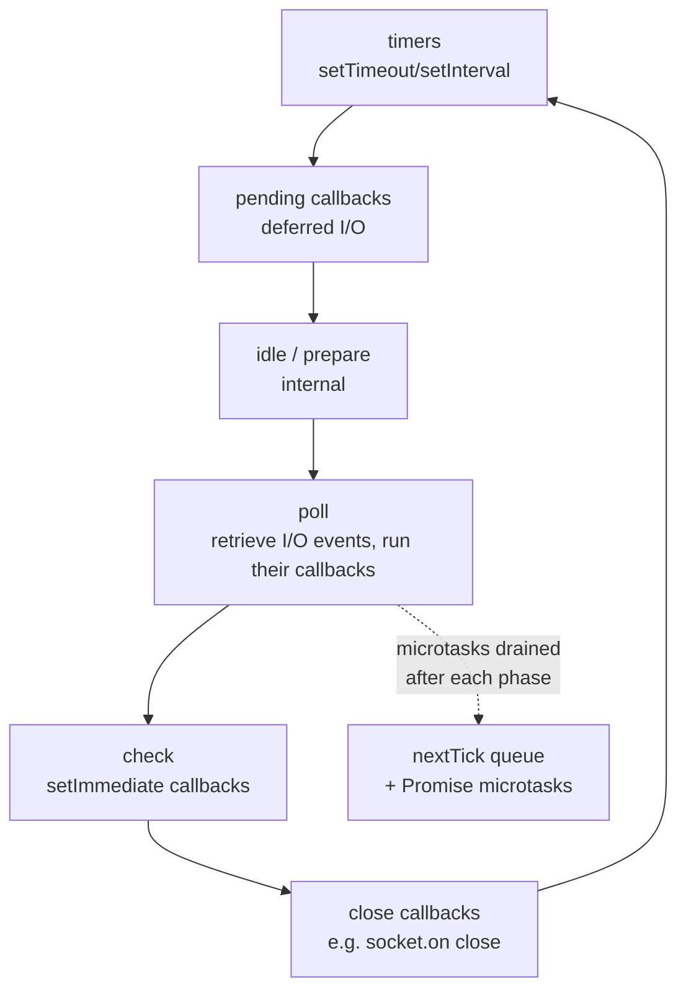

Between every phase (and between each callback), Node drains the **microtask queues**: `process.nextTick()` callbacks first, then resolved **Promise** callbacks. This is why microtasks always run before the next timer or I/O callback.

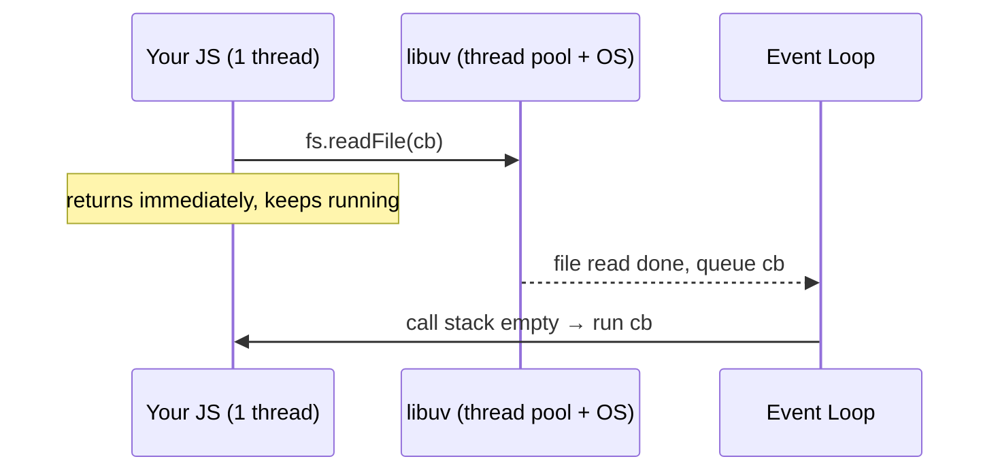

### Code Example

```js
const fs = require('fs');

console.log('1: start');

fs.readFile('./data.txt', 'utf8', (err, data) => {
  console.log('4: file read (I/O callback, poll phase)');
});

setTimeout(() => console.log('3: timeout (timers phase)'), 0);

Promise.resolve().then(() => console.log('2: promise (microtask)'));

console.log('1.5: end of sync code');

// Output order:
// 1: start
// 1.5: end of sync code
// 2: promise        <- microtasks run before any phase
// 3: timeout        <- timers phase
// 4: file read      <- poll phase (I/O finished)
```

The synchronous code runs first; then microtasks; then the loop's phases.

### Real-World Usage

A REST API serving 5,000 concurrent users querying MongoDB doesn't need 5,000 threads. Each DB query is async — Node fires the query, the connection waits in the background, and the event loop serves other requests meanwhile. This is why Node excels at **I/O-heavy** workloads (APIs, gateways, chat, streaming) and struggles with **CPU-heavy** ones (image processing, encryption) unless offloaded.

### Common Mistakes

- Running CPU-bound work directly in a request handler → blocks the event loop → all requests hang.
- Using synchronous APIs (`fs.readFileSync`, `JSON.parse` on huge bodies, `bcrypt.hashSync`) in request paths.
- Assuming `setTimeout(fn, 0)` runs "immediately" — it waits for the timers phase.

### Best Practices

> [!TIP]
> Offload CPU-heavy work to `worker_threads`, a child process, or a separate queue (e.g. BullMQ). Keep the event loop free for I/O. Measure event-loop lag with `perf_hooks` or tools like `clinic.js`.

### Possible Follow-up Questions

- What happens if a callback throws an error inside the event loop?
- How does the libuv thread pool size affect performance, and how do you change it (`UV_THREADPOOL_SIZE`)?
- Why is `bcrypt` (which uses the thread pool) better than a pure-JS hashing loop?
- Related: [[Q7. How does Node.js scale across CPU cores]]

---

## Q2. What is the difference between `process.nextTick`, `setImmediate`, and `setTimeout`?

### Short Interview Answer

`process.nextTick()` runs its callback **immediately after the current operation**, before the event loop continues — it's a microtask with the highest priority. `setImmediate()` runs in the **check phase**, after the poll phase of the current loop iteration. `setTimeout(fn, 0)` runs in the **timers phase** of a future iteration. Order of priority: `nextTick` → Promises → `setImmediate`/`setTimeout` (depending on context).

### Detailed Explanation

These three are constantly confused. The key is **which queue** they go into:

- **`process.nextTick(cb)`** → the **nextTick queue**, drained *between phases* and even between individual callbacks. It does **not** belong to any loop phase.
- **Promise `.then`** → the **microtask queue**, drained right after the nextTick queue.
- **`setImmediate(cb)`** → the **check phase** queue.
- **`setTimeout(cb, 0)`** → the **timers phase** queue (minimum 1ms in practice).

### Internal Working

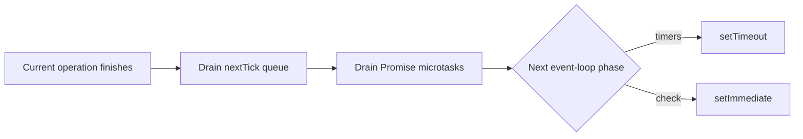

> [!WARNING]
> Recursively calling `process.nextTick()` can **starve the event loop** — because the nextTick queue is fully drained before the loop proceeds, an infinite chain of `nextTick` calls prevents I/O from ever being handled. `setImmediate` does not have this problem.

### Code Example

```js
setTimeout(() => console.log('setTimeout'), 0);
setImmediate(() => console.log('setImmediate'));
process.nextTick(() => console.log('nextTick'));
Promise.resolve().then(() => console.log('promise'));

// Output (when run at top level):
// nextTick
// promise
// setTimeout      <-- order of these two can vary at top level...
// setImmediate

// Inside an I/O callback, setImmediate ALWAYS beats setTimeout:
const fs = require('fs');
fs.readFile(__filename, () => {
  setTimeout(() => console.log('timeout in I/O'), 0);
  setImmediate(() => console.log('immediate in I/O'));  // runs first
});
```

### Real-World Usage

`setImmediate` is used to **break up long synchronous loops** so the event loop can breathe: process a batch, then `setImmediate` the next batch instead of blocking. `process.nextTick` is used by libraries to **guarantee a callback fires asynchronously but ASAP**, e.g. emitting an event after the constructor returns.

### Common Mistakes

- Assuming `setTimeout(fn, 0)` and `setImmediate` are interchangeable — they're not, especially inside I/O callbacks.
- Overusing `nextTick` and accidentally starving I/O.

### Best Practices

> [!NOTE]
> Prefer `setImmediate` over `process.nextTick` when you just want to defer work — it's safer and won't starve the loop. Reserve `nextTick` for cases where the deferral must happen before any I/O.

### Possible Follow-up Questions

- Why can the order of `setTimeout(0)` vs `setImmediate` be non-deterministic at the top level?
- How would you yield control in a CPU-heavy loop without blocking?
- Related: [[Q1. What is the Event Loop]]

---

## Q3. Callbacks vs Promises vs Async/Await

### Short Interview Answer

All three handle asynchronous results. **Callbacks** are functions passed to be called later — they lead to "callback hell" and awkward error handling. **Promises** are objects representing a future value with `.then`/`.catch`, enabling chaining and centralized error handling. **Async/await** is syntactic sugar over Promises that lets you write asynchronous code that *reads* synchronously, with `try/catch` for errors. Under the hood, async/await still uses Promises and the microtask queue.

### Detailed Explanation

- **Callbacks** invert control: you hand your function to an API and trust it to call back exactly once. Problems: nesting ("pyramid of doom"), no standard error contract (error-first convention `(err, data)` helps), and difficulty composing.
- **Promises** are state machines: `pending → fulfilled` or `pending → rejected`. Once settled, they're immutable. `.then` returns a *new* promise, enabling flat chains. Errors propagate down the chain to the nearest `.catch`.
- **Async/await**: `async` functions always return a Promise; `await` pauses the function (not the thread) until the awaited promise settles, resuming via a microtask.

### Internal Working

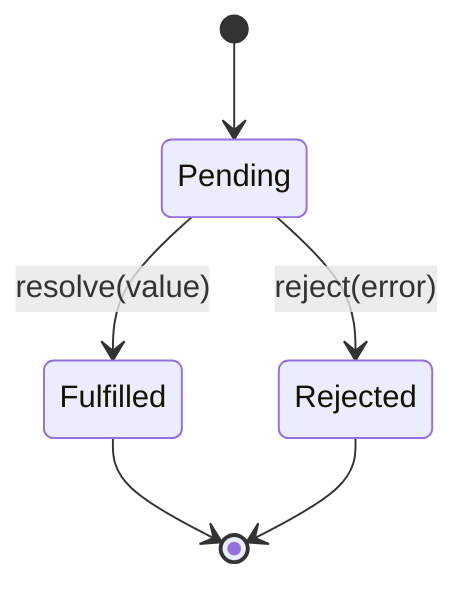


### Code Example

```js
// Callback hell
getUser(id, (err, user) => {
  if (err) return handle(err);
  getOrders(user.id, (err, orders) => {
    if (err) return handle(err);
    getInvoice(orders[0], (err, invoice) => { /* ... */ });
  });
});

// Promise chain — flat, single error handler
getUser(id)
  .then(user => getOrders(user.id))
  .then(orders => getInvoice(orders[0]))
  .catch(handle);

// Async/await — reads top-to-bottom
async function getInvoiceForUser(id) {
  try {
    const user = await getUser(id);
    const orders = await getOrders(user.id);
    return await getInvoice(orders[0]);
  } catch (err) {
    handle(err);
  }
}
```

> [!TIP]
> Run independent async operations **in parallel** with `Promise.all` instead of awaiting them serially:
> ```js
> // Slow: serial (sum of both)
> const a = await fetchA(); const b = await fetchB();
> // Fast: parallel (max of both)
> const [a, b] = await Promise.all([fetchA(), fetchB()]);
> ```

### Real-World Usage

In a checkout flow, you might fetch the user's cart, inventory, and saved payment methods simultaneously with `Promise.all`, then proceed once all resolve — cutting latency from the sum to the slowest single call.

### Common Mistakes

- **Forgetting to `await`** → you get a pending Promise instead of the value, and errors become unhandled rejections.
- Using `await` inside a `forEach` (it doesn't wait) — use `for...of` or `Promise.all` with `map`.
- Not catching rejections → `UnhandledPromiseRejection` crashes the process in modern Node.
- Mixing callbacks and promises inconsistently.

### Best Practices

> [!IMPORTANT]
> Always handle rejections (`try/catch` or `.catch`). Use `Promise.allSettled` when you want all results regardless of individual failures. Wrap async Express handlers so thrown errors reach your error middleware (see [[Q6. How do you handle errors in async Express routes]]).

### Possible Follow-up Questions

- What's the difference between `Promise.all`, `Promise.allSettled`, `Promise.race`, and `Promise.any`?
- How does `await` interact with the microtask queue?
- Why does `forEach` with `await` not work as expected?

---

## Q4. How does middleware work in Express?

### Short Interview Answer

Middleware are functions with the signature `(req, res, next)` that run **in order** during the request–response cycle. Each can read/modify `req` and `res`, end the response, or call `next()` to pass control to the next middleware. Express maintains a **stack** of middleware and routes; a request flows through it until something sends a response. Error-handling middleware has four arguments `(err, req, res, next)` and is invoked when `next(err)` is called.

### Detailed Explanation

Express is fundamentally a **middleware pipeline**. When a request arrives, Express walks its stack of registered functions in registration order, matching by path and method. Middleware enables cross-cutting concerns — logging, authentication, body parsing, CORS, rate limiting — to be composed cleanly without duplicating logic in every route.

The `next` function is the linchpin: calling `next()` advances to the next matching layer; calling `next(err)` skips all remaining normal middleware and jumps to the **error-handling** middleware. Forgetting to call `next()` (or send a response) leaves the request **hanging**.

### Internal Working

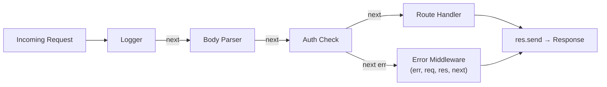

### Code Example

```js
const express = require('express');
const app = express();

// Application-level middleware (runs for every request)
app.use((req, res, next) => {
  req.requestTime = Date.now();
  console.log(`${req.method} ${req.url}`);
  next();                       // MUST call next or send a response
});

app.use(express.json());        // built-in body parser

// Route-specific middleware
const auth = (req, res, next) => {
  if (!req.headers.authorization) return next(new Error('Unauthorized'));
  next();
};

app.get('/profile', auth, (req, res) => {
  res.json({ ok: true, at: req.requestTime });
});

// Error-handling middleware — note the 4 args, registered LAST
app.use((err, req, res, next) => {
  console.error(err.message);
  res.status(err.status || 500).json({ error: err.message });
});

app.listen(3000);
```

### Real-World Usage

A production API typically layers: `helmet` (security headers) → `cors` → `express.json` → request logger (`morgan`/`pino`) → rate limiter → authentication → route handlers → 404 handler → centralized error handler. Order matters: e.g. body parsing must run before handlers that read `req.body`.

### Common Mistakes

- **Forgetting `next()`** → request hangs until timeout.
- Registering the **error handler before** routes — it must come last.
- Putting `express.json()` after a route that needs `req.body`.
- Defining error middleware with only 3 args (Express won't recognize it as an error handler).

### Best Practices

> [!NOTE]
> Keep middleware **single-purpose and ordered intentionally**. Use `app.use('/api', router)` to scope middleware to a path prefix. Always terminate the chain with a 404 handler and a single centralized error handler.

> [!WARNING]
> Never put heavy synchronous work in middleware — it runs on every request and blocks the event loop. See [[Q1. What is the Event Loop]].

### Possible Follow-up Questions

- What's the difference between application-level, router-level, and error-handling middleware?
- How does Express match routes and what is the role of `app.use` vs `app.get`?
- How would you write middleware to measure response time?

---

## Q5. How do streams and buffers work in Node.js?

### Short Interview Answer

A **Buffer** is a fixed-length chunk of raw binary memory outside V8's heap, used for handling binary data (files, network packets). **Streams** are abstractions for processing data **piece by piece** instead of loading it all into memory. There are four types — Readable, Writable, Duplex, Transform — and they're connected with `.pipe()`. Streams enable handling huge files or live data with constant, low memory usage.

### Detailed Explanation

Without streams, reading a 2 GB file with `fs.readFile` loads all 2 GB into memory before you can use it — risking out-of-memory crashes and high latency. Streams instead emit data in **chunks** (default 64 KB), letting you process and forward data as it arrives. This is **backpressure-aware**: if a slow consumer can't keep up, the stream pauses the producer.

Buffers underpin streams — each chunk is typically a Buffer. Buffers are allocated outside the V8 heap because binary data shouldn't be subject to JS string encoding overhead and GC pressure.

### Internal Working

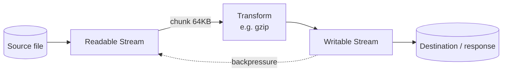

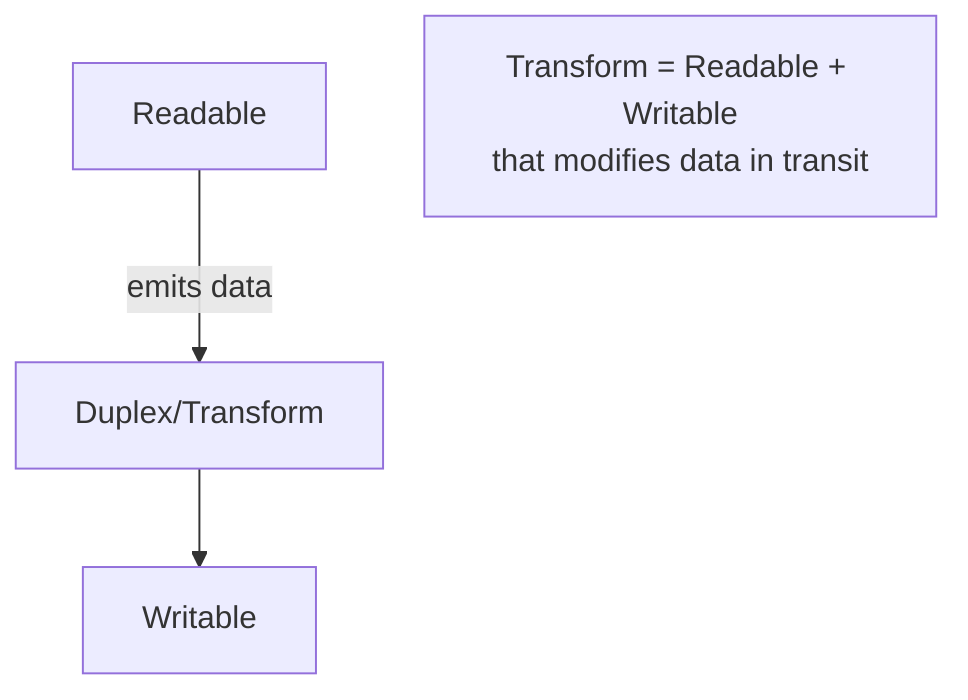

### Code Example

```js
const fs = require('fs');
const zlib = require('zlib');

// Bad: loads entire file into memory
// const data = fs.readFileSync('huge.log');

// Good: stream + pipe, constant memory, with compression
fs.createReadStream('huge.log')
  .pipe(zlib.createGzip())              // Transform stream
  .pipe(fs.createWriteStream('huge.log.gz'))
  .on('finish', () => console.log('Done'));

// Streaming a file as an HTTP response (Express)
app.get('/download', (req, res) => {
  const stream = fs.createReadStream('./big-video.mp4');
  stream.pipe(res);                     // backpressure handled automatically
  stream.on('error', () => res.status(500).end());
});
```

> [!TIP]
> Use `pipeline()` from the `stream` module instead of chaining `.pipe()` — it properly forwards errors and cleans up resources on failure:
> ```js
> const { pipeline } = require('stream/promises');
> await pipeline(readStream, gzip, writeStream);
> ```

### Real-World Usage

Video streaming services, log processors, CSV import pipelines, and file upload/download endpoints all use streams. For example, parsing a 5 GB CSV row-by-row with a Transform stream keeps memory flat regardless of file size.

### Common Mistakes

- Buffering an entire large file/response in memory instead of streaming.
- Ignoring the `'error'` event on streams → uncaught exceptions crash the process.
- Not handling backpressure when manually writing (ignoring the `false` return of `write()`).

### Best Practices

> [!IMPORTANT]
> Always handle stream errors and prefer `pipeline()` for multi-stage flows. For HTTP, stream large payloads rather than building them in memory.

### Possible Follow-up Questions

- What is backpressure and how does `pipe()` handle it?
- Difference between `Buffer.alloc` and `Buffer.allocUnsafe`?
- How would you implement a custom Transform stream?

---

## Q6. How do you handle errors in async Express routes?

### Short Interview Answer

Express 4 does **not** automatically catch errors thrown in async handlers — a rejected promise won't reach your error middleware unless you forward it with `next(err)`. The standard solutions are: wrap handlers in a try/catch that calls `next(err)`, use an `asyncHandler` wrapper utility, or use a library like `express-async-errors`. All errors should funnel into a **single centralized error-handling middleware**.

### Detailed Explanation

When you `throw` inside a synchronous Express handler, Express catches it and routes to error middleware. But in an `async` handler, a thrown error becomes a **rejected promise** that Express never sees — resulting in an unhandled rejection and a hanging request. You must explicitly bridge the gap.

### Internal Working

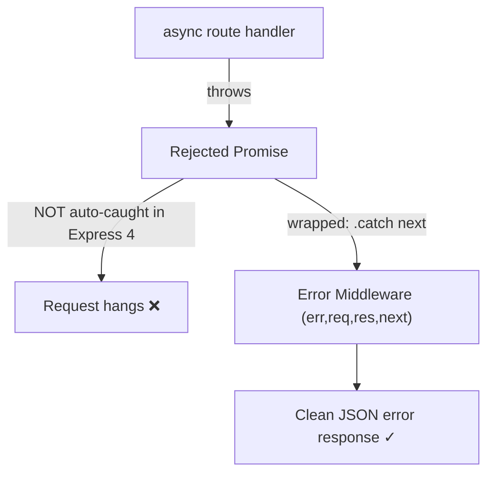

### Code Example

```js
// Reusable wrapper — converts rejections into next(err)
const asyncHandler = (fn) => (req, res, next) =>
  Promise.resolve(fn(req, res, next)).catch(next);

// Custom error class for operational errors
class AppError extends Error {
  constructor(message, statusCode) {
    super(message);
    this.statusCode = statusCode;
    this.isOperational = true;
  }
}

app.get('/users/:id', asyncHandler(async (req, res) => {
  const user = await User.findById(req.params.id);
  if (!user) throw new AppError('User not found', 404);   // safely forwarded
  res.json(user);
}));

// Centralized error handler (registered last)
app.use((err, req, res, next) => {
  const status = err.statusCode || 500;
  // Don't leak internals for unexpected errors
  const message = err.isOperational ? err.message : 'Internal Server Error';
  if (status >= 500) console.error(err);   // log unexpected errors
  res.status(status).json({ error: message });
});
```

### Real-World Usage

Production APIs distinguish **operational errors** (expected: validation failure, not found, unauthorized — return clean 4xx) from **programmer errors** (bugs: undefined access — log fully, return generic 500, and consider restarting the process). The centralized handler enforces consistent error response shape across the whole API.

### Common Mistakes

- Forgetting to wrap async handlers → unhandled rejections.
- Sending stack traces / internal messages to clients (security leak).
- Multiple `res.send` calls (`Cannot set headers after they are sent`).
- Swallowing errors silently with empty `catch` blocks.

### Best Practices

> [!IMPORTANT]
> Use one centralized error handler, a custom `AppError` class, and an `asyncHandler` wrapper. Never expose stack traces in production responses. Log 5xx errors with full context (request id, user) for observability.

> [!WARNING]
> Also handle `process.on('unhandledRejection')` and `uncaughtException` as a last resort — log and gracefully shut down rather than continuing in an unknown state.

### Possible Follow-up Questions

- What's the difference between operational and programmer errors?
- Why does Express 5 improve async error handling?
- How do you return validation errors consistently (e.g. with Joi/Zod)?
- Related: [[Q4. How does middleware work in Express]]

---

## Q7. How does Node.js scale across CPU cores (cluster / worker_threads)?

### Short Interview Answer

A single Node process uses one CPU core for JS execution. To use all cores, you either run the **cluster module** (forks multiple processes that share a server port via the master) or **worker_threads** (multiple threads sharing memory within one process). Cluster is for scaling **I/O-bound web servers** across cores; worker_threads are for offloading **CPU-bound tasks** without blocking the main event loop. In production, a process manager like **PM2** usually handles clustering.

### Detailed Explanation

- **Cluster**: The master process forks N worker processes (typically one per CPU core). The OS / master load-balances incoming connections across workers. Each worker is a full Node process with its own memory and event loop — so there's no shared state (use Redis/DB for shared data).
- **worker_threads**: Real threads within a single process that can share memory via `SharedArrayBuffer` and exchange messages. Ideal for CPU-heavy computation (image resizing, parsing, encryption) that would otherwise block the event loop.

### Internal Working

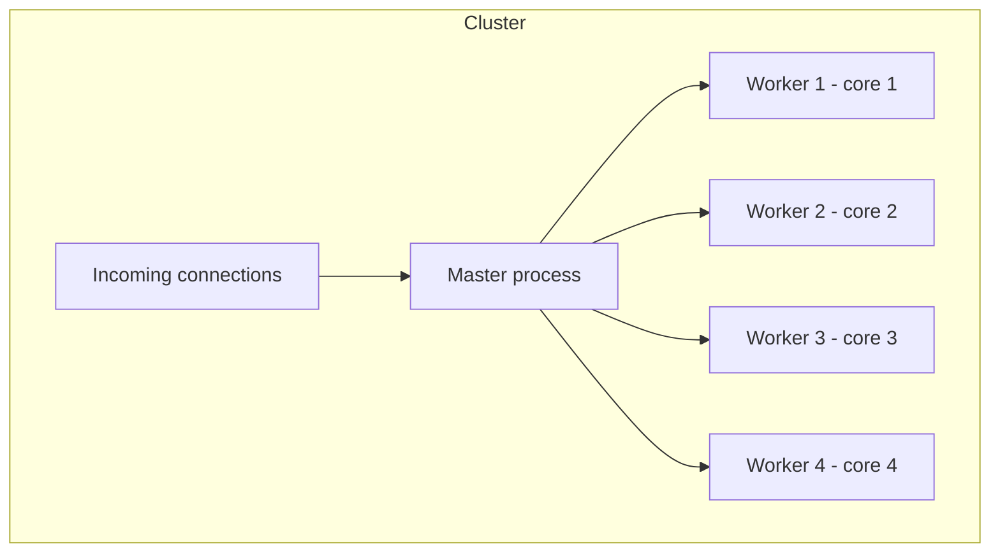

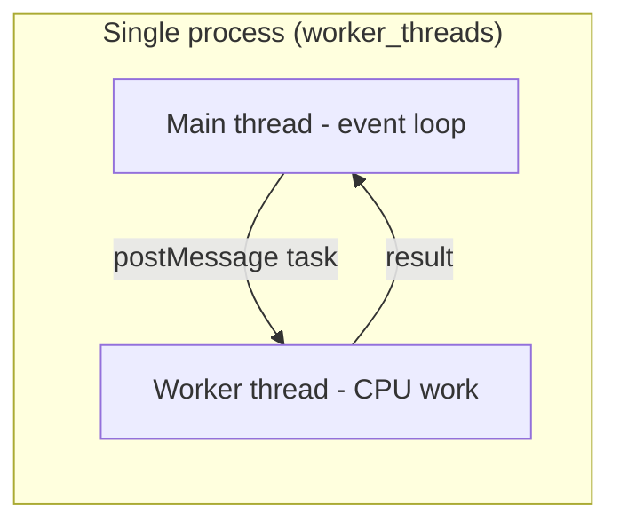

### Code Example

```js
// Cluster: scale an HTTP server across all cores
const cluster = require('cluster');
const os = require('os');
const http = require('http');

if (cluster.isPrimary) {
  const cpus = os.cpus().length;
  for (let i = 0; i < cpus; i++) cluster.fork();
  cluster.on('exit', (worker) => {
    console.log(`Worker ${worker.process.pid} died, restarting`);
    cluster.fork();                       // self-healing
  });
} else {
  http.createServer((req, res) => res.end(`Handled by ${process.pid}`))
      .listen(3000);
}
```

```js
// worker_threads: offload CPU-bound work
const { Worker } = require('worker_threads');
function runHeavyTask(data) {
  return new Promise((resolve, reject) => {
    const worker = new Worker('./heavy-task.js', { workerData: data });
    worker.on('message', resolve);
    worker.on('error', reject);
  });
}
```

### Real-World Usage

A web API on a 4-core machine runs `pm2 start app.js -i max` to spawn 4 workers, roughly 4×-ing throughput. A separate image-processing service uses worker_threads (or a job queue with worker processes) so that resizing a 20 MP image doesn't freeze the API.

### Common Mistakes

- Storing session/state in worker memory → breaks when requests hit different workers (use Redis).
- Using cluster for CPU-bound work expecting it to help a single heavy request (it won't — that request still runs on one core).
- Forgetting to restart dead workers.

### Best Practices

> [!TIP]
> Make app processes **stateless**; externalize state to Redis/DB. Use PM2 or Kubernetes for process management and auto-restart. Use worker_threads (or a queue) specifically for CPU-bound work.

> [!NOTE]
> Cluster scales **across** cores for concurrency; worker_threads scale **within** a process for parallel CPU computation. They solve different problems.

### Possible Follow-up Questions

- How does the master distribute connections (round-robin vs OS scheduling)?
- When would you choose worker_threads over child_process?
- How do you share state between clustered workers?
- Related: [[Q1. What is the Event Loop]] · [[Q11. How do you prevent and detect memory leaks]]

---

## Q8. How do MongoDB indexes work and when do they hurt you?

### Short Interview Answer

A MongoDB index is a **B-tree** data structure storing a sorted subset of fields plus pointers to documents, so queries can locate matching documents without scanning the whole collection (a **COLLSCAN**). Indexes dramatically speed up reads and sorts, but they **cost write performance and storage** because every insert/update must also update the indexes. The key skill is matching indexes to your query patterns and avoiding unused or redundant indexes.

### Detailed Explanation

Without an index, a query examines every document — O(n). With a B-tree index, lookups are O(log n). MongoDB always has a default index on `_id`. You create indexes on fields you filter, sort, or join on.

**Compound indexes** follow the **ESR rule** (Equality, Sort, Range): order fields so equality matches come first, then sort fields, then range fields. Index **prefixes** matter — a compound index `{a:1, b:1, c:1}` can serve queries on `{a}`, `{a,b}`, and `{a,b,c}`, but **not** `{b}` or `{c}` alone.

### Internal Working

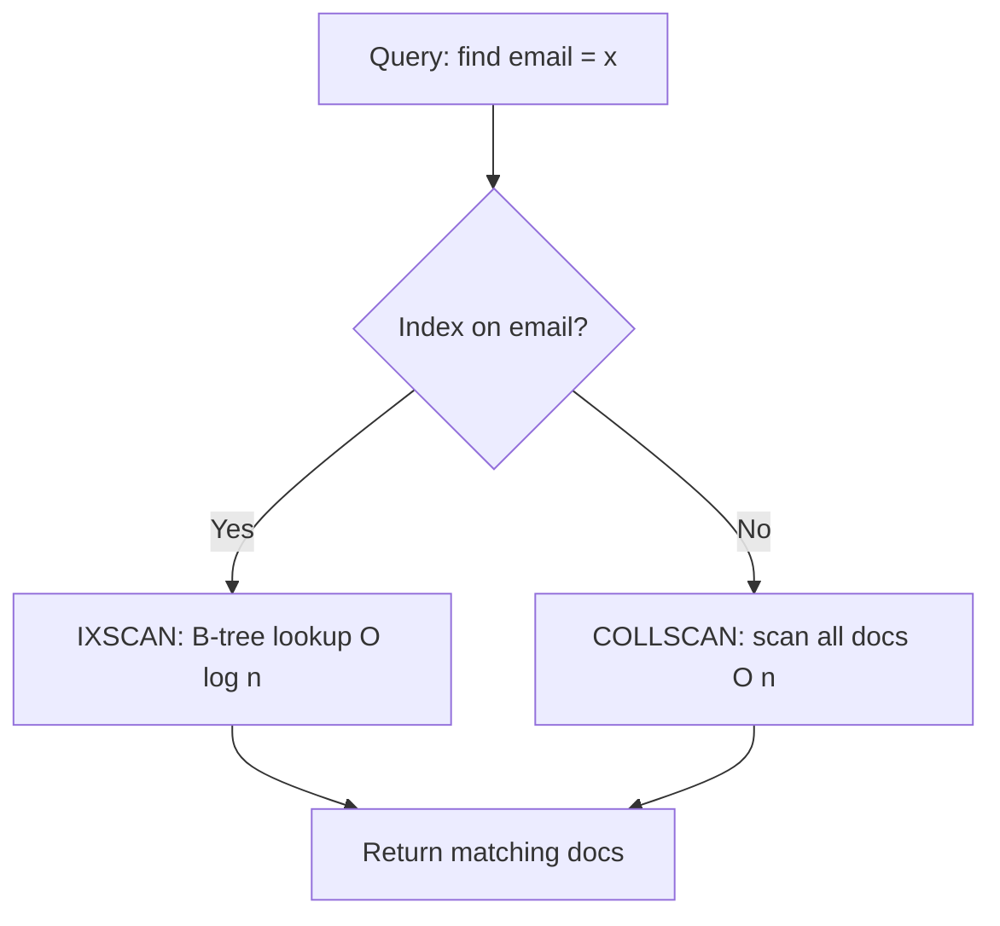

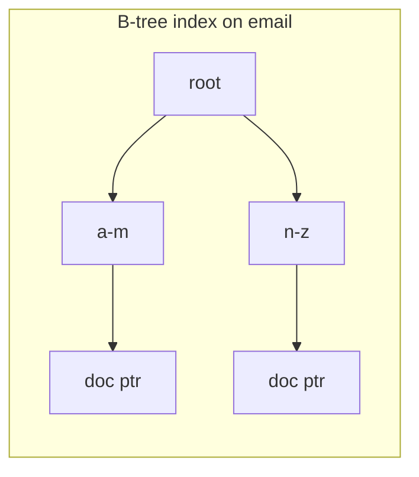

### Code Example

```js
// Create indexes (Mongoose schema)
const userSchema = new mongoose.Schema({
  email: { type: String, unique: true },   // unique index
  status: String,
  createdAt: Date,
});

// Compound index following ESR: equality(status) → sort(createdAt)
userSchema.index({ status: 1, createdAt: -1 });

// Diagnose a slow query — look for COLLSCAN vs IXSCAN
const plan = await User.find({ status: 'active' })
  .sort({ createdAt: -1 })
  .explain('executionStats');
// Check: plan.queryPlanner.winningPlan.stage and executionStats.totalDocsExamined
```

> [!TIP]
> Use `.explain('executionStats')` and compare `totalDocsExamined` to `nReturned`. If you examine 1,000,000 docs to return 10, you're missing an index.

### Real-World Usage

An e-commerce orders collection queried by `{ userId, status }` and sorted by `createdAt` gets a compound index `{ userId: 1, status: 1, createdAt: -1 }`. This turns a multi-second COLLSCAN over millions of orders into a millisecond IXSCAN.

### Common Mistakes

- Creating an index per field instead of the right **compound** index for the query.
- Indexing low-cardinality fields alone (e.g. a boolean) — little benefit.
- Too many indexes → slow writes, bloated storage, RAM pressure (indexes should fit in RAM).
- Ignoring the ESR rule, so sorts still require an in-memory sort.

### Best Practices

> [!IMPORTANT]
> Index based on **actual query patterns**, not guesses. Periodically review index usage (`$indexStats`) and drop unused ones. Ensure the **working set + indexes fit in RAM**. Use covered queries (index contains all returned fields) where possible.

> [!WARNING]
> Building an index on a huge collection in the foreground **locks** the collection. Use rolling/background index builds in production.

### Possible Follow-up Questions

- What is the ESR rule and why does field order matter?
- What is a covered query?
- Difference between sparse, partial, TTL, and text indexes?
- How do you find and remove unused indexes?

---

## Q9. An API endpoint is slow under load. How do you debug it?

### Short Interview Answer

I'd approach it methodically: **measure first** (is it CPU, I/O, DB, or network bound?), then isolate. Check APM/latency metrics and logs, reproduce with load testing, profile the event loop and CPU, inspect slow DB queries with `explain`, look for blocking synchronous code, N+1 queries, missing indexes, missing caching, and connection-pool exhaustion. Fix the dominant bottleneck, then re-measure.

### Detailed Explanation

Slowness "under load" specifically hints at **resource contention** that doesn't appear with a single request: a blocked event loop, exhausted DB connections, lock contention, or unbounded memory growth. The cardinal rule is **don't guess — measure**.

### Internal Working — Debugging Decision Tree

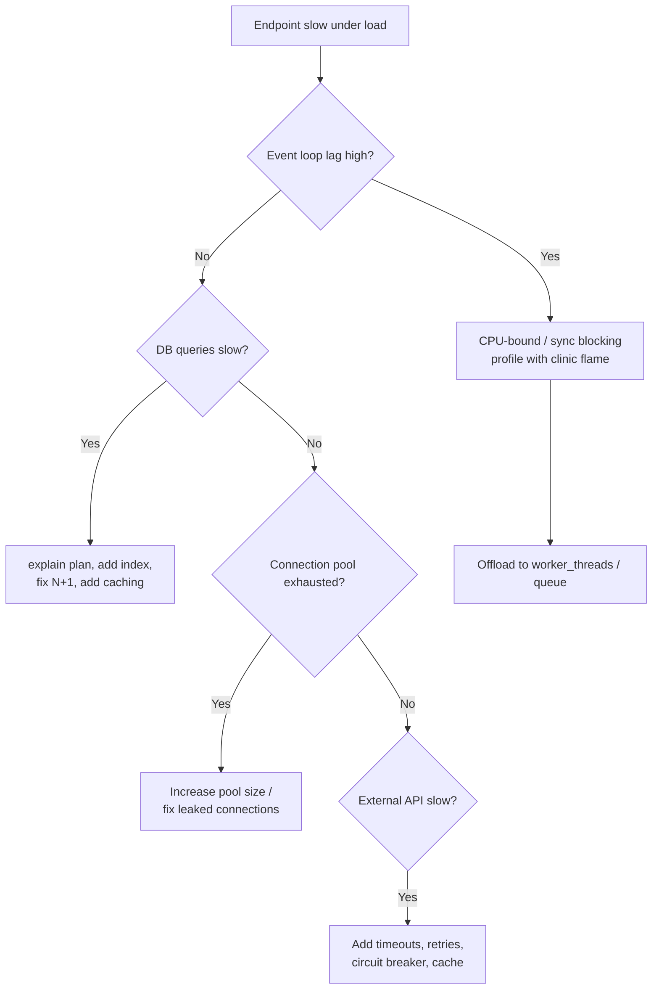

### Code Example

```js
// 1) Measure event-loop lag
const { monitorEventLoopDelay } = require('perf_hooks');
const h = monitorEventLoopDelay(); h.enable();
setInterval(() => console.log('loop lag p99 ms:', h.percentile(99) / 1e6), 5000);

// 2) Spot an N+1 query (BAD)
for (const order of orders) {
  order.user = await User.findById(order.userId);   // 1 query per order!
}
// FIX: single query with $in, then map
const users = await User.find({ _id: { $in: orders.map(o => o.userId) } });
const byId = new Map(users.map(u => [String(u._id), u]));
orders.forEach(o => { o.user = byId.get(String(o.userId)); });

// 3) Cache hot reads
const cached = await redis.get(key);
if (cached) return JSON.parse(cached);
const data = await db.query(...);
await redis.set(key, JSON.stringify(data), 'EX', 60);
```

### Real-World Usage

A `/dashboard` endpoint was slow under load because it made 50 sequential DB calls (N+1) and parsed a large JSON synchronously. Fixes: batch the queries with `$in`, add a compound index, cache the result in Redis for 30s, and offload the parsing. p99 latency dropped from 4s to 120ms.

### Common Mistakes

- Optimizing without measuring ("premature optimization").
- Ignoring event-loop lag — a single blocking call degrades the whole process under load.
- Not load-testing in a realistic environment.
- Treating average latency as sufficient — watch **p95/p99**.

### Best Practices

> [!IMPORTANT]
> Instrument everything: structured logging with request ids, APM (Datadog/New Relic/OpenTelemetry), and metrics (latency percentiles, throughput, error rate). Load-test with `autocannon`/`k6`. Profile with `clinic.js` (doctor/flame/bubbleprof).

> [!TIP]
> Common high-impact fixes: add the right DB index, eliminate N+1 queries, add caching, increase connection pool, set timeouts on external calls, and offload CPU work.

### Possible Follow-up Questions

- How do you detect a blocked event loop in production?
- What is an N+1 query and how do you fix it in Mongoose?
- How do you load test and what metrics matter most?
- Related: [[Q8. How do MongoDB indexes work]] · [[Q1. What is the Event Loop]]

---

## Q10. Design a rate limiter for a REST API

### Short Interview Answer

A rate limiter restricts how many requests a client can make in a time window to protect against abuse and overload. Common algorithms are **fixed window**, **sliding window**, **token bucket**, and **leaky bucket**. For a distributed API, I'd implement it in **Redis** (shared across instances) using a token-bucket or sliding-window-counter approach, keyed by client identity (API key / user id / IP), returning HTTP `429 Too Many Requests` with `Retry-After` and `X-RateLimit-*` headers when exceeded.

### Detailed Explanation

- **Fixed window**: count requests per fixed interval (e.g. 100/min). Simple but allows bursts at window edges (200 requests across a boundary).
- **Sliding window**: smooths the boundary problem by weighting the previous window or tracking timestamps.
- **Token bucket**: a bucket refills tokens at a steady rate; each request consumes one. Allows controlled bursts up to bucket capacity — the most flexible and widely used.
- **Leaky bucket**: processes requests at a constant rate, queuing/dropping overflow.

In a multi-instance deployment, the counter must live in a **shared store (Redis)**, otherwise each instance enforces its own limit and the effective limit multiplies by the instance count.

### Internal Working

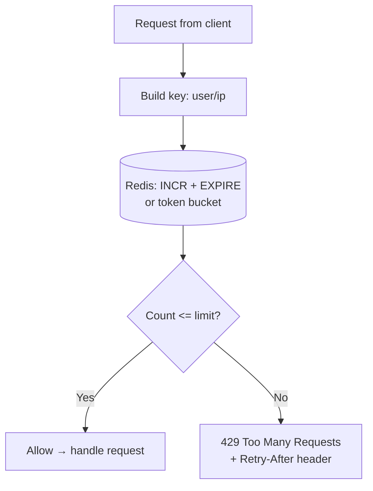

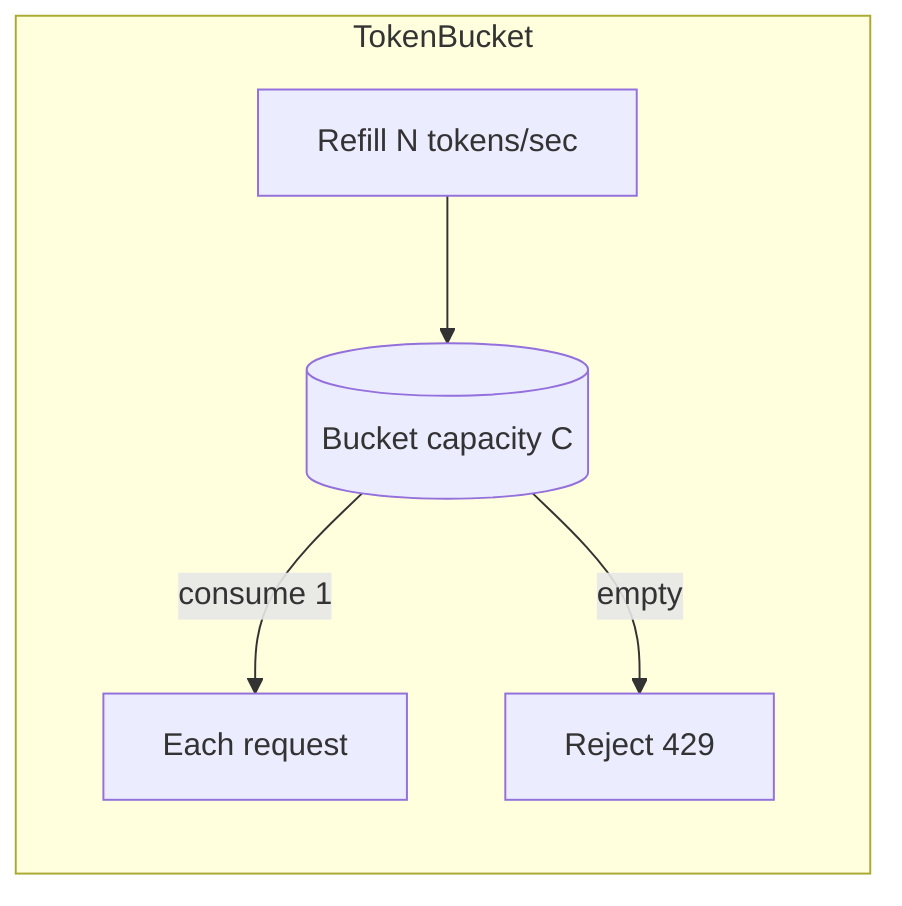

### Code Example

```js
// Simple Redis fixed-window limiter middleware
const rateLimit = (limit, windowSec) => async (req, res, next) => {
  const key = `rl:${req.ip}`;
  const count = await redis.incr(key);
  if (count === 1) await redis.expire(key, windowSec);   // set TTL on first hit
  res.set('X-RateLimit-Limit', limit);
  res.set('X-RateLimit-Remaining', Math.max(0, limit - count));
  if (count > limit) {
    res.set('Retry-After', windowSec);
    return res.status(429).json({ error: 'Too many requests' });
  }
  next();
};

app.use('/api/', rateLimit(100, 60));   // 100 requests / minute / IP
```

> [!NOTE]
> For production, use a battle-tested library like `express-rate-limit` with `rate-limit-redis`, or an API gateway / `nginx` / cloud WAF that rate-limits before traffic even reaches Node.

### Real-World Usage

GitHub, Stripe, and Twitter APIs all rate-limit and return `429` with `X-RateLimit-Remaining` and `X-RateLimit-Reset` headers. A SaaS might apply tiered limits (free: 60/min, pro: 1000/min) keyed by API key, enforced in Redis shared across all API pods.

### Common Mistakes

- Storing counters in process memory in a multi-instance setup → limit multiplied by instance count.
- Rate-limiting by IP only (breaks behind shared NAT/proxies; honor `X-Forwarded-For` correctly).
- Not setting a TTL → counters never reset.
- Returning the wrong status code (use `429`, not `403`).

### Best Practices

> [!TIP]
> Use Redis for distributed counters, choose token bucket for burst-friendly limits, key by authenticated identity when possible, and always return `Retry-After` + `X-RateLimit-*` headers so clients can back off gracefully.

> [!WARNING]
> Place rate limiting as early as possible (gateway/edge) so abusive traffic doesn't consume app resources.

### Possible Follow-up Questions

- Compare token bucket vs sliding window — trade-offs?
- How do you rate-limit fairly behind a load balancer / proxy?
- How would you implement per-user vs per-endpoint limits?
- How do you make the Redis check atomic (Lua script)?

---

## Q11. How do you prevent and detect memory leaks in production?

### Short Interview Answer

A memory leak is when memory that's no longer needed isn't released because something still references it, so heap usage grows over time until the process crashes (OOM) or slows due to GC pressure. Common causes in Node: unbounded caches/arrays, lingering event listeners, closures holding large objects, and global variables. I detect them by monitoring heap usage trends, taking **heap snapshots** and diffing them, and profiling with tools like `clinic`, `--inspect`, or `heapdump`.

### Detailed Explanation

V8 manages memory with a generational **garbage collector**: short-lived objects in "new space," long-lived in "old space." The GC frees objects that are **unreachable**. A leak happens when objects remain *reachable* (referenced) even though they're logically dead — so GC can't collect them. Over hours/days, the heap climbs, GC runs more often (raising latency and CPU), and eventually the process hits its heap limit and crashes.

### Internal Working

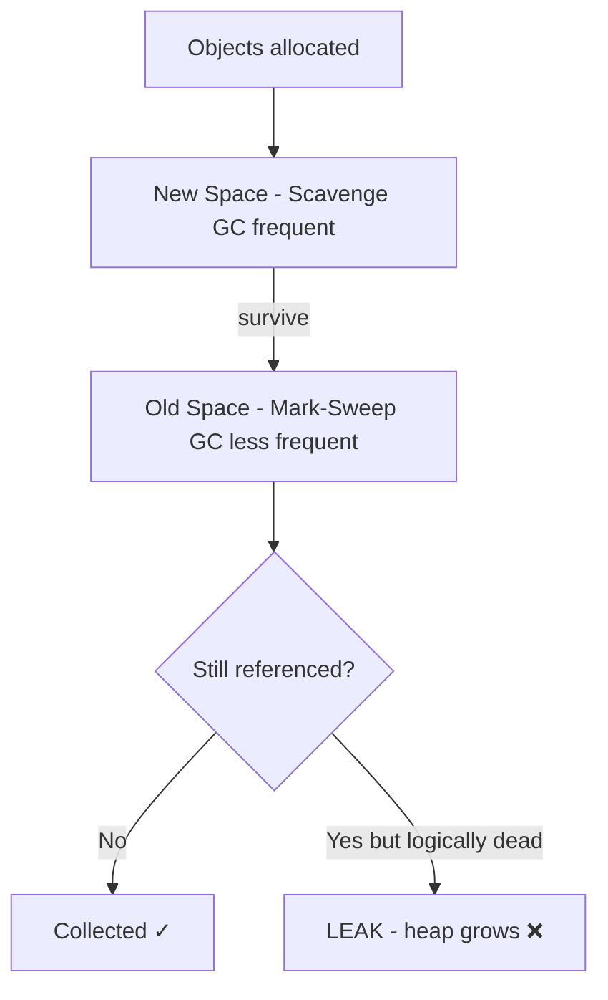

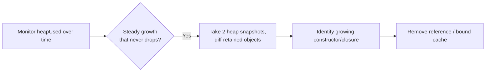

### Code Example

```js
// LEAK: unbounded in-memory cache grows forever
const cache = {};
app.get('/item/:id', (req, res) => {
  if (!cache[req.params.id]) cache[req.params.id] = loadItem(req.params.id);
  res.json(cache[req.params.id]);   // never evicted → leak
});

// FIX: bounded LRU cache with TTL
const { LRUCache } = require('lru-cache');
const cache2 = new LRUCache({ max: 5000, ttl: 1000 * 60 });

// LEAK: listener added per request, never removed
emitter.on('event', handler);       // grows unbounded → "possible EventEmitter memory leak"
// FIX: add once, or remove when done
emitter.once('event', handler);

// Monitor heap in production
setInterval(() => {
  const { heapUsed, rss } = process.memoryUsage();
  console.log(`heapUsed=${(heapUsed/1e6).toFixed(1)}MB rss=${(rss/1e6).toFixed(1)}MB`);
}, 30000);
```

> [!TIP]
> Take two heap snapshots (Chrome DevTools via `node --inspect`, or the `heapdump` module) under steady load — minutes apart — and use the **Comparison** view to find object types whose retained count keeps growing.

### Real-World Usage

A service slowly crept to OOM every ~12 hours. A heap-snapshot diff revealed an unbounded `Map` caching DB results keyed by request, never evicted. Replacing it with an LRU cache (max size + TTL) flattened memory and eliminated the nightly restarts.

### Common Mistakes

- Unbounded caches, arrays, or maps used as caches.
- Adding event listeners in request handlers without removing them.
- Closures capturing large objects that stay alive via a long-lived callback/timer.
- Treating rising RSS as always a leak — some growth is normal fragmentation; look at `heapUsed` trend over time.

### Best Practices

> [!IMPORTANT]
> Bound all caches (size + TTL), remove listeners, avoid module-level mutable state that grows, and monitor `heapUsed`/GC metrics. Set `--max-old-space-size` appropriately and run under a supervisor (PM2/K8s) that restarts on OOM as a safety net — but treat restarts as a symptom, not a fix.

> [!WARNING]
> Auto-restarting to "fix" a leak hides the real problem and risks dropped requests. Always find the root cause via snapshots.

### Possible Follow-up Questions

- How does V8's generational GC work (scavenge vs mark-sweep)?
- Difference between `rss`, `heapTotal`, `heapUsed`, and `external`?
- How do you take and analyze a heap snapshot in production safely?
- Related: [[Q7. How does Node.js scale across CPU cores]]

---

## Q12. How do you secure a production Node.js REST API?

### Short Interview Answer

Security is layered (defense in depth): use **HTTPS/TLS**, secure headers (`helmet`), strict **input validation** and output encoding to prevent injection/XSS, parameterized queries to stop NoSQL/SQL injection, robust **authentication** (hashed passwords with bcrypt/argon2, JWT or sessions) and **authorization** checks, rate limiting, CORS configured tightly, secrets in env/secret managers (never in code), dependency scanning, and never leaking stack traces. No single control is enough — you combine them.

### Detailed Explanation

The OWASP Top 10 guides the priorities: injection, broken auth, broken access control, security misconfiguration, sensitive data exposure, etc. In Node/Express specifically, you must guard against **NoSQL injection** (passing objects like `{ $gt: '' }` as query values), prototype pollution, and overly permissive CORS.

### Internal Working — Layered Defenses

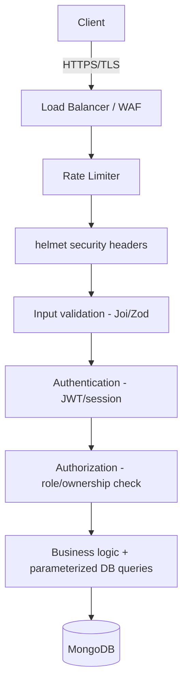

### Code Example

```js
const helmet = require('helmet');
const rateLimit = require('express-rate-limit');
const mongoSanitize = require('express-mongo-sanitize');
const bcrypt = require('bcrypt');
const jwt = require('jsonwebtoken');

app.use(helmet());                                   // secure headers
app.use(express.json({ limit: '10kb' }));            // limit body size (DoS)
app.use(mongoSanitize());                            // strip $ and . from inputs
app.use(rateLimit({ windowMs: 60_000, max: 100 }));  // throttle abuse
app.use(cors({ origin: ['https://app.example.com'] }));  // restrict origins

// Hash passwords — never store plaintext
const hash = await bcrypt.hash(password, 12);
const valid = await bcrypt.compare(input, user.passwordHash);

// Auth middleware: verify JWT
function authenticate(req, res, next) {
  const token = req.headers.authorization?.split(' ')[1];
  if (!token) return res.status(401).json({ error: 'No token' });
  try {
    req.user = jwt.verify(token, process.env.JWT_SECRET);
    next();
  } catch {
    res.status(401).json({ error: 'Invalid token' });
  }
}

// Authorization: check ownership, not just authentication
app.delete('/posts/:id', authenticate, async (req, res) => {
  const post = await Post.findById(req.params.id);
  if (post.authorId !== req.user.id) return res.status(403).json({ error: 'Forbidden' });
  await post.deleteOne();
  res.status(204).end();
});
```

> [!WARNING]
> **NoSQL injection**: if you do `User.findOne({ email: req.body.email, password: req.body.password })` and an attacker sends `{ "email": "x", "password": { "$gt": "" } }`, the query may match unintended documents. Always validate types and use `express-mongo-sanitize`.

### Real-World Usage

A typical secure stack: TLS terminated at the load balancer, `helmet` + CORS + rate limiting in Express, Zod/Joi validating every request body, bcrypt-hashed passwords, short-lived JWT access tokens + refresh tokens, role-based authorization middleware, secrets in AWS Secrets Manager / environment, and `npm audit` + Dependabot in CI.

### Common Mistakes

- Storing passwords in plaintext or with weak/fast hashes (use bcrypt/argon2).
- Trusting client input; no validation → injection, prototype pollution.
- Authentication without authorization (any logged-in user can access others' data — **IDOR**).
- Hardcoded secrets/API keys in the repo.
- `cors({ origin: '*' })` with credentials, or returning stack traces to clients.

### Best Practices

> [!IMPORTANT]
> Validate and sanitize all inputs, hash passwords with bcrypt/argon2, enforce authorization on every resource (check ownership/role), keep dependencies patched (`npm audit`), store secrets outside code, set body-size limits, and use `helmet` + tight CORS + rate limiting. Log security events and never expose internals.

> [!TIP]
> Use short-lived access tokens with refresh tokens, rotate secrets, and add `npm audit`/Snyk to CI to catch vulnerable dependencies before deploy.

### Possible Follow-up Questions

- How does JWT work and what are its security pitfalls vs sessions?
- What is NoSQL injection and how do you prevent it in MongoDB?
- Why is bcrypt preferred over SHA-256 for passwords?
- What's the difference between authentication and authorization (and what's IDOR)?
- Related: [[Q10. Design a rate limiter for a REST API]] · [[Q6. How do you handle errors in async Express routes]]

---

> [!NOTE] How to use this note
> Practice **speaking** the "Short Interview Answer" out loud, then use the deeper sections to handle follow-ups. Interviewers reward candidates who explain **why** (internals, trade-offs) and back claims with **real production examples**.

### See Also
- [[express]] — Express framework deep dive
- [[mongodb]] — MongoDB aggregation, transactions, replication
- [[system-design]] — scaling, caching, queues
- [[git_notes]] — version control
