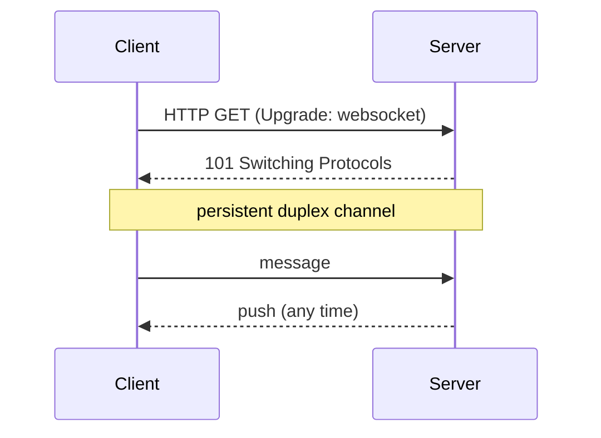
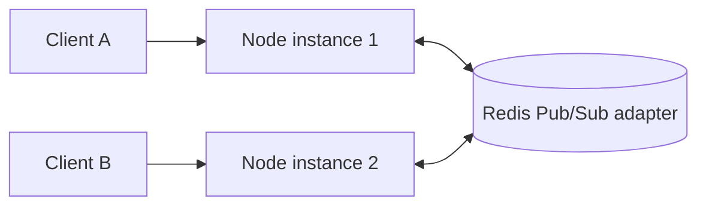
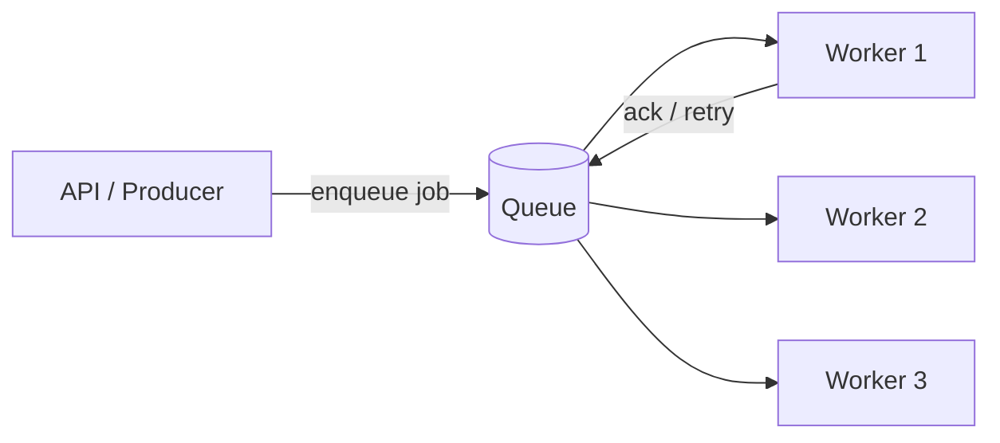
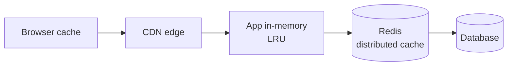
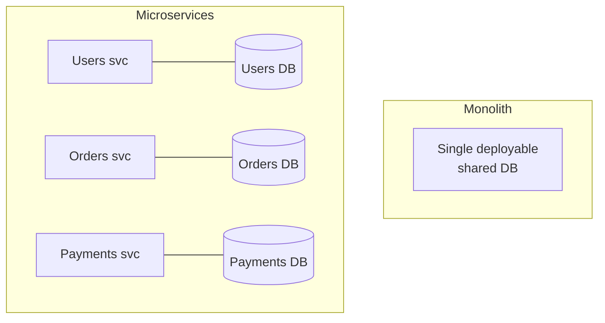
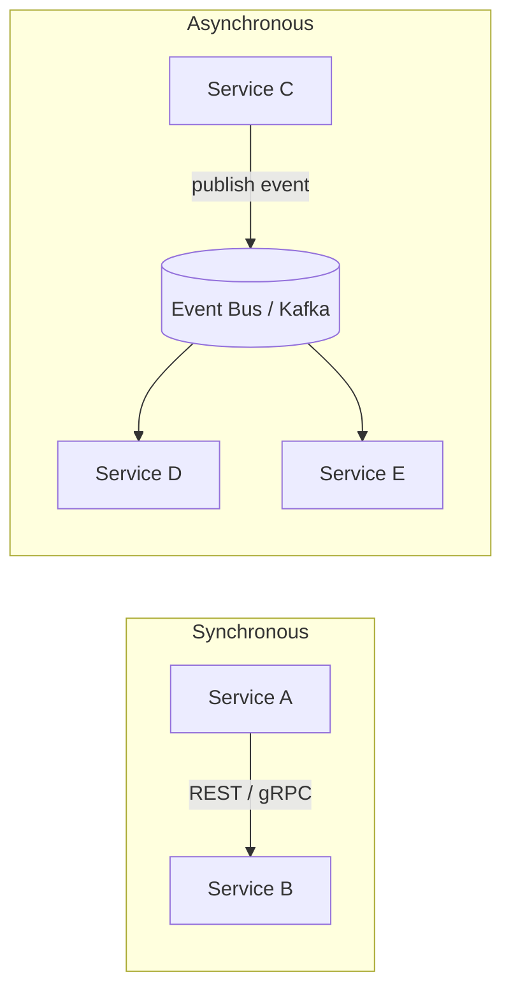
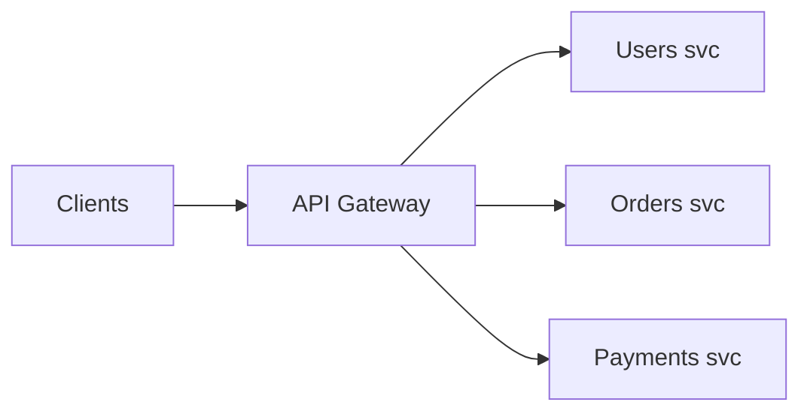
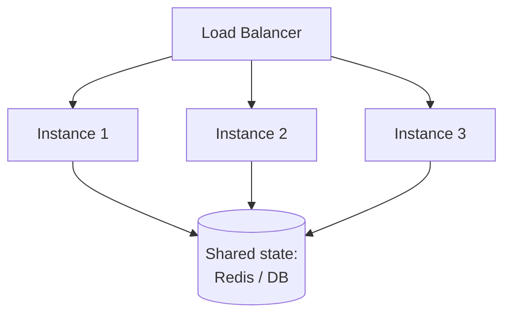
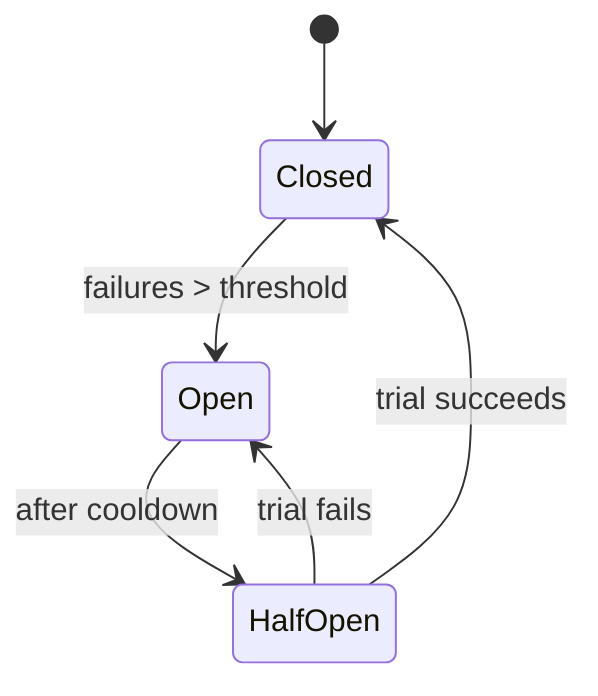
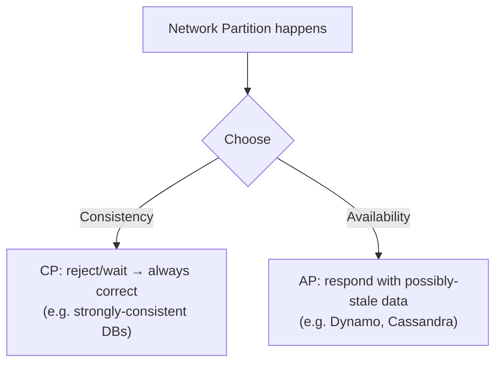

# Backend System Design & Distributed Concepts

> **Topic:** General backend infrastructure & distributed-systems concepts every senior Node.js engineer is expected to know
> **Target audience:** Backend Developer (Node.js) — 5+ years / senior
> **Format:** Concept deep dives + Q&A, with Mermaid diagrams, callouts, code, and follow-ups
> **Related notes:** [[nodejs]] · [[express]] · [[mongodb]] · [[git_notes]]

---

## Table of Contents

**Real-time & messaging**
1. [WebSockets & Real-Time Communication](#1-websockets--real-time-communication)
2. [Message Queues & Async Processing](#2-message-queues--async-processing)
3. [Cron Jobs & Scheduling](#3-cron-jobs--scheduling)

**Data & speed**
4. [Caching](#4-caching)
5. [Redis](#5-redis)

**Distributed architecture**
6. [Monolith vs Microservices](#6-monolith-vs-microservices)
7. [Inter-Service Communication](#7-inter-service-communication)
8. [API Gateway & Service Discovery](#8-api-gateway--service-discovery)
9. [Load Balancing & Horizontal Scaling](#9-load-balancing--horizontal-scaling)

**Reliability & correctness**
10. [Resilience Patterns (timeouts, retries, circuit breaker)](#10-resilience-patterns)
11. [Idempotency & Exactly-Once](#11-idempotency--exactly-once)
12. [CAP Theorem & Consistency](#12-cap-theorem--consistency)
13. [Observability & Health](#13-observability--health)

14. [Interview Questions](#14-interview-questions)
15. [Quick Cheat-Sheet](#15-quick-cheat-sheet)

---

## 1. WebSockets & Real-Time Communication

**WebSockets provide a persistent, full-duplex TCP connection** — unlike HTTP's request/response, the server can push data to the client any time. Essential for chat, live dashboards, gaming, collaborative editing.

### Choosing a real-time transport

| Technique | Direction | Cost | Use case |
|-----------|-----------|------|----------|
| **Polling** | client pulls repeatedly | wasteful | simple, infrequent updates |
| **Long-polling** | client holds request open | medium | fallback when WS unavailable |
| **SSE** (Server-Sent Events) | server → client (one-way) | cheap | notifications, live feeds |
| **WebSockets** | full duplex | persistent conn | chat, presence, multiplayer |



### Scaling WebSockets across instances



> [!WARNING]
> WebSockets are **stateful** (connection pinned to one instance). To broadcast across a cluster, instances must share events — use the **Socket.io Redis adapter** (pub/sub) so a message from a client on instance 1 reaches clients on instance 2. The load balancer also needs **sticky sessions** or proper WS support.

```js
// Socket.io with Redis adapter for multi-instance broadcast
const { createAdapter } = require('@socket.io/redis-adapter');
io.adapter(createAdapter(pubClient, subClient));
io.on('connection', (socket) => {
  socket.join('room:42');
  io.to('room:42').emit('message', payload);   // reaches clients on ANY instance
});
```

> [!TIP]
> Use **rooms/namespaces** to target subsets of clients. Authenticate the WS handshake (validate JWT on connect) — don't leave sockets open to anyone. Related: [[nodejs]] §G6.

---

## 2. Message Queues & Async Processing

**A message queue decouples producers from consumers**, letting you offload slow/failure-prone work to background workers, absorb traffic spikes, and retry safely.



### When to use a queue

- Sending emails / SMS / push notifications
- Image/video processing, report generation
- Webhooks & third-party API calls (retry on failure)
- Order/payment pipelines, fan-out to multiple services

### Choosing a broker

| Broker | Model | Best for |
|--------|-------|----------|
| **BullMQ** (Redis) | job queue | app-level background jobs in Node (delays, retries, repeatable) |
| **RabbitMQ** | AMQP routing | complex routing, RPC, work distribution |
| **Kafka** | distributed log | high-throughput event streaming, replay, analytics |
| **SQS** (AWS) | managed queue | serverless / cloud-native, no ops |

```js
// BullMQ — producer + worker
const { Queue, Worker } = require('bullmq');
const emailQueue = new Queue('email', { connection });

await emailQueue.add('welcome', { userId }, {
  attempts: 5, backoff: { type: 'exponential', delay: 1000 },  // auto-retry
});

new Worker('email', async (job) => {
  await sendEmail(job.data.userId);     // runs in a separate process
}, { connection });
```

> [!IMPORTANT]
> Queue delivery is usually **at-least-once** → a job may run **more than once**. Make workers **idempotent** (see [[#11. Idempotency & Exactly-Once]]). Always configure retries + a **dead-letter queue** for poison messages.

> [!TIP] Queues vs Pub/Sub
> A **queue** delivers each message to exactly one consumer (work distribution). **Pub/Sub** broadcasts each message to all subscribers (event notification). Kafka does both via consumer groups.

---

## 3. Cron Jobs & Scheduling

**Scheduled/recurring tasks**: cleanups, report generation, cache warming, sending digests, syncing data.

```js
const cron = require('node-cron');
// ┌ min ┌ hour ┌ day ┌ month ┌ weekday
cron.schedule('0 2 * * *', () => runNightlyReport());   // every day at 02:00
```

> [!WARNING] The multi-instance trap
> If you run cron **inside** your clustered/replicated app, **every instance fires the job** → duplicate emails, double charges. Solutions:
> - Run schedulers as a **single dedicated worker/process**, or
> - Use a **distributed lock** (Redis `SET NX`) so only one instance executes, or
> - Use a queue scheduler (**BullMQ repeatable jobs**) or an external scheduler (Kubernetes CronJob, cloud scheduler).

```js
// Distributed lock so only ONE instance runs the job
const locked = await redis.set('cron:report', '1', 'NX', 'EX', 300);
if (locked) await runNightlyReport();
```

> [!TIP]
> For reliability and visibility, prefer **BullMQ repeatable jobs** or an infra-level scheduler over in-process `node-cron` in production — they survive restarts and avoid the duplicate-execution problem.

---

## 4. Caching

**Caching stores expensive-to-compute or frequently-read data closer to the consumer** to cut latency and DB load. It's the single highest-leverage performance tool.

### Where caching lives (layers)



### Cache patterns

> [!question]- Cache strategies
> - **Cache-aside (lazy loading):** app checks cache; on miss, reads DB and populates cache. Most common, resilient. Risk: first-request latency + stale data.
> - **Read-through:** cache library loads from DB on miss transparently.
> - **Write-through:** writes go to cache + DB together → consistent, slower writes.
> - **Write-behind (write-back):** write to cache, async flush to DB → fast, risk of data loss on crash.

```js
// Cache-aside pattern
async function getProduct(id) {
  const cached = await redis.get(`product:${id}`);
  if (cached) return JSON.parse(cached);              // hit
  const product = await Product.findById(id);          // miss → DB
  await redis.set(`product:${id}`, JSON.stringify(product), 'EX', 300); // populate, TTL 5m
  return product;
}
```

> [!IMPORTANT] The two hard problems
> 1. **Invalidation** — keeping cache fresh. Use **TTLs** always; invalidate keys on write. "There are only two hard things in CS: cache invalidation and naming things."
> 2. **Cache stampede** — when a hot key expires, many requests miss simultaneously and hammer the DB. Mitigate with **locks/single-flight**, **stale-while-revalidate**, or **jittered TTLs**.

> [!TIP] Eviction
> When memory fills, caches evict by policy — **LRU** (least recently used) is the common default. Size caches and set TTLs so they never grow unbounded ([[nodejs]] Q11).

---

## 5. Redis

**Redis is a single-threaded, in-memory data store** with sub-millisecond ops and rich data structures — the Swiss-army knife of backend infrastructure.

### Common Redis use cases

| Use case | How |
|----------|-----|
| **Caching** | `GET/SET` with `EX` TTL |
| **Session store** | shared sessions across instances |
| **Rate limiting** | `INCR` + `EXPIRE` ([[nodejs]] Q10) |
| **Distributed lock** | `SET key val NX EX` |
| **Pub/Sub** | real-time fan-out, Socket.io adapter |
| **Job queues** | BullMQ |
| **Leaderboards / counters** | Sorted Sets (`ZADD`/`ZRANGE`) |

> [!question]- Key Redis data types
> - **String** — caching, counters (`INCR`)
> - **Hash** — objects (user profile fields)
> - **List** — queues, recent items
> - **Set** — unique membership (tags, online users)
> - **Sorted Set** — leaderboards, priority queues, rate windows
> - **Streams** — append-only log, consumer groups

> [!NOTE] Why is single-threaded Redis so fast?
> It's in-memory (no disk per op) and avoids lock contention by processing commands sequentially — most commands are O(1)/O(log n). Commands are **atomic**; use **Lua scripts** or `MULTI/EXEC` for multi-step atomicity.

> [!WARNING]
> Redis is in-memory → plan for **persistence** (RDB snapshots / AOF) if you need durability, **eviction policy** (`maxmemory-policy`) when full, and **clustering/replication** for HA. Beware `KEYS *` in production (O(n), blocks) — use `SCAN`.

---

## 6. Monolith vs Microservices

**Start with a (modular) monolith; split into microservices only when team size, independent scaling, or independent deployment justify the operational cost.**



| Monolith | Microservices |
|----------|---------------|
| Simple deploy & local dev | Independent deploy & scale per service |
| One DB → easy transactions | DB-per-service → eventual consistency |
| Scales as one unit | Fine-grained scaling |
| Tight coupling risk | Network latency + distributed debugging |

> [!WARNING]
> Microservices trade *code complexity* for *distributed-systems complexity*: network failures, partial failures, data consistency, distributed tracing, deployment orchestration. **Don't adopt prematurely** — a "distributed monolith" is the worst of both worlds.

> [!TIP] Database-per-service
> Each microservice owns its data; others access it only via its API/events — never by reaching into its DB. This is what enables independent evolution. See [[#7. Inter-Service Communication]].

---

## 7. Inter-Service Communication

Two broad styles: **synchronous** (request/response) and **asynchronous** (events/messages).



| | Synchronous (REST/gRPC) | Asynchronous (events/queue) |
|---|---|---|
| Coupling | tighter (caller waits) | loose (fire-and-forget) |
| Latency | adds up across calls | decoupled |
| Failure | cascades if callee down | buffered, retried |
| Use | immediate read/response | workflows, fan-out, decoupling |

> [!question]- Sync transport choices
> - **REST/JSON** — universal, human-readable, easy to debug; verbose.
> - **gRPC (HTTP/2 + Protobuf)** — fast, strongly-typed contracts, streaming; great for internal service-to-service.
> - **GraphQL** — client-driven field selection; usually edge/BFF, not service-to-service.

> [!IMPORTANT] Saga pattern
> With DB-per-service you can't use a single ACID transaction across services. Use a **Saga**: a sequence of local transactions, each publishing an event; on failure, run **compensating transactions** to undo. This is how distributed workflows stay consistent (eventually). Pairs with [[#11. Idempotency & Exactly-Once]].

> [!TIP] Event-driven benefits
> Async/event-driven communication improves resilience (a down consumer just processes later) and enables adding new consumers without touching producers. See [[#2. Message Queues & Async Processing]].

---

## 8. API Gateway & Service Discovery

**An API Gateway is a single entry point** in front of microservices, handling cross-cutting concerns so each service doesn't reimplement them.



> [!question]- Gateway responsibilities
> Routing · authentication/authorization · rate limiting ([[nodejs]] Q10) · request aggregation (BFF) · TLS termination · caching · logging/metrics. Examples: Kong, AWS API Gateway, nginx, Express gateway.

**Service discovery** lets services find each other's dynamic network locations (in K8s, via DNS/service names; or via a registry like Consul/Eureka) instead of hardcoded IPs.

> [!NOTE]
> In Kubernetes, the gateway/ingress + built-in service DNS handle most of this; you rarely wire discovery manually.

---

## 9. Load Balancing & Horizontal Scaling

**Horizontal scaling = add more instances; a load balancer distributes traffic across them.** Requires apps to be **stateless** so any instance can serve any request.



> [!question]- LB algorithms
> Round-robin · least-connections · IP-hash (sticky) · weighted. Layer 4 (TCP) vs Layer 7 (HTTP-aware, can route by path/header).

> [!IMPORTANT] Statelessness is the prerequisite
> Externalize sessions, caches, and uploaded files to Redis / DB / object storage. If an instance holds local state, requests routed elsewhere break — and you can't scale or do rolling deploys. See [[nodejs]] Q7 (cluster/PM2) and §F3.

> [!TIP]
> **Vertical scaling** (bigger machine) is simplest but has a ceiling; **horizontal scaling** is near-unlimited and fault-tolerant (one instance dies, others serve). Set `app.set('trust proxy', …)` so `req.ip`/rate-limits work behind the LB ([[express]] §11).

---

## 10. Resilience Patterns

Distributed calls **will** fail. Senior engineers design for it.

> [!question]- Core resilience patterns
> - **Timeouts** — never wait forever on a dependency; bound every external call.
> - **Retries with exponential backoff + jitter** — retry transient failures, spacing attempts out (jitter avoids synchronized retry storms).
> - **Circuit breaker** — after N failures, "open" and fail fast instead of piling up; periodically test recovery.
> - **Bulkhead** — isolate resource pools so one failing dependency can't exhaust everything.
> - **Graceful degradation / fallback** — serve cached/partial data when a dependency is down.



```js
// Timeout + retry sketch
async function callWithResilience(fn, { retries = 3, timeout = 2000 } = {}) {
  for (let attempt = 1; attempt <= retries; attempt++) {
    try { return await withTimeout(fn(), timeout); }
    catch (err) {
      if (attempt === retries) throw err;
      await sleep(2 ** attempt * 100 + Math.random() * 100);  // backoff + jitter
    }
  }
}
```

> [!WARNING]
> Naive retries can **amplify an outage** (retry storm). Always combine retries with backoff, jitter, a cap, and ideally a circuit breaker. Only retry **idempotent** operations. Library: `opossum`.

---

## 11. Idempotency & Exactly-Once

**Idempotency = doing the same operation multiple times has the same effect as once.** Critical because networks retry, queues redeliver, and users double-click.

```js
// Idempotency key prevents duplicate side effects (e.g. double charge)
app.post('/payments', async (req, res) => {
  const key = req.get('Idempotency-Key');
  const existing = await Payment.findOne({ idempotencyKey: key });
  if (existing) return res.json(existing);           // replay → return prior result
  const payment = await charge(req.body, key);
  res.json(payment);
});
```

> [!IMPORTANT] "Exactly-once" is mostly a myth
> Most systems are **at-least-once** (may redeliver) or **at-most-once** (may lose). Practical "exactly-once processing" = **at-least-once delivery + idempotent consumers** (dedupe by a unique key). This is the standard answer for payments, webhooks, and queue workers. See [[#2. Message Queues]] and [[nodejs]] §G4.

---

## 12. CAP Theorem & Consistency

**CAP: during a network Partition, a distributed system must choose between Consistency and Availability** — you can't have both while partitioned.



> [!question]- Consistency models
> - **Strong consistency** — every read sees the latest write (e.g. single-primary, `w:majority` reads from primary).
> - **Eventual consistency** — replicas converge over time; reads may be stale (e.g. reading from MongoDB secondaries, caches, AP stores).

> [!NOTE]
> Real systems tune per-operation: MongoDB lets you pick **write concern** (`w`) and **read preference**; you trade latency/availability for freshness. Caches are inherently eventually consistent ([[#4. Caching]]). MongoDB replica-set details: [[mongodb]] / [[nodejs]] §E5.

---

## 13. Observability & Health

**You can't operate what you can't see.** Observability = understanding system state from its outputs.

> [!question]- The three pillars
> - **Logs** — discrete events; use **structured JSON** + a **correlation/request ID** ([[nodejs]] §A7) to trace one request across services.
> - **Metrics** — aggregate numbers over time (latency p95/p99, throughput, error rate, queue depth, event-loop lag). Tools: Prometheus/Grafana.
> - **Traces** — a request's path across services with timing per hop. Tool: OpenTelemetry/Jaeger.

**Health checks** let orchestrators manage instances:

```js
app.get('/health/live',  (_, res) => res.sendStatus(200));   // process alive?
app.get('/health/ready', async (_, res) =>                    // can serve traffic?
  (mongoose.connection.readyState === 1 && await redisOk())
    ? res.sendStatus(200) : res.sendStatus(503));
```

> [!TIP]
> Pair health checks with **graceful shutdown** on SIGTERM ([[nodejs]] §A6) for zero-downtime deploys. Alert on **symptoms** (error rate, latency) not just causes.

---

## 14. Interview Questions

> [!question]- Real-time & messaging
> **Q: WebSockets vs SSE vs polling — when each?** Polling for simple/infrequent; SSE for one-way live feeds; WebSockets for bidirectional (chat/gaming).
> **Q: How do you scale WebSockets across instances?** Redis pub/sub adapter + sticky sessions; broadcast via rooms.
> **Q: Why use a message queue?** Decouple producers/consumers, absorb spikes, retry failures, offload slow work.
> **Q: Queue vs pub/sub?** Queue = one consumer per message (work); pub/sub = all subscribers get it (broadcast).
> **Q: How do you avoid duplicate cron execution across replicas?** Single scheduler process, distributed lock, or BullMQ repeatable jobs.

> [!question]- Caching & Redis
> **Q: Explain cache-aside.** App checks cache; miss → load from DB → populate cache with TTL.
> **Q: What is cache stampede and how do you prevent it?** Many simultaneous misses on an expired hot key hammer the DB; fix with locks/single-flight, stale-while-revalidate, jittered TTL.
> **Q: Why is Redis fast despite being single-threaded?** In-memory, O(1) ops, no lock contention; commands are atomic.
> **Q: Name 5 Redis use cases.** Cache, sessions, rate limiting, distributed locks, pub/sub, queues, leaderboards.

> [!question]- Distributed architecture
> **Q: When would you choose microservices?** When teams/scaling/deploy independence justify the operational overhead — not by default.
> **Q: How do services communicate?** Sync (REST/gRPC) for request/response; async (events/queues) for decoupling and resilience.
> **Q: How do you keep data consistent across services without distributed transactions?** Saga pattern with compensating transactions + idempotency.
> **Q: What does an API gateway do?** Single entry point: routing, auth, rate limiting, aggregation, TLS.

> [!question]- Reliability & correctness
> **Q: How do you make a system resilient to a flaky dependency?** Timeouts + retries (backoff + jitter) + circuit breaker + fallback.
> **Q: What is idempotency and why does it matter?** Repeating an op has the same effect as once — needed because queues/networks retry (prevents double charges).
> **Q: Explain CAP.** Under a partition, choose consistency or availability; eventual consistency trades freshness for availability.
> **Q: What are the three pillars of observability?** Logs, metrics, traces — tied together by a correlation ID.

---

## 15. Quick Cheat-Sheet

| Concept | One-liner |
|---------|-----------|
| WebSockets | persistent full-duplex; scale via Redis adapter + sticky sessions |
| SSE | one-way server→client push, cheap |
| Message queue | decouple + retry + spike absorption; workers must be idempotent |
| BullMQ / RabbitMQ / Kafka | jobs / routing-RPC / event-stream |
| Cron | schedule tasks; guard against duplicate runs across replicas |
| Cache-aside | check cache → miss → DB → populate (TTL) |
| Cache stampede | locks / stale-while-revalidate / jittered TTL |
| Redis | in-memory store: cache, sessions, locks, rate limit, pub/sub, queues |
| Microservices | independent deploy/scale; DB-per-service; eventual consistency |
| Sync vs async comms | REST/gRPC (wait) vs events/queue (decouple) |
| Saga | local txns + compensations across services |
| API gateway | single entry: routing/auth/rate-limit/TLS |
| Load balancer | distribute traffic; requires stateless apps |
| Resilience | timeout + retry(backoff+jitter) + circuit breaker |
| Idempotency | same op N times = same effect (idempotency key) |
| CAP | partition → consistency *or* availability |
| Observability | logs + metrics + traces + correlation id |

---

> [!NOTE] How to use this note
> These topics are the **senior differentiators** — interviewers probe them to separate mid from senior. For each, be ready to explain the **trade-off** and give a **real example** ("we used BullMQ with idempotent workers and a dead-letter queue because…"). Pair with [[nodejs]] (runtime/internals) and [[express]] (API layer).

### See Also
- [[nodejs]] — Node.js core, async, scaling, security, MongoDB
- [[express]] — Express framework deep dive
- [[mongodb]] — schema design, aggregation, transactions, replication
- [[git_notes]] — version control
