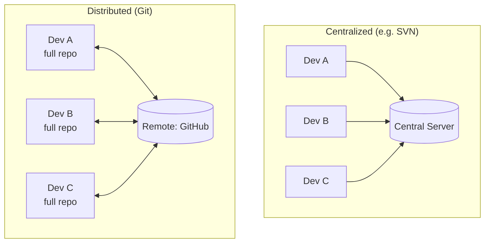
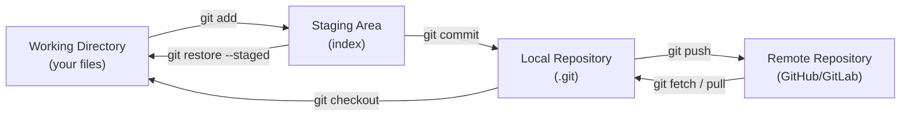
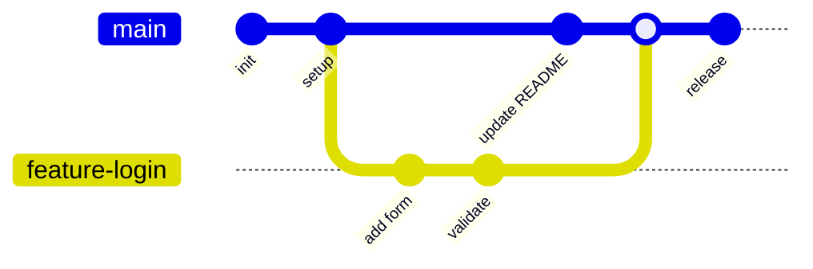
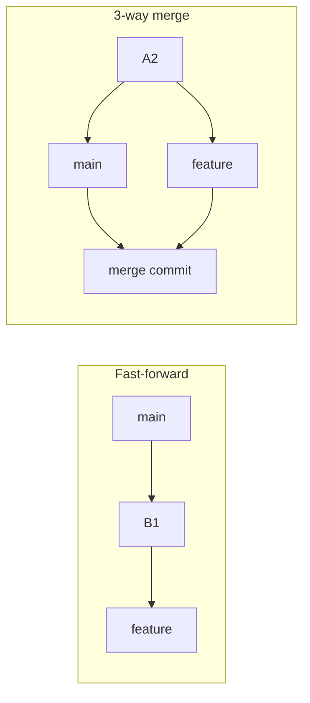
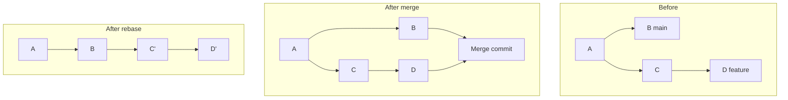
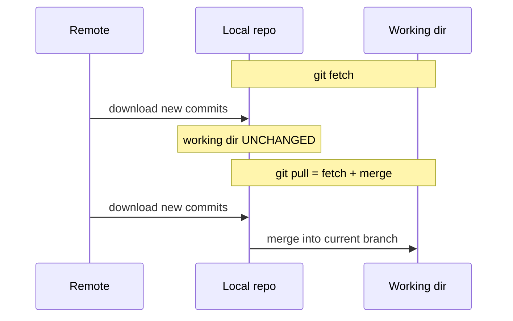
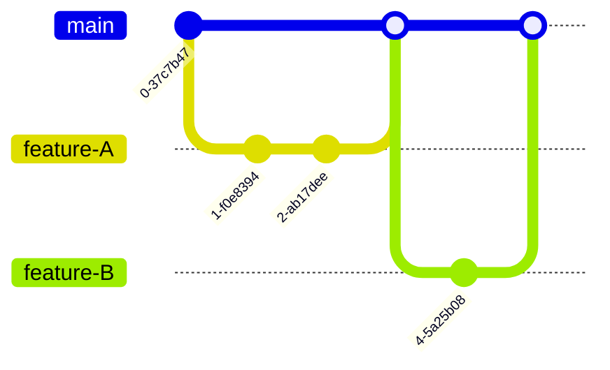
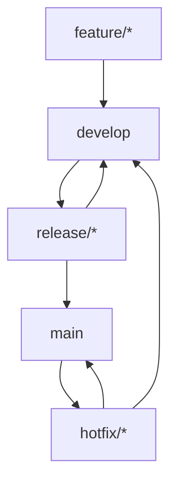
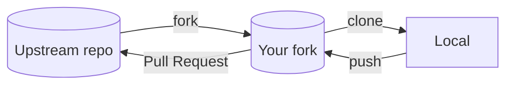
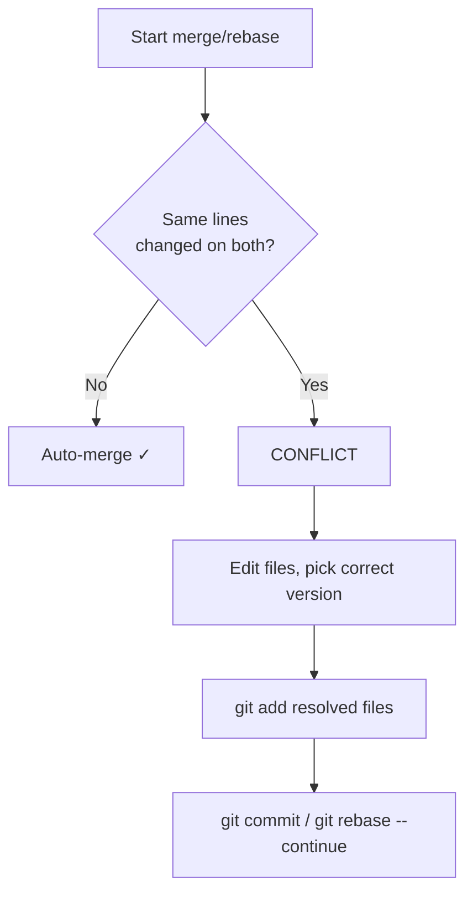

# Git — Complete Revision & Interview Notes

> **Topic:** Version Control with Git
> **Scope:** Concepts → core commands → branching → remotes → workflows → conflicts → real-world use cases → interview prep
> **Format:** Obsidian-compatible (Mermaid diagrams, callouts, code blocks)

---

## Table of Contents

1. [What is Git & Version Control](#1-what-is-git--version-control)
2. [Git Architecture — The Three Trees](#2-git-architecture--the-three-trees)
3. [Core Workflow Commands](#3-core-workflow-commands)
4. [Branching & Merging](#4-branching--merging)
5. [Merge vs Rebase](#5-merge-vs-rebase)
6. [Remote Repositories](#6-remote-repositories)
7. [Undoing Changes](#7-undoing-changes)
8. [Stashing, Tags & Cherry-pick](#8-stashing-tags--cherry-pick)
9. [Git Workflows](#9-git-workflows)
10. [.gitignore & Best Practices](#10-gitignore--best-practices)
11. [Merge Conflicts](#11-merge-conflicts)
12. [Real-World Use Cases](#12-real-world-use-cases)
13. [Interview Questions](#13-interview-questions)
14. [Quick Command Cheat-Sheet](#14-quick-command-cheat-sheet)

---

## 1. What is Git & Version Control

**Version Control System (VCS)** = a system that records changes to files over time so you can recall specific versions later, collaborate, and never lose work.

**Git** is a **Distributed** Version Control System (DVCS) created by Linus Torvalds in 2005 for Linux kernel development. Every developer has a **full copy** of the repository — including the entire history — on their machine.

### Centralized vs Distributed



> [!note] Key difference
> In **CVCS**, history lives only on the central server — if it goes down, no one can commit or see history. In **Git**, every clone is a complete backup, and most operations (commit, diff, log, branch) are **local and fast** — no network needed.

> [!tip] Git tracks snapshots, not diffs
> Unlike older VCS that store file-by-file differences, Git stores a **snapshot** of all files at each commit. Unchanged files are stored as a reference (pointer) to the previous identical file, so it stays efficient.

---

## 2. Git Architecture — The Three Trees

Git manages your project across **three main areas** (plus the remote):



| Area | What it holds | Moved into it by |
|------|---------------|------------------|
| **Working Directory** | The actual files you edit | (your editor) |
| **Staging Area (Index)** | Changes marked for the next commit | `git add` |
| **Local Repository** | Committed history in `.git/` | `git commit` |
| **Remote Repository** | Shared history on a server | `git push` |

> [!info] What is `.git/`?
> When you run `git init`, Git creates a hidden `.git/` folder. It contains the entire object database (commits, trees, blobs), refs (branches/tags), config, and the staging index. **Delete it and you delete the repo's history** (working files remain).

### A commit is identified by a SHA-1 hash

Each commit gets a unique 40-character hash (e.g. `a1b2c3d…`). A commit points to its **parent(s)**, forming a directed acyclic graph (DAG).


---

## 3. Core Workflow Commands

```bash
# Configure identity (once per machine)
git config --global user.name "Your Name"
git config --global user.email "you@example.com"

# Start a repo
git init                      # create a new local repo
git clone <url>               # copy an existing remote repo

# The daily loop
git status                    # what's changed / staged
git add file.txt              # stage a specific file
git add .                     # stage everything in current dir
git commit -m "message"       # commit staged changes
git commit -am "message"      # stage tracked files + commit (skips git add)

# Inspect
git log                       # full commit history
git log --oneline --graph     # compact, visual history
git diff                      # working dir vs staging
git diff --staged             # staging vs last commit
git show <hash>               # details of a specific commit
```

> [!tip] Write good commit messages
> Use the imperative mood: *"Add login validation"* not *"Added login validation"*. First line ≤ 50 chars (summary), then a blank line, then a detailed body if needed.

> [!example] Typical flow
> ```bash
> git status                  # see "modified: app.py"
> git add app.py
> git commit -m "Fix null check in login handler"
> git push
> ```

---

## 4. Branching & Merging

A **branch** is just a lightweight, movable pointer to a commit. `HEAD` points to the branch you're currently on.

```bash
git branch                      # list branches
git branch feature-login        # create a branch
git switch feature-login        # switch to it (modern)
git checkout feature-login      # switch to it (classic)
git switch -c feature-login     # create + switch in one step
git branch -d feature-login     # delete a merged branch
git branch -D feature-login     # force-delete (unmerged)
```

### Branch visualization



### Merging

```bash
git switch main
git merge feature-login         # bring feature-login into main
```

> [!note] Fast-forward vs 3-way merge
> - **Fast-forward:** `main` had no new commits since the branch split → Git just moves the `main` pointer forward. Linear history, no merge commit.
> - **3-way merge:** both branches advanced → Git creates a **merge commit** with two parents, combining both lines of work.



---

## 5. Merge vs Rebase

Both integrate changes from one branch into another, but **history looks different**.

```bash
# Merge: preserves history, creates a merge commit
git switch main
git merge feature

# Rebase: replays your commits on top of another branch → linear history
git switch feature
git rebase main
```



| | Merge | Rebase |
|---|-------|--------|
| History | Non-linear, true record | Linear, clean |
| Merge commit | Yes | No |
| Rewrites commits | No | Yes (new hashes) |
| Best for | Integrating shared branches | Tidying local work before sharing |

> [!warning] The Golden Rule of Rebase
> **Never rebase commits that have been pushed to a shared branch.** Rebasing rewrites commit history (new hashes); if others have based work on those commits, you'll create duplicate commits and painful conflicts. Rebase only **local, unpushed** work.

---

## 6. Remote Repositories

A **remote** is a version of your repo hosted elsewhere (GitHub, GitLab, Bitbucket). `origin` is the default name for the remote you cloned from.

```bash
git remote -v                          # list remotes
git remote add origin <url>            # link a remote
git push -u origin main                # push + set upstream tracking
git push                               # push current branch
git fetch                              # download remote changes (no merge)
git pull                               # fetch + merge into current branch
git pull --rebase                      # fetch + rebase (linear history)
```

### Fetch vs Pull



> [!tip] fetch is safe, pull changes your files
> `git fetch` only updates your remote-tracking branches (`origin/main`) — it never touches your working files. `git pull` additionally merges, which can cause conflicts. When unsure, **fetch first, review, then merge**.

---

## 7. Undoing Changes

> [!danger] Know your tool before undoing
> `reset --hard` and `checkout --` on files **discard work permanently**. When in doubt, prefer `git revert` (safe) or `git stash` (recoverable).

```bash
# Unstage (keep changes in working dir)
git restore --staged file.txt          # modern
git reset HEAD file.txt                 # classic

# Discard working-dir changes (DESTRUCTIVE)
git restore file.txt                    # modern
git checkout -- file.txt                # classic

# Amend the last commit (message or forgotten files)
git commit --amend -m "new message"

# Move HEAD / branch pointer
git reset --soft HEAD~1                  # undo commit, keep changes staged
git reset --mixed HEAD~1                 # undo commit, keep changes unstaged (default)
git reset --hard HEAD~1                  # undo commit, DISCARD changes

# Revert: create a NEW commit that undoes a previous one (safe for shared history)
git revert <hash>

# Recover "lost" commits
git reflog                               # shows every HEAD movement
git reset --hard <hash-from-reflog>
```

| Command | Affects history | Affects files | Safe on shared branch? |
|---------|-----------------|---------------|------------------------|
| `reset --soft` | Yes (moves pointer) | No | ❌ |
| `reset --mixed` | Yes | Unstages | ❌ |
| `reset --hard` | Yes | **Deletes** | ❌ |
| `revert` | Adds new commit | No (inverts via commit) | ✅ |
| `restore` / `checkout --` | No | Discards file changes | n/a |

> [!tip] reflog is your safety net
> Even after a `reset --hard`, the old commits aren't gone immediately — `git reflog` lists every position HEAD has been, so you can `reset` back to them. They're only garbage-collected after ~30–90 days.

---

## 8. Stashing, Tags & Cherry-pick

### Stash — shelve work-in-progress

```bash
git stash                       # save uncommitted changes, clean working dir
git stash push -m "wip: login"  # named stash
git stash list                  # view stashes
git stash pop                   # re-apply latest stash and remove it
git stash apply                 # re-apply but keep it in the list
git stash drop                  # delete a stash
```

> [!example] When to stash
> You're mid-feature when an urgent bug comes in. `git stash` → switch to a hotfix branch → fix → switch back → `git stash pop` to resume.

### Tags — mark releases

```bash
git tag v1.0.0                          # lightweight tag
git tag -a v1.0.0 -m "Release 1.0.0"    # annotated tag (recommended)
git push origin v1.0.0                  # push a tag
git push origin --tags                  # push all tags
```

### Cherry-pick — grab a single commit

```bash
git cherry-pick <hash>          # apply one specific commit to current branch
```

> [!note] Cherry-pick use case
> Apply a single bug-fix commit from `develop` onto a `release` branch without merging everything else.

---

## 9. Git Workflows

### Feature Branch Workflow

Every new feature gets its own branch; merge to `main` via Pull Request.



### Gitflow

Structured branches for releases: `main` (production), `develop` (integration), `feature/*`, `release/*`, `hotfix/*`.



### Forking Workflow (open source)



> [!tip] Choosing a workflow
> - **Small team / continuous delivery →** Feature Branch + PRs (GitHub Flow)
> - **Scheduled releases / multiple versions →** Gitflow
> - **Open source / external contributors →** Forking workflow

---

## 10. .gitignore & Best Practices

A `.gitignore` file tells Git which files/folders to **never track** (build artifacts, secrets, dependencies, logs).

```gitignore
# Dependencies
node_modules/
venv/

# Build output
dist/
build/
*.pyc

# Environment & secrets
.env
*.key

# OS / editor
.DS_Store
.vscode/
```

> [!warning] .gitignore only ignores untracked files
> If a file is **already tracked**, adding it to `.gitignore` won't stop tracking it. Remove it from the index first:
> ```bash
> git rm --cached secrets.env
> ```

> [!tip] Best practices
> - Commit **often**, in small logical units.
> - **Never commit secrets** (API keys, passwords) — use env vars / secret managers.
> - Pull/rebase before pushing to reduce conflicts.
> - Use branches for everything; keep `main` always deployable.
> - Write meaningful commit messages.

---

## 11. Merge Conflicts

A conflict happens when **two branches change the same lines** of a file and Git can't auto-merge.



Git marks conflicts inside the file:

```text
<<<<<<< HEAD
const timeout = 30;        // your change
=======
const timeout = 60;        // incoming change
>>>>>>> feature-branch
```

```bash
# Resolve
git status                  # list conflicted files
# ... edit files, remove <<<<<<< ======= >>>>>>> markers ...
git add resolved-file.js
git commit                  # (or: git merge --continue / git rebase --continue)

git merge --abort           # bail out and return to pre-merge state
```

> [!tip] Reduce conflicts
> Pull/rebase frequently, keep branches short-lived, and coordinate so two people don't edit the same code simultaneously.

---

## 12. Real-World Use Cases

> [!example] 1. Hotfix to production
> A critical bug is live. Branch from `main`, fix, fast-track review, merge, and tag a patch release:
> ```bash
> git switch main && git pull
> git switch -c hotfix/payment-crash
> # ...fix...
> git commit -am "Fix payment crash on null cart"
> git push -u origin hotfix/payment-crash   # open PR, merge, deploy
> ```

> [!example] 2. Collaborative feature development
> Two devs work on separate feature branches off `develop`, open PRs, get code review, and merge independently — no one blocks the other.

> [!example] 3. Code review via Pull Requests
> PRs let teammates comment line-by-line, run CI checks, and require approval before code reaches `main`. The branch is the unit of review.

> [!example] 4. CI/CD trigger
> A push or merge to `main` triggers an automated pipeline (build → test → deploy). Tags like `v1.2.0` trigger production releases.

> [!example] 5. Reverting a bad deploy
> A merged feature broke production. Instead of a destructive reset on the shared branch, safely invert it:
> ```bash
> git revert <bad-commit-hash>   # creates a new "undo" commit, history preserved
> git push
> ```

> [!example] 6. Bisecting to find a bug
> `git bisect` binary-searches commit history to pinpoint which commit introduced a regression:
> ```bash
> git bisect start
> git bisect bad                 # current commit is broken
> git bisect good v1.0.0         # this old version worked
> # Git checks out midpoints; you mark good/bad until it finds the culprit
> ```

---

## 13. Interview Questions

> [!question]- Beginner
> **Q: What's the difference between Git and GitHub?**
> Git is the distributed version-control *tool* that runs locally. GitHub is a *cloud hosting service* for Git repos adding collaboration features (PRs, issues, CI, access control). Alternatives: GitLab, Bitbucket.
>
> **Q: Difference between `git fetch` and `git pull`?**
> `fetch` downloads remote changes but doesn't touch your working branch. `pull` = `fetch` + `merge` (or rebase) into your current branch.
>
> **Q: What does the staging area do?**
> It's an intermediate area where you assemble exactly what goes into the next commit, letting you commit a subset of your changes.
>
> **Q: `git commit` vs `git commit -m`?**
> Both create a commit; `-m` supplies the message inline instead of opening an editor.

> [!question]- Intermediate
> **Q: Merge vs rebase?**
> Merge preserves history and creates a merge commit (non-linear). Rebase replays commits on top of another branch for a linear history but rewrites commit hashes. Never rebase shared/pushed commits.
>
> **Q: `git reset` vs `git revert`?**
> `reset` moves the branch pointer (rewrites history) — dangerous on shared branches. `revert` creates a *new* commit that undoes a previous one — safe for shared history.
>
> **Q: What is `HEAD`?**
> A pointer to the current commit/branch you have checked out. `HEAD~1` is its parent.
>
> **Q: How do you resolve a merge conflict?**
> Open the conflicted files, choose/merge the correct content, remove the `<<<<<<< ======= >>>>>>>` markers, `git add` them, then commit (or `--continue`).
>
> **Q: Difference between `reset --soft`, `--mixed`, `--hard`?**
> `--soft` keeps changes staged, `--mixed` (default) keeps them unstaged, `--hard` discards them entirely.

> [!question]- Advanced
> **Q: What's the difference between `merge --squash` and a normal merge?**
> `--squash` combines all the branch's commits into a single set of staged changes (one new commit), discarding the individual commit history.
>
> **Q: How would you recover a deleted commit/branch?**
> Use `git reflog` to find the commit's hash (HEAD history is kept ~30–90 days), then `git reset --hard <hash>` or `git branch <name> <hash>`.
>
> **Q: What is `git cherry-pick` and when do you use it?**
> Applies a specific commit from one branch onto another — useful for back-porting a single fix without merging an entire branch.
>
> **Q: How does Git store data internally?**
> As a content-addressable object database: **blobs** (file contents), **trees** (directory structure), **commits** (snapshot + metadata + parent), each keyed by a SHA-1 hash. Identical content is stored once.
>
> **Q: What is `git bisect` used for?**
> Binary search through history to find the commit that introduced a bug by marking commits good/bad.

---

## 14. Quick Command Cheat-Sheet

| Task | Command |
|------|---------|
| Initialize repo | `git init` |
| Clone repo | `git clone <url>` |
| Stage changes | `git add .` |
| Commit | `git commit -m "msg"` |
| Check status | `git status` |
| View history | `git log --oneline --graph` |
| Create + switch branch | `git switch -c <name>` |
| Merge branch | `git merge <branch>` |
| Rebase | `git rebase <branch>` |
| Push (set upstream) | `git push -u origin <branch>` |
| Fetch | `git fetch` |
| Pull | `git pull` |
| Stash WIP | `git stash` / `git stash pop` |
| Undo commit (keep changes) | `git reset --soft HEAD~1` |
| Safe undo (shared) | `git revert <hash>` |
| Discard file changes | `git restore <file>` |
| Recover lost commits | `git reflog` |
| Tag a release | `git tag -a v1.0.0 -m "..."` |
| Apply one commit | `git cherry-pick <hash>` |

---

> [!summary] TL;DR
> Git tracks **snapshots** across three areas (working dir → staging → repo) and the remote. Branch freely, merge or rebase to integrate (rebase only unpushed work), use `revert` (not `reset`) on shared history, and lean on `reflog` as your safety net. Commit small, commit often, and keep `main` deployable.
