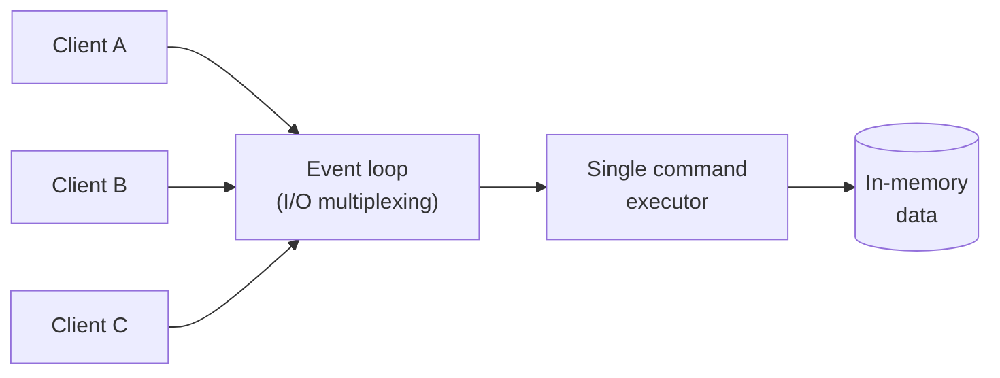
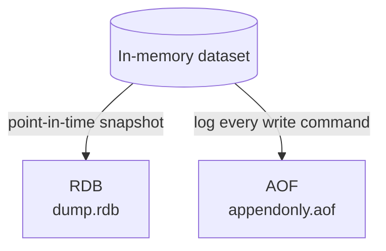
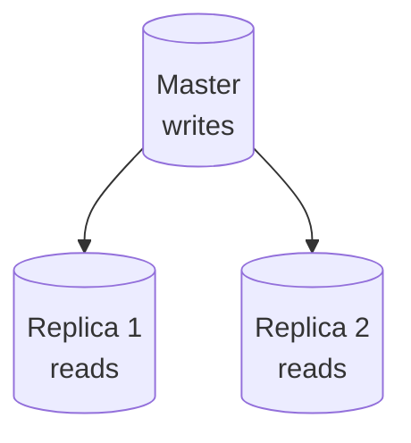
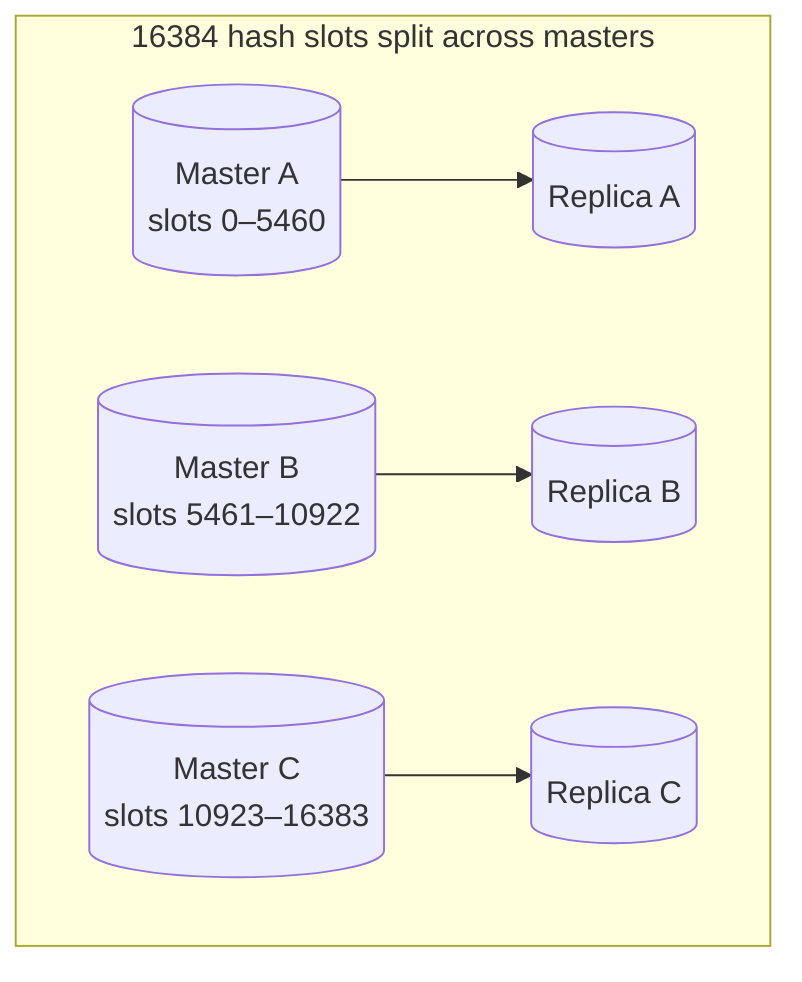
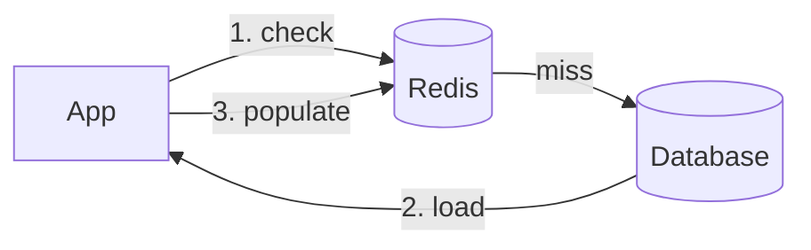

# Redis — Complete Revision & Interview Notes

> **Topic:** Redis — In-memory data store, cache & message broker
> **Scope:** Fundamentals → data types → persistence → concurrency → scaling → caching → distributed locks → production pitfalls → interview prep
> **Format:** Obsidian-compatible (Mermaid diagrams, callouts, code blocks, collapsible Q&A)
> **Related notes:** [[nodejs]] · [[mongodb]] · [[system-design]] · [[git_notes]]

---

## Table of Contents

1. [What is Redis](#1-what-is-redis)
2. [Redis vs RDBMS vs Memcached](#2-redis-vs-rdbms-vs-memcached)
3. [Data Types & When to Use Each](#3-data-types--when-to-use-each)
4. [Core Commands & Expiration](#4-core-commands--expiration)
5. [Single-Threaded Model & Concurrency](#5-single-threaded-model--concurrency)
6. [Transactions, Pipelining & Lua](#6-transactions-pipelining--lua)
7. [Persistence — RDB vs AOF](#7-persistence--rdb-vs-aof)
8. [Eviction Policies & Memory](#8-eviction-policies--memory)
9. [Pub/Sub & Streams](#9-pubsub--streams)
10. [Replication, Sentinel & Cluster](#10-replication-sentinel--cluster)
11. [Scaling Redis](#11-scaling-redis)
12. [Caching Strategies](#12-caching-strategies)
13. [Distributed Locks](#13-distributed-locks)
14. [Monitoring & Common Pitfalls](#14-monitoring--common-pitfalls)
15. [Security](#15-security)
16. [Modules, Backup & Niche Topics](#16-modules-backup--niche-topics)
17. [Redis with Node.js (Practical)](#17-redis-with-nodejs-practical)
18. [Interview Questions](#18-interview-questions)
19. [Quick Command Cheat-Sheet](#19-quick-command-cheat-sheet)

---

## 1. What is Redis

**Redis** = **RE**mote **DI**ctionary **S**erver. An open-source, **in-memory**, key-value data store written in C. It keeps the entire dataset in RAM (optionally persisted to disk), which is why reads/writes are typically **sub-millisecond**.

It's often called a **data structure server** because values aren't just plain strings — they can be Lists, Sets, Hashes, Sorted Sets, and more, each with atomic operations.

> [!note] What Redis is used *as*
> - **Cache** — the #1 use case (in front of a slower DB/API)
> - **Primary database** — for the right workloads, with persistence enabled
> - **Message broker / queue** — Pub/Sub, Lists, Streams
> - **Session store, rate limiter, leaderboard, distributed lock, real-time analytics**

> [!tip] Key features to name in an interview
> In-memory speed · rich data structures · **single-threaded** command execution (atomic) · optional persistence (RDB/AOF) · replication · high availability (Sentinel) · horizontal scaling (Cluster) · Pub/Sub · Lua scripting · TTL/expiration.

---

## 2. Redis vs RDBMS vs Memcached

| | **Redis** | **RDBMS (MySQL/Postgres)** | **Memcached** |
|---|---|---|---|
| **Storage** | In-memory (+ optional disk) | Disk-based | In-memory only |
| **Data model** | Key-value + data structures | Relational tables, SQL, joins | Key-value (strings only) |
| **Speed** | Sub-ms | ms–slower (disk I/O) | Sub-ms |
| **Persistence** | Yes (RDB/AOF) | Yes (core) | ❌ No |
| **Data types** | Rich (List/Set/Hash/ZSet/Stream…) | Rich via schema | Strings/blobs only |
| **Replication/HA** | Yes (Sentinel/Cluster) | Yes | Limited |
| **Transactions** | Partial (MULTI/EXEC) | Full ACID | ❌ No |
| **Threading** | Single-threaded core | Multi-threaded | Multi-threaded |

> [!important] Redis vs Memcached — the interview one-liner
> Both are fast in-memory caches. Choose **Memcached** for simple, multi-threaded string caching of large flat objects. Choose **Redis** when you need **data structures, persistence, replication, Pub/Sub, or atomic operations** — it does everything Memcached does and much more.

---

## 3. Data Types & When to Use Each

| Type | Description | Great for |
|------|-------------|-----------|
| **String** | Bytes up to 512 MB (text, number, JSON, binary) | Caching, counters (`INCR`), flags, sessions |
| **List** | Ordered, linked list of strings | Queues/stacks (`LPUSH`/`RPOP`), recent activity feeds |
| **Set** | Unordered collection of **unique** strings | Tags, unique visitors, membership tests, set math |
| **Sorted Set (ZSet)** | Set where each member has a **score**, kept ordered | **Leaderboards**, rankings, priority queues, rate limiting |
| **Hash** | Field–value map under one key | Objects (`user:1 → {name, age}`) — memory-efficient |
| **Bitmap** | Bit-level ops on a string | Boolean state per ID (daily active users, feature flags) |
| **HyperLogLog** | Probabilistic **unique count** (~0.81% error, ~12 KB) | Counting unique items at massive scale cheaply |
| **Stream** | Append-only log with consumer groups | Event sourcing, durable queues, message streaming |
| **Geospatial** | Lat/long stored in a ZSet | "Find shops within 5 km", ride-hailing |

```bash
# Examples
INCR page:views                    # String as counter
LPUSH queue:jobs "job1"            # List as queue
SADD tags:post:1 "redis" "cache"   # Set of unique tags
ZADD leaderboard 100 "alice"       # Sorted set for ranking
HSET user:1 name "Alice" age 30    # Hash as an object
PFADD visitors "u1" "u2"           # HyperLogLog unique count
GEOADD shops 13.36 38.11 "shopA"   # Geospatial
```

> [!tip] Choosing between List / Set / ZSet
> Need **order + duplicates** → List. Need **uniqueness** → Set. Need **uniqueness + ranking/score** → Sorted Set.

---

## 4. Core Commands & Expiration

```bash
SET user:1 "Alice"            # store a value
GET user:1                    # read it
SET session:1 "data" EX 3600  # set with 1-hour expiry (preferred, atomic)
SETEX session:1 3600 "data"   # same thing, older syntax
EXPIRE user:1 60              # add/replace a 60s TTL on an existing key
TTL user:1                    # seconds left (-1 = no expiry, -2 = key gone)
PERSIST user:1                # remove TTL, make key permanent
DEL user:1                    # delete
EXISTS user:1                 # 1 if present
INCR counter                  # atomic increment (great for counters/rate limits)
SET lock "1" NX EX 30         # set only if Not eXists (used for locks)
```

> [!example] Cache-with-TTL pattern
> ```bash
> # Cache a DB result for 5 minutes so the DB isn't hit on every request
> SET product:42 "{...json...}" EX 300
> ```

### Key naming best practices

- Keys are **binary-safe** (any bytes), but keep them **short and consistent**.
- Use **colon-separated namespaces**: `user:123:profile`, `order:456:items`.
- Avoid very long keys (they cost memory) and avoid keys with no structure.

---

## 5. Single-Threaded Model & Concurrency

Redis executes **commands one at a time on a single thread** using an event loop with **I/O multiplexing** (`epoll`/`kqueue`) to handle thousands of connections concurrently.



> [!important] Why single-threaded is a *feature*
> Because only one command runs at a time, **every command is atomic** — no locks, no race conditions on the data. There's no context-switching or locking overhead, and RAM access is so fast that one thread saturates the CPU before I/O becomes the bottleneck.

> [!warning] The CPU-bound caveat
> A single slow, **O(N)** command (e.g. `KEYS *` on millions of keys, a huge `SORT`, or a big Lua script) **blocks every other client** until it finishes. Redis is bound by single-core speed for command execution — throughput scales by adding more instances (sharding), not more cores.

> [!note] "Isn't modern Redis multi-threaded?"
> Redis 6+ added **multi-threaded I/O** (reading/writing sockets and parsing) and background threads for tasks like deletion (`UNLINK`) and persistence. But **command execution on the data is still single-threaded**, preserving atomicity.

---

## 6. Transactions, Pipelining & Lua

### Transactions — `MULTI` / `EXEC` / `WATCH`

```bash
WATCH balance         # optimistic lock: abort if 'balance' changes
MULTI                 # start queuing commands
DECRBY balance 100
INCRBY savings 100
EXEC                  # execute all queued commands atomically
```

- Commands between `MULTI` and `EXEC` are **queued**, then run **sequentially and atomically** (no other client interleaves).
- `WATCH` gives **optimistic concurrency**: if a watched key changes before `EXEC`, the whole transaction is aborted (returns nil).

> [!warning] Redis transactions ≠ full ACID
> There's **no rollback**. If one command fails at runtime (e.g. wrong type), the others still execute. Redis guarantees isolation + atomic batch execution, not the "all-or-nothing on error" you get from an RDBMS.

### Pipelining

Sends **many commands in one network round-trip** without waiting for each reply, then reads all replies at once.

| | **Pipelining** | **Transaction (MULTI)** |
|---|---|---|
| Purpose | Reduce **network latency (RTT)** | **Atomicity** of a group |
| Atomic? | ❌ No (others can interleave) | ✅ Yes |
| Replies | All at end | All at `EXEC` |

### Lua scripting — `EVAL`

```bash
EVAL "return redis.call('SET', KEYS[1], ARGV[1])" 1 mykey myval
```

- The **entire script runs atomically** on the single thread — nothing interleaves.
- **When to use:** combine multiple commands into one atomic, server-side operation (e.g. check-then-set, atomic counters with limits) to eliminate round-trips and races.
- **Security/best practice:** keep scripts **short and fast** (they block the server); never build scripts from untrusted input; pass keys via `KEYS[]` (not hard-coded) so Cluster can route correctly; prefer `EVALSHA` (cached by hash) to save bandwidth.

---

## 7. Persistence — RDB vs AOF

Redis is in-memory but can persist to disk two ways:



| | **RDB (Snapshot)** | **AOF (Append-Only File)** |
|---|---|---|
| What | Binary point-in-time snapshot | Log of every write command |
| Recovery | Fast (compact file) | Slower (replays commands) |
| Durability | Can lose minutes of data | Loses ≤1s (with `everysec`) |
| File size | Small | Larger (rewrite/compaction needed) |
| Perf impact | Fork on save; low ongoing cost | Ongoing disk writes |

> [!important] Does Redis lose data on crash?
> **It can.** With **RDB only**, everything since the last snapshot is lost. With **AOF (`appendfsync everysec`)**, you lose at most ~1 second. **Best practice: enable both** — AOF for durability, RDB for fast restarts and backups.

> [!tip] AOF fsync policies
> `always` (safest, slowest — fsync every write) · `everysec` (recommended balance) · `no` (fastest, OS decides — least safe).

---

## 8. Eviction Policies & Memory

When memory hits `maxmemory`, Redis applies an **eviction policy** to decide what to remove.

| Policy | Behavior |
|--------|----------|
| `noeviction` | Reject writes with an error (default) |
| `allkeys-lru` | Evict **L**east **R**ecently **U**sed key (any key) |
| `volatile-lru` | Evict LRU **only among keys with a TTL** |
| `allkeys-lfu` | Evict **L**east **F**requently **U**sed (Redis 4+) |
| `volatile-lfu` | LFU among keys with a TTL |
| `allkeys-random` / `volatile-random` | Evict a random key |
| `volatile-ttl` | Evict the key with the **shortest remaining TTL** |

```bash
# Production config
maxmemory 4gb
maxmemory-policy allkeys-lru
```

> [!tip] Which policy for a cache?
> Use **`allkeys-lru`** (or `allkeys-lfu`) for a pure cache — you want Redis to drop cold data automatically. Use **`volatile-*`** when the instance mixes cache data (with TTLs) and persistent data (no TTL) that must never be evicted.

> [!note] Handling large datasets / memory limits
> Set `maxmemory` + an eviction policy; use **Hashes** to pack objects efficiently; set TTLs; shard across a **Cluster** to spread data; watch **memory fragmentation** (`used_memory` vs `used_memory_rss`).

---

## 9. Pub/Sub & Streams

### Pub/Sub — fire-and-forget messaging

```bash
SUBSCRIBE news          # consumer listens
PUBLISH news "hello"     # publisher broadcasts to all current subscribers
```

> [!warning] Pub/Sub limitations
> **Not durable** — messages are pushed to *currently connected* subscribers only. If a subscriber is offline, it **misses** the message (no replay, no storage, no acknowledgement). Fine for live notifications; **wrong for a reliable queue**.

### Streams — durable, log-like queues

Append-only log with **consumer groups**, offsets, and acknowledgements.

```bash
XADD events * type "signup" user "1"   # append an event (auto ID)
XREADGROUP GROUP g1 c1 COUNT 10 STREAMS events >   # consumer group read
XACK events g1 <id>                    # acknowledge processing
```

> [!tip] Pub/Sub vs Streams vs Kafka
> **Pub/Sub** = ephemeral broadcast. **Streams** = persistent log + consumer groups (Kafka-like, at smaller scale) with replay & acks. For very high-throughput, long-retention, multi-partition event pipelines, a dedicated broker like **Kafka** is the right tool — Streams is great for lighter event/queue needs already inside Redis.

---

## 10. Replication, Sentinel & Cluster

### Replication (master–replica)

One **master** handles writes; **replicas** copy its data asynchronously and serve **reads**. Provides read scaling and redundancy.



### Sentinel — high availability

Monitors master + replicas and performs **automatic failover**: if the master dies, Sentinels reach a quorum, **promote a replica to master**, and reconfigure clients.

> [!note] Sentinel gives HA, not scaling
> Sentinel keeps a single-master setup **available** (auto-failover). It does **not** shard data — the whole dataset must still fit on one master.

### Cluster — horizontal scaling + HA

Splits data across multiple masters using **16384 hash slots**. `CRC16(key) mod 16384` decides which node owns a key; each master has replicas for failover.



| | **Replication** | **Sharding / Cluster** |
|---|---|---|
| Copies data | Full copy on each replica | Data **split** across nodes |
| Scales | Reads + redundancy | Reads **and writes** + memory |
| Dataset size | Limited to one node's RAM | Sum of all masters' RAM |
| Purpose | HA + read scaling | Horizontal scale-out |

> [!warning] Cluster limitation: multi-key ops
> Multi-key commands only work if keys live in the **same slot**. Use **hash tags** — `{user:1}:profile` and `{user:1}:cart` share a slot because only `{...}` is hashed.

---

## 11. Scaling Redis

- **Scale reads** → add **replicas**, route reads to them.
- **Scale writes + memory** → **Cluster** (shard across masters); no single node is the bottleneck.
- **Availability** → **Sentinel** (non-clustered) or Cluster's built-in failover.
- **Sharding approaches:**
  - **Server-side (Redis Cluster):** the cluster manages slots & redirects; clients follow `MOVED`/`ASK`. Automatic rebalancing.
  - **Client-side:** the client library hashes keys to instances (e.g. consistent hashing). Simpler servers, but resharding and failover are manual.

> [!tip] Rule of thumb
> Start single instance → add replicas for read scale & HA → move to Cluster only when the dataset or write throughput outgrows one machine.

---

## 12. Caching Strategies



| Strategy | How it works | Trade-off |
|----------|--------------|-----------|
| **Cache-Aside (Lazy)** | App checks cache; on miss, reads DB and populates cache | Most common; first request is slow; risk of stale data |
| **Read-Through** | Cache library loads from DB on miss transparently | Cleaner app code; needs cache provider support |
| **Write-Through** | Write to cache **and** DB synchronously | Cache always fresh; slower writes |
| **Write-Behind (Write-Back)** | Write to cache, async flush to DB later | Fast writes; risk of data loss before flush |

### Cache invalidation & staleness

- **TTL / expiration** — simplest: let stale data expire (`EX`).
- **Explicit invalidation** — `DEL` / update the key on a write.
- **Watch out for:**
  - **Cache stampede** — many misses hit the DB at once when a hot key expires → use locks/jitter on TTL or pre-warming.
  - **Stale reads** — write-behind and cache-aside can serve outdated data briefly.

> [!important] "There are only two hard things..."
> Cache invalidation is famously hard. Pick TTLs deliberately, invalidate on write for critical data, and accept eventual consistency where staleness is tolerable.

---

## 13. Distributed Locks

A lock shared across processes/servers, backed by Redis.

```bash
# Acquire: set only if not exists, with an expiry so a crash can't deadlock
SET lock:order:1 <random-token> NX EX 30

# Release safely with Lua (only delete if WE still own it)
EVAL "if redis.call('GET', KEYS[1]) == ARGV[1] then
        return redis.call('DEL', KEYS[1]) else return 0 end" 1 lock:order:1 <random-token>
```

> [!important] Why `NX`, `EX`, and a random token all matter
> - **`NX`** — only one client can acquire (atomic set-if-absent).
> - **`EX`** — auto-expiry prevents a **deadlock** if the holder crashes.
> - **Random token** — so you only release *your own* lock, not one that already expired and was re-acquired by someone else.

> [!warning] Redlock and its critics
> **Redlock** acquires the lock on a **majority of independent masters** for better safety across node failures. It's debated — under clock drift / GC pauses / network delays, locks aren't perfectly safe. For correctness-critical work, add **fencing tokens** (a monotonically increasing number checked by the resource). For most app-level mutual exclusion, single-instance `SET NX EX` + token is enough.

---

## 14. Monitoring & Common Pitfalls

```bash
INFO                 # server stats: memory, clients, persistence, stats, replication
INFO memory          # just the memory section
SLOWLOG GET 10       # last 10 commands that exceeded slowlog threshold
MONITOR              # live stream of every command (DEBUG ONLY — heavy overhead)
DBSIZE               # number of keys
MEMORY USAGE <key>   # bytes used by a key
LATENCY DOCTOR       # latency analysis
```

> [!danger] Never run these in production
> - **`KEYS *`** — O(N), scans everything, **blocks the server**. Use **`SCAN`** (cursor-based, non-blocking) instead.
> - **`MONITOR`** for long periods — huge throughput hit.
> - **`FLUSHALL` / `FLUSHDB`** — wipes data.

> [!warning] Common performance issues
> - **Hot keys** — one key gets disproportionate traffic → shard it or add a local/replica cache layer.
> - **Big keys** — a single huge List/Hash/Set makes ops slow and eviction lumpy → split it.
> - **O(N) commands** — `KEYS`, big `SORT`, large range ops block the single thread.
> - **Memory fragmentation** — RSS >> used_memory; consider `activedefrag` or restart.
> - **Unbounded memory** — no `maxmemory`/eviction → OOM.

---

## 15. Security

> [!important] Redis's default posture
> Redis is built to run inside a **trusted network** — historically it had no auth by default. **Never expose it directly to the internet.**

- **Authentication** — `requirepass <strong-password>` (or `AUTH` command); enforced by default in newer versions with `protected-mode`.
- **ACLs (Redis 6+)** — fine-grained users: restrict which **commands** and **key patterns** each user can access (`ACL SETUSER ...`).
- **Encryption** — **TLS** for client↔server and replication traffic (Redis 6+).
- **Command renaming/disabling** — rename or disable dangerous commands (`FLUSHALL`, `CONFIG`, `KEYS`) via `rename-command`.
- **Network** — bind to private interfaces, use firewalls/VPC, disable external access.

---

## 16. Modules, Backup & Niche Topics

### Modules (extend Redis)

| Module | Adds |
|--------|------|
| **RediSearch** | Full-text search & secondary indexing |
| **RedisJSON** | Native JSON documents with path queries |
| **RedisBloom** | Bloom/Cuckoo filters (probabilistic membership) |
| **RedisTimeSeries** | Time-series data |

### Backup & Restore

```bash
BGSAVE                 # background RDB snapshot (non-blocking fork)
SAVE                   # synchronous snapshot (BLOCKS — avoid in prod)
# Restore: copy dump.rdb into the Redis data dir and restart the server
BGREWRITEAOF           # compact the AOF file
```

> [!tip] Rate limiting pattern
> Fixed-window with `INCR` + `EXPIRE`, or sliding window with a **Sorted Set** (store request timestamps as scores, trim old ones with `ZREMRANGEBYSCORE`). Do it atomically in **Lua** to avoid races.

> [!tip] Session management pattern
> Store the session as a **Hash** or serialized String under `session:<id>` with a TTL (`EX`) that refreshes on activity. Fast, shared across app servers, auto-expiring.

> [!warning] When NOT to use Redis
> - Data **larger than affordable RAM** with no natural TTL.
> - Need **complex queries/joins/strong relational integrity** → use an RDBMS.
> - Need **durable, ordered, long-retention event streaming at scale** → Kafka.
> - Need a **primary store with full ACID transactions** → traditional DB.

---

## 17. Redis with Node.js (Practical)

> [!info] Client choice
> Two mainstream clients: **`ioredis`** (used here — great Cluster/Sentinel support, powers BullMQ) and **`redis`** (the official node-redis, v4+). This note uses `ioredis`; node-redis differences are flagged inline. Install: `npm i ioredis`.

### 17.1 Connecting (do it once, reuse everywhere)

**What/Why:** Redis is single-threaded and connections are cheap to *keep* but expensive to *churn*. A Node app should create **one shared client** at startup and reuse it — not a new connection per request.

```js
// redis.js — a single shared client for the whole app
const Redis = require('ioredis');

const redis = new Redis({
  host: process.env.REDIS_HOST || '127.0.0.1',
  port: 6379,
  password: process.env.REDIS_PASSWORD,
  maxRetriesPerRequest: 3,
  retryStrategy: (times) => Math.min(times * 200, 2000), // reconnect backoff
});

redis.on('connect', () => console.log('Redis connected'));
redis.on('error', (err) => console.error('Redis error', err));

module.exports = redis;

// Or from a single URL:  new Redis('redis://:pass@host:6379/0')
```

```js
// Cluster / Sentinel constructors
const cluster = new Redis.Cluster([{ host: 'node1', port: 6379 }]);
const sentinel = new Redis({
  sentinels: [{ host: 's1', port: 26379 }],
  name: 'mymaster', // the monitored master's name
});
```

> [!tip] node-redis equivalent
> `const { createClient } = require('redis'); const redis = createClient({ url }); await redis.connect();` — node-redis requires an explicit `await redis.connect()`; ioredis connects lazily on its own.

> [!warning] Graceful shutdown
> On `SIGTERM`/`SIGINT`, call `await redis.quit()` so in-flight commands finish and the socket closes cleanly. Don't leave dangling connections.

---

### 17.2 Caching a database call (Cache-Aside)

**What/Why:** The #1 real use — wrap a slow DB/API call so repeat reads come from Redis. This is the pattern interviewers most want to see.

```js
const redis = require('./redis');

// Generic cache-aside helper: try cache → miss → fetch → populate with TTL
async function getOrSet(key, ttlSeconds, fetchFn) {
  const cached = await redis.get(key);
  if (cached !== null) return JSON.parse(cached); // HIT

  const fresh = await fetchFn();                   // MISS → hit the DB
  await redis.set(key, JSON.stringify(fresh), 'EX', ttlSeconds);
  return fresh;
}

// Usage
async function getUser(id) {
  return getOrSet(`user:${id}`, 300, () => db.users.findById(id));
}

// Invalidate on write so the cache never serves stale data
async function updateUser(id, data) {
  await db.users.update(id, data);
  await redis.del(`user:${id}`); // next read repopulates
}
```

> [!important] Two things interviewers probe
> 1. **Serialization** — Redis stores strings/bytes, so objects must be `JSON.stringify`'d on write and `JSON.parse`'d on read.
> 2. **Invalidation** — always `DEL` (or overwrite) the key on an update, or rely on a short TTL. Stale cache is the classic bug.

---

### 17.3 Express response-caching middleware

```js
// Cache GET responses by URL for `ttl` seconds
function cache(ttl = 60) {
  return async (req, res, next) => {
    const key = `route:${req.originalUrl}`;
    const hit = await redis.get(key);
    if (hit) return res.json(JSON.parse(hit));

    const originalJson = res.json.bind(res);
    res.json = (body) => {
      redis.set(key, JSON.stringify(body), 'EX', ttl).catch(() => {});
      return originalJson(body);
    };
    next();
  };
}

app.get('/products', cache(120), async (req, res) => {
  res.json(await db.products.findAll());
});
```

> See [[express]] for middleware patterns and [[nodejs]] for the async model.

---

### 17.4 Sessions (shared across instances)

**What/Why:** When you run multiple Node instances behind a load balancer, in-memory sessions break (a user's requests hit different instances). Store sessions in Redis so they're shared.

```js
const session = require('express-session');
const { RedisStore } = require('connect-redis');

app.use(session({
  store: new RedisStore({ client: redis }),
  secret: process.env.SESSION_SECRET,
  resave: false,
  saveUninitialized: false,
  cookie: { maxAge: 1000 * 60 * 60 }, // 1h; Redis auto-expires the key
}));
```

---

### 17.5 Rate limiting (atomic, race-free)

**What/Why:** A naive `GET` → check → `SET` in JS has a **race** (two requests read the same count). Do the increment atomically in Redis. `INCR` returns the new value; set the TTL only on the first hit.

```js
// Fixed-window limiter: max `limit` requests per `windowSec` per key
async function rateLimit(id, limit = 100, windowSec = 60) {
  const key = `rl:${id}`;
  const count = await redis.incr(key);
  if (count === 1) await redis.expire(key, windowSec); // first request starts the window
  return count <= limit; // false → reject with 429
}

app.use(async (req, res, next) => {
  const ok = await rateLimit(req.ip, 100, 60);
  if (!ok) return res.status(429).send('Too Many Requests');
  next();
});
```

> [!tip] Fully atomic version with Lua
> Even `INCR` then `EXPIRE` is two commands. To make it one atomic step (and avoid a key that never expires if the process dies between them), use a Lua script — it runs atomically on Redis's single thread:
> ```js
> const LUA = `
>   local c = redis.call('INCR', KEYS[1])
>   if c == 1 then redis.call('EXPIRE', KEYS[1], ARGV[1]) end
>   return c`;
> const count = await redis.eval(LUA, 1, `rl:${id}`, windowSec);
> ```

---

### 17.6 Pub/Sub (use TWO connections)

**What/Why:** Once a connection issues `SUBSCRIBE`, it enters subscriber mode and **can't run normal commands**. So publishers and subscribers need **separate clients**.

```js
const pub = new Redis();
const sub = new Redis(); // dedicated subscriber connection

sub.subscribe('notifications');
sub.on('message', (channel, message) => {
  console.log(`[${channel}]`, JSON.parse(message));
});

// elsewhere in the app
await pub.publish('notifications', JSON.stringify({ userId: 1, type: 'like' }));
```

> [!warning] Pub/Sub isn't durable
> If no subscriber is connected, the message is gone. For reliable delivery/replay use **Streams** (`XADD` / `XREADGROUP`) or a real queue (below).

---

### 17.7 Background jobs / queues (BullMQ)

**What/Why:** Node devs rarely hand-roll queues with `LPUSH`/`BRPOP` — they use **BullMQ** (Redis-backed): retries, delays, concurrency, and dashboards for free. Great for email sending, image processing, webhooks.

```js
const { Queue, Worker } = require('bullmq');
const connection = { host: '127.0.0.1', port: 6379 };

const emailQueue = new Queue('emails', { connection });

// Producer: enqueue a job
await emailQueue.add('welcome', { to: 'user@x.com' }, { attempts: 3 });

// Consumer: process jobs (can run in a separate process)
new Worker('emails', async (job) => {
  await sendEmail(job.data.to);
}, { connection, concurrency: 5 });
```

> [!note] The raw primitive
> Under the hood a queue is just a List: `LPUSH queue job` to enqueue, `BRPOP queue 0` to **block** until a job arrives. BullMQ builds reliability on top of this + Streams.

---

### 17.8 Pipelining & transactions in code

```js
// Pipeline: batch commands in ONE round-trip (faster, NOT atomic)
const results = await redis.pipeline()
  .set('a', 1)
  .incr('a')
  .get('a')
  .exec(); // -> [[null,'OK'], [null,2], [null,'2']]

// Transaction: MULTI/EXEC — atomic, nothing interleaves
await redis.multi()
  .decrby('balance', 100)
  .incrby('savings', 100)
  .exec();
```

> [!tip] When to reach for these
> Doing N independent commands in a loop? Wrap them in a **pipeline** to collapse N round-trips into 1 — often a 5–10× latency win. Need a group to be **atomic**? Use `multi()`.

---

### 17.9 Node-specific pitfalls

| Pitfall | Fix |
|---------|-----|
| `KEYS *` blocks the server | Use `redis.scanStream({ match: 'user:*' })` (non-blocking cursor) |
| New client per request | Create **one** shared client at startup, reuse it |
| Forgetting TTLs → memory leak | Always `EX` on cache keys; set `maxmemory-policy` |
| Same connection for Pub/Sub + commands | Use a **separate** subscriber connection |
| Unhandled promise rejections | `await` every command; attach `redis.on('error', …)` |
| Caching huge objects | Watch `JSON.stringify` cost & key size; store only what you need |

```js
// Safe key iteration — never use KEYS in production
const stream = redis.scanStream({ match: 'session:*', count: 100 });
stream.on('data', (keys) => { if (keys.length) redis.unlink(...keys); });
```

---

## 18. Interview Questions

> [!question]- Beginner
> **Q: What is Redis and what does it stand for?**
> **RE**mote **DI**ctionary **S**erver — an in-memory key-value data-structure store used as a cache, database, and message broker. Sub-millisecond latency because data lives in RAM.
>
> **Q: How is Redis different from MySQL and from Memcached?**
> vs MySQL: in-memory & key-value with data structures vs disk-based relational — much faster, less durable, no SQL/joins. vs Memcached: Redis adds data structures, persistence, replication, and Pub/Sub; Memcached is a simpler multi-threaded string cache.
>
> **Q: What data types does Redis support?**
> Strings, Lists, Sets, Sorted Sets, Hashes, Bitmaps, HyperLogLogs, Streams, Geospatial.
>
> **Q: How do you set a value that expires?**
> `SET key val EX 3600` (or `SETEX key 3600 val`); `TTL key` checks remaining time; `PERSIST key` removes expiry.
>
> **Q: Common use cases?**
> Caching, sessions, queues, leaderboards, Pub/Sub, rate limiting, real-time analytics, distributed locks.
>
> **Q: Best practices for keys?**
> Binary-safe; use `:` namespaces like `user:123:profile`; keep them short and consistent.

> [!question]- Intermediate
> **Q: Is Redis single-threaded? How does it handle concurrency?**
> Command execution is single-threaded (one command at a time → inherently atomic, no locks), with I/O multiplexing for many connections. Redis 6+ adds multi-threaded network I/O, but data operations stay single-threaded.
>
> **Q: RDB vs AOF? Does Redis lose data on crash?**
> RDB = periodic binary snapshots (fast restart, can lose minutes). AOF = logs every write (loses ≤1s with `everysec`, slower). It *can* lose data — enable both for best durability + fast restarts.
>
> **Q: Explain eviction policies.**
> When `maxmemory` is hit, Redis evicts by policy: `allkeys-lru`/`lfu` (any key), `volatile-*` (only keys with TTL), `volatile-ttl`, random, or `noeviction` (reject writes). Use `allkeys-lru` for a pure cache.
>
> **Q: MULTI/EXEC vs pipelining?**
> MULTI/EXEC = atomic, isolated batch (no rollback though). Pipelining = a network optimization that batches commands to cut round-trips — not atomic.
>
> **Q: What is WATCH?**
> Optimistic locking — aborts the transaction if a watched key changed before EXEC.
>
> **Q: Pub/Sub limitations?**
> Not durable — only delivers to currently-connected subscribers; offline consumers miss messages. Use Streams for reliable, replayable queues.
>
> **Q: Replication vs Sentinel?**
> Replication = master→replica copies (read scaling/redundancy). Sentinel = monitoring + automatic failover for high availability. Neither shards data.

> [!question]- Advanced
> **Q: What is Redis Cluster and how does sharding work?**
> Data is split across masters via **16384 hash slots** (`CRC16(key) mod 16384`). Each master has replicas for failover. Scales writes + memory horizontally. Multi-key ops need same-slot keys (use `{hashtags}`).
>
> **Q: Replication vs sharding?**
> Replication copies the *full* dataset (read scale, HA). Sharding *splits* the dataset across nodes (write + memory scale). Cluster combines both.
>
> **Q: How do you implement a distributed lock? Redlock?**
> `SET lock token NX EX 30` — NX for mutual exclusion, EX to avoid deadlock on crash, random token so you only release your own lock (via Lua). Redlock acquires on a majority of independent masters; for correctness add fencing tokens.
>
> **Q: When and why use Lua scripting?**
> To run multiple commands atomically server-side, eliminating round-trips and race conditions. Keep scripts short (they block); pass keys via `KEYS[]`; use `EVALSHA`.
>
> **Q: Caching strategies & invalidation?**
> Cache-Aside (lazy load), Read-Through, Write-Through (sync), Write-Behind (async). Invalidate via TTL or explicit `DEL` on write. Watch for cache stampede and stale reads.
>
> **Q: How do you scale Redis?**
> Replicas for reads, Cluster for write/memory scale, Sentinel/Cluster for HA. Server-side sharding (Cluster) vs client-side sharding (consistent hashing).
>
> **Q: Common production pitfalls?**
> Hot keys, big keys, O(N) commands (`KEYS *` → use `SCAN`), memory fragmentation, no `maxmemory` set, running `MONITOR` in prod.
>
> **Q: How does the single-threaded model affect CPU-bound work?**
> One slow command blocks all clients; Redis is limited by single-core speed, so you scale out with more instances rather than more cores.
>
> **Q: Security features?**
> `requirepass`/AUTH, ACLs (per-command/per-key users), TLS encryption, command renaming, and running in a trusted/private network.
>
> **Q: How do you back up and restore?**
> `BGSAVE` for a non-blocking RDB snapshot; copy `dump.rdb` to restore and restart. `BGREWRITEAOF` compacts the AOF.
>
> **Q: Redis vs Kafka / Cassandra?**
> Kafka for durable, high-throughput, long-retention event streaming (Redis Streams is a lighter alternative). Cassandra for massive, durable, write-heavy distributed storage. Redis wins on latency and data-structure ops, not on huge persistent datasets.

> [!question]- Node.js + Redis
> **Q: Which Redis client do you use in Node, and why?**
> `ioredis` — promise-based, first-class Cluster/Sentinel support, and it powers BullMQ. The official `redis` (node-redis v4+) is also fine; it needs an explicit `await client.connect()`.
>
> **Q: How do you manage the connection?**
> Create **one shared client** at app startup and reuse it everywhere — never a new connection per request. Handle `error` events and `await redis.quit()` on shutdown.
>
> **Q: How would you cache a database call?**
> Cache-Aside: `GET` the key → on hit `JSON.parse` and return → on miss call the DB, `SET key JSON.stringify(v) EX ttl`, return. Invalidate with `DEL` on writes.
>
> **Q: Why do objects need `JSON.stringify`?**
> Redis values are strings/bytes — there's no native object type, so you serialize on write and parse on read.
>
> **Q: How do you rate-limit atomically in Node?**
> `INCR` the key (returns the new count); set `EXPIRE` only when count === 1. For full atomicity use a small Lua script via `redis.eval` so INCR+EXPIRE happen as one step.
>
> **Q: Why do Pub/Sub publisher and subscriber need separate connections?**
> A connection in subscriber mode can't issue normal commands, so you keep one client for `SUBSCRIBE` and another for everything else.
>
> **Q: How do you run background jobs?**
> BullMQ (Redis-backed) for retries/delays/concurrency. The raw primitive is a List: `LPUSH` to enqueue, `BRPOP` to block-and-consume.
>
> **Q: How do you cut round-trips?**
> `redis.pipeline()` batches many commands into one network trip (not atomic); `redis.multi()` batches them atomically.
>
> **Q: Biggest Node/Redis footgun?**
> Running `KEYS *` (blocks the server) — use `redis.scanStream()` instead. Also: forgetting TTLs, and opening a client per request.

---

## 19. Quick Command Cheat-Sheet

| Task | Command |
|------|---------|
| Set / get | `SET k v` / `GET k` |
| Set with expiry | `SET k v EX 3600` |
| Check / remove TTL | `TTL k` / `PERSIST k` |
| Delete | `DEL k` |
| Atomic counter | `INCR k` / `DECRBY k n` |
| List push/pop | `LPUSH k v` / `RPOP k` |
| Set add/member | `SADD k v` / `SISMEMBER k v` |
| Sorted set add/rank | `ZADD k score m` / `ZRANGE k 0 -1` |
| Hash set/get | `HSET k f v` / `HGET k f` |
| Set-if-absent (lock) | `SET k tok NX EX 30` |
| Transaction | `MULTI` … `EXEC` (with `WATCH`) |
| Lua script | `EVAL "..." numkeys ...` |
| Safe key scan | `SCAN 0 MATCH user:* COUNT 100` |
| Pub/Sub | `SUBSCRIBE ch` / `PUBLISH ch msg` |
| Stream | `XADD s * f v` / `XREADGROUP ...` |
| Snapshot | `BGSAVE` |
| Server stats | `INFO` / `SLOWLOG GET` |

---

> [!summary] TL;DR
> Redis is a **single-threaded, in-memory data-structure store** — sub-ms, atomic per command. Pick the right **data type** (ZSet for leaderboards, Hash for objects, Stream for durable queues). Persist with **RDB + AOF**, cap RAM with **`maxmemory` + `allkeys-lru`**. Scale reads with **replicas**, writes/memory with **Cluster** (16384 hash slots), and stay available with **Sentinel**. Cache with **Cache-Aside + TTL**, lock with **`SET NX EX` + token**, and avoid the classic traps (`KEYS *`, hot/big keys, unbounded memory). Not a replacement for an ACID RDBMS or Kafka-scale streaming.
